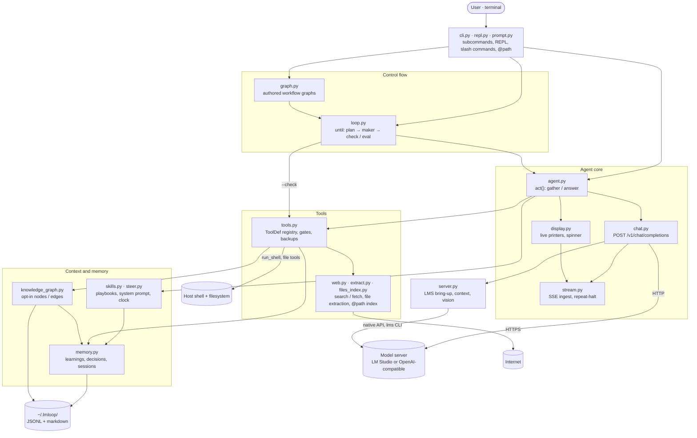
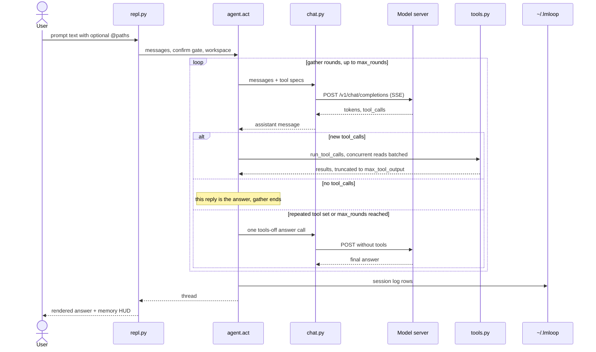
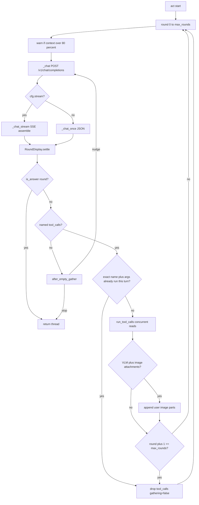
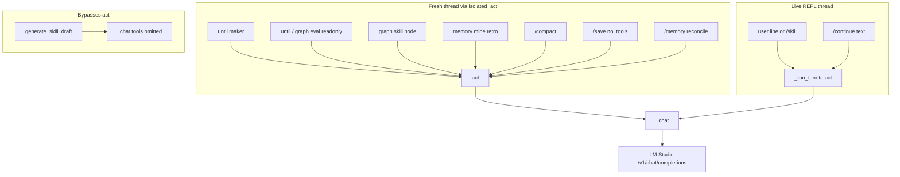

# lmloop — Technical Architecture

A small, fully-local research and coding agent. Runs any model in LM Studio (or any OpenAI-compatible server), gives it real tools, and wraps it in persistent per-project memory. Everything stays on your machine.

**Python 3.10+ stdlib** for the agent core. The REPL adds `prompt_toolkit` and `rich`. Web search uses `ddgs` (no API key), then urllib fallbacks (DuckDuckGo HTML/Lite, Instant Answer, Wikipedia). How to change the code: [DEVELOPMENT.md](../DEVELOPMENT.md).

---

## Component Map

```
lmloop/
├── bin/lmloop                  # entrypoint script
├── setup-lmloop.sh             # venv + pip install + symlink
├── requirements.txt            # prompt_toolkit, rich, ddgs
├── DEVELOPMENT.md              # contribution practices
├── docs/
│   ├── ARCHITECTURE.md         # this file
│   ├── DESIGN_LOOP_AND_GRAPH.md  # knowledge-graph memory (shipped opt-in)
│   ├── DESIGN_GRAPH_ENGINEERING.md  # control-flow graphs (shipped)
│   ├── DESIGN_LLM_CALLING.md   # completions HTTP + act() budgets (shipped)
│   ├── DESIGN_FILE_READING.md  # @path gift + read_file header (proposal)
│   ├── DESIGN_SANDBOX_AND_VERIFICATION.md  # opt-in --docker exec + acceptance gates (proposed)
│   ├── DESIGN_DAG_AND_KNOWLEDGE_CANVAS.md  # model lock, DAG fan-out/joins, flow mining, TUI canvas (proposed)
│   ├── DESIGN_MEMORY_RETRIEVAL.md  # memory hot paths, ranking, FTS5 index, rerank (proposed)
│   ├── DESIGN_ROADMAP.md       # final review: build order, cuts, config budget (proposed)
│   ├── DESIGN_MULTI_AGENT_COMPANY.md  # Docker + OpenRouter multi-agent orchestrator (proposed)
│   └── GUIDE_DOCKER_AND_OPENROUTER.md  # user guide: OpenRouter today, Docker sandbox status
├── sandbox/
│   └── Dockerfile              # reference image for future lmloop sandbox build
├── company/
│   └── openrouter_autonomous.yaml  # illustrative allowlist tiers (company mode proposed)
├── lmloop/
│   ├── __init__.py             # version string
│   ├── __main__.py             # raise SystemExit(main())
│   ├── cli.py                  # argparse subcommands → REPL or one-shot
│   ├── repl.py                 # interactive loop with slash commands
│   ├── prompt.py               # prompt_toolkit session, completers
│   ├── agent.py                # gather/answer tool loop, skill drafting
│   ├── chat.py                 # POST /v1/chat/completions (leaf)
│   ├── skills.py               # skill playbooks, name validation, system prompt
│   ├── server.py               # LMS bring-up, models, context length, vision
│   ├── stream.py               # SSE ingest, overlap, repeat-halt
│   ├── display.py              # spinner, live printers, thinking lines
│   ├── tools.py                # tool registry: specs + Python impls
│   ├── web.py                  # web_search / fetch_url + HTML parsers
│   ├── memory.py               # JSONL learnings, decisions, sessions, checkpoints
│   ├── knowledge_graph.py      # opt-in JSONL knowledge graph (use_graph)
│   ├── config.py               # ~/.lmloop/config.json, DEFAULTS, cfg_* accessors
│   ├── context.py              # live-thread file manifest for /context
│   ├── usage.py                # local feature-usage JSONL (usage.record / tracked)
│   ├── files_index.py          # @path completion + ref expansion (~, abs, relative)
│   ├── extract.py              # PDF/Office/image/audio extraction (leaf)
│   ├── markdown_view.py        # render assistant markdown (no quote gutter)
│   ├── ui.py                   # Console: ANSI theming, status bars, clipboard
│   ├── commands.py             # slash/CLI command names + reserved skill stems
│   ├── status.py               # status / resume / until-graph follow-up copy
│   ├── loop.py                 # until goal loop: isolated maker + check/eval
│   ├── checks.py               # derived check plans (no model calls)
│   ├── snapshot.py             # git temp-index refs before autonomous maker steps
│   ├── graph.py                # authored workflow graphs: parser + runner
│   ├── steer.py                # always-on steering markdown + live clock
│   ├── skills/                 # packaged skill prompts (markdown playbooks)
│   │   ├── system.md           # system prompt: how to work, memory, safety
│   │   ├── _author.md          # meta-prompt for skill drafting (not user-facing)
│   │   ├── _graph_mine.md      # mine phase: propose graph edges (private)
│   │   ├── _reconcile.md       # review contradicts edges (private)
│   │   ├── retro.md            # mine sessions → learnings
│   │   ├── investigate.md      # root-cause debugging
│   │   ├── review.md           # pre-landing code review
│   │   ├── compact.md          # compress thread for context recovery
│   │   ├── qa.md               # run tests, verify changes
│   │   ├── learn.md            # curate and audit learnings
│   │   └── ceo.md              # strategy / plan review
│   ├── steer/                  # packaged always-on rules (injected, not /name)
│   │   ├── time.md             # relative windows; Clock is source of truth
│   │   ├── memory.md           # current question wins over context recovery
│   │   ├── skills.md           # when to follow a playbook
│   │   └── development.md      # model-facing coding bar
│   └── graphs/                 # packaged workflow graphs
│       └── company.md          # ceo → build → qa → mine
├── tests/                      # stdlib unittest; named test_<area>.py
```

---

## System Overview

Everything runs in one Python process on the user's machine. Arrows point from caller
to callee and follow the import graph in [DEVELOPMENT.md](../DEVELOPMENT.md); nothing
calls back up the stack. Leaf helpers used nearly everywhere — `config.py` (paths,
slug), `ui.py` (terminal chrome), `status.py` (user-facing copy), and `commands.py`
(command names) — are omitted so the call structure stays readable.



Trust boundaries today:

- **Model server:** the only destination of generated-token traffic. The default is
  local LM Studio on `127.0.0.1:1234`, so nothing leaves the machine unless `base_url`
  is changed.
- **Host shell and filesystem:** `run_shell` executes on the host with the workspace as
  `cwd`. Protection is the confirm gates, `GatePolicy`, workspace scoping for file tools,
  and pre-image backups in `trash/` — there is no process isolation.
- **Internet:** only `web_search` and `fetch_url`, and their content is fenced as
  untrusted.
- **State:** human-readable files under `~/.lmloop/`, one writer per project.

One interactive turn, end to end:



---

## The Agent Loop

**Files:** `agent.py` (gather/answer), `chat.py` (HTTP)

The heart of lmloop. A single function, `act()`, implements the multi-round tool loop. Every generated token comes from `chat._chat()` posting to `{base_url}/chat/completions`. Call inventory and budgets: [DESIGN_LLM_CALLING.md](DESIGN_LLM_CALLING.md).

```
gather (tools on, up to max_rounds):
    msg, usage = _chat(..., tools + tool_choice=auto)
    if no tool_calls:
        return                          # natural final reply
    if this tool set was already run this turn:
        go to answer                    # exact name+args; not fuzzy text
    run tools; append results
answer (tools off, one call):
    msg, usage = _chat(..., tools omitted)
    return
```



Key properties:

- **No SDK dependency.** Plain `urllib` in `chat.py` against `/v1/chat/completions`. Swap `base_url` to point at Ollama, llama.cpp, OpenRouter, or anything OpenAI-compatible. Optional bearer auth via `api_key` / `OPENROUTER_API_KEY` (`config.resolve_api_key`). When tools are present the payload includes `tool_choice: "auto"`; the answer round and `no_tools` omit both `tools` and `tool_choice`. User-facing remote + Docker notes: [GUIDE_DOCKER_AND_OPENROUTER.md](GUIDE_DOCKER_AND_OPENROUTER.md).
- **Tool errors are reported back** as text so the model can self-correct instead of crashing the session.
- **Usage tracking.** Prompt/completion/total tokens accumulated per-turn; fed to the UI for context fill bars.
- **Streaming is on by default** (`stream: true` in config). Completions use SSE (`stream.py`); tokens render live via `rich.Live` markdown when available (else plain tokens) in `display.py`. The live view grows with the answer up to the terminal and never shrinks (reflow cannot leave leftover rows in scrollback); it only tails if it would overflow. `finish()` reprints the full answer folded at the terminal width (list items included — never cropped). Live refreshes on new tokens only (`auto_refresh` off) and closes when `tool_calls` start, so a long `write_file` argument stream cannot redraw the same preamble into scrollback. A spinner shows until the first token, and again while tool arguments stream. Set `stream: false` for a non-SSE full reply. Within one SSE body, `stream.py` halt-loops repeating thinking (including paraphrases) and exact-repeat content. `_halted` means the round did not finish on its own: a looping answer, or looping thinking that either forced the body closed or never reached an answer — thinking that looped and then produced content before a natural `[DONE]` is a normal round. A halted stream closes before the server's `usage` chunk, so that round's `last_*` stats are zeroed (the round line omits them; context fill falls back to the estimate). A halt with no tools is unfinished: gather nudges when the model has not produced a draft (empty CoT hang, punctuation-only noise such as a run of `.` lines, or a last-line "let me…"); a halted long answer is kept. Across rounds, `act()` is gather/answer: tools stay on for up to `max_rounds` gather steps; a repeated tool set (exact name+args already run this turn) or that budget forces one tools-off answer. Eval threads use `eval_max_rounds` (default 8) instead of `max_rounds`.
- **Concurrent reads.** Consecutive side-effect-free tools (`read_file`, `list_dir`, `find_files`, `search_files`, `web_search`, `fetch_url`, `recall_memory`, `current_time`) share a thread pool. `run_shell`, `write_file`, `update_file`, `move_file`, `delete_file`, `remember`, `log_decision`, and `graph_add_edge` stay serial and act as barriers. Results stay in `tool_call` order.
- **`/save` is tools-off.** `act(no_tools=True)` skips `build_tools` so a checkpoint summary cannot emit tool calls.

### Who calls `act()`



Not completions: `GET /v1/models`, native `GET /api/v0/models` (context + vision), `lms` CLI, whisper, `--check` shell.

### Server management (`ensure_server`)

**File:** `server.py`

Before the loop starts, `ensure_server()` (`LmsClient.ensure`) checks if LM Studio is reachable. If not and `auto_start_server` is enabled, it runs `lms server start` and `lms load` (if the `lms` CLI is on PATH). Falls back to first available model if the configured model isn't loaded.

### Context limit detection

`get_context_limit()` queries LM Studio's native API (`/api/v0/models` or `/api/v1/models`) to discover the loaded model's context window. Users can override with `context_length` in config.

---

## Goal loop

**Files:** `loop.py`, `checks.py`

`until` is a while-statement around isolated `act()` calls. The maker does not declare the goal done — exit codes or a **fresh** eval thread do.

```
until goal:
    plan     — flags, or checks.py derives commands (goal text, project files,
               repo docs, memory, proven history). Shown once on a TTY.
    baseline — run the plan once (until_baseline). Unrunnable inferred commands
               are dropped; unrunnable typed ones block. An inferred check that
               already passes becomes a keep. A failing keep blocks.
    maker    — isolated act() with the goal + prior handoff
    check    — run the plan. A check that went fail → pass, with keeps and
               advisory commands green, is done (no eval). Otherwise a failing
               command returns to the maker. If nothing can prove the goal,
               eval judges and every keep must still pass.
    eval     — isolated act() with read-only tools; last line STATUS: pass|fail|blocked
    fail → next maker cycle; blocked → y/N gate; pass → optional memory mine → done
```

- `checks.py` does not call the model. Trust is a property of the source: flags, goal text, project files, repo docs, user-stated memory, and proven history are authoritative. Observed or inferred memory, and CI lines whose program is not on `PATH`, are advisory — a failure sends the cycle back to the maker, a pass never finishes the run.
- `--check` and `--keep` are repeatable. Either flag disables inference for that run. `check_inference: off` disables it globally. `until_baseline: off` restores direct gating: a passing check finishes the run, with no reclassification.
- The plan is stored on the until log (`checks` on the meta row, then on the `baseline` or `plan` row). Resume reuses it and does not baseline again. A graph until-node copies the plan onto the node row's `verify` field.
- Maker and checker are different session logs. Missing `STATUS:` is `blocked`, never `pass`.
- Eval cannot `write_file`, `update_file`, `move_file`, `delete_file`, `remember`, `log_decision`, or `graph_add_edge` (`tools.READONLY_OMIT`). It may `run_shell` to verify; a destructive shell request there is simply `DENIED` under the until/graph `GatePolicy` and never re-asked.
- A failing check goes straight back to the maker — no eval turn. `DENIED:`, spawn `ERROR:`, and exit 126/127 are `blocked` → gate.
- `until_max_steps` (default 12) counts maker cycles **this invocation**; pause, then `/continue` or `lmloop until` with no goal resumes.
- REPL `/continue` resumes `state.until_run` (the run this session started). `/new` clears that pointer and does not auto-resume a disk until-run. CLI `lmloop until` with no goal still resumes the latest open run.
- After the run stops (pass, pause, or interrupt), the REPL appends a handoff so follow-up questions have context. `lmloop until` on a TTY then enters the prompt loop (piped stdin still exits).
- Run state is append-only JSONL under `projects/<slug>/until/<ts>.jsonl`. The event is written **after** the step, so a crash retries the same role. Maker rows may include `snapshot_ref` (`HEAD` or `refs/lmloop/…`) from `snapshot.take_snapshot` when `autonomous_snapshot` is `git` and the workspace is a git repo.
- `agent.py` / `stream.py` / `display.py` must not import `loop`. Handlers stay in `cli.py` / `repl.py`.

This is control-flow, not a knowledge graph. Knowledge-graph memory is opt-in (`use_graph`) in `knowledge_graph.py`: JSONL nodes/edges, `recall_memory` hops, `/memory graph` and `/memory reconcile`. See [DESIGN_LOOP_AND_GRAPH.md](DESIGN_LOOP_AND_GRAPH.md).

---

## Workflow graph

**File:** `graph.py`

A graph is a list of named loops with **authored** sparse edges. Until is the inner node. There is no LLM router over a fully connected graph.

```
node <name> skill <skill> [--check cmd] [--keep cmd] [task…]
    isolated act + eval STATUS: (read-only tools) unless --check
node <name> until [--check cmd] [--keep cmd] <goal>
    existing run_until, including derived checks when no flag is set
node <name> mine                      memory mine over this graph run's session logs
node <name> … needs <pred> …          join: run only after every named predecessor passed
edge <from> -> <to> [on pass|fail|blocked]
edge <from> -> <a> <b> …              fan-out on pass only (one row per `(from, on)`)
```

- Packaged graphs live in `lmloop/graphs/*.md`; `~/.lmloop/graphs/<name>.md` overrides the same name.
- One packaged graph: `company` (ceo → build → qa → mine).
- Each node is an isolated thread. Handoff is the last assistant summary, not the eval `STATUS:` line or the tool transcript.
- Missing edge for fail/blocked → HITL gate; pass with no outgoing edge is terminal success.
- `graph_max_steps` (default 24) counts **skill/until node entries this invocation** (mine and HITL gate do not count). Pause, then `/continue` or `lmloop graph` with no name resumes.
- REPL `/continue` prefers a paused `state.graph_run` over `state.until_run`. `/new` clears both pointers.
- `lmloop graph <name>` starts a run (name required). `lmloop graph` with no name resumes the latest open graph run.
- Run logs: `projects/<slug>/graphs/<name>/<ts>.jsonl`. Event written last, so a crash retries the same node.
- `loop.py` must not import `graph`. `agent.py` / `stream.py` / `display.py` must not import `graph`. Handlers stay in `cli.py` / `repl.py`.

---

## Tools

**File:** `tools.py` (registry) + `web.py` (search/fetch)

Each tool has a JSON Schema spec (for the model) and a Python callable (for execution). The `build_tools()` function returns both the OpenAI tool spec list and an impl dispatch dict.

| Tool | Purpose | Safety |
|------|---------|--------|
| `run_shell` | Execute shell commands | Destructive patterns (rm -rf, sudo, DROP TABLE…) require user y/N confirmation. `cp`/`mv`/`unzip` (extract) of a path outside the workspace also confirms. Pipe/redirection syntax is off by default (`confirm_shell_syntax`); set that key to enable. |
| `read_file` | Read file with line numbers; PDF/Office extract as text (and `@path` of those types inlines the extract); zip lists members in place; images attach as vision parts when a VLM is loaded; audio transcribes via whisper CLI | Scoped to the workspace directory captured at session start, plus paths the user attached with `@` on this turn. Relative `path` resolves there; `~` and absolute paths work. The ⚙ line and result header show the resolved path. Max 400 lines per call; when more remain the header names the exact next window (`[continue with start_line=401]`). |
| `write_file` | Create a file | Scoped to the workspace directory captured at session start. Overwriting an **existing** file asks y/N (`overwrite <path>`; rides `confirm_destructive`) and backs the old content up first. `@` attachments outside the workspace may be written only after y/N confirmation. Creates parent dirs. Result cites the resolved path (and backup). |
| `update_file` | Surgical edit: replace an exact `old_string` with `new_string` | Same scope as `write_file`. Must match exactly once unless `replace_all`; 0 or many matches return an `ERROR:` naming the line numbers. Backs up first. Result is a header plus a compact unified diff, which the REPL echoes as a dim hint. |
| `move_file` | Rename/move a single file inside the workspace | Always asks y/N (`move_file a -> b`). Destination must not exist; directories refused. Backs up first. |
| `delete_file` | Delete a single file inside the workspace | Always asks y/N (`delete_file <path>`). Directories refused (use gated `rm -r`). Backs up first. |
| `list_dir` | List directory entries | Scoped to the session workspace, plus directories the user attached with `@` this turn. Includes dotfiles. |
| `find_files` | Find files by glob (`*.py`, `src/*.ts`) or case-insensitive path substring | Git-aware via `files_index.list_project_paths` (honours `.gitignore`). Scoped to the workspace. Cap 200. |
| `search_files` | Regex search (ripgrep or grep fallback) with optional `glob`, `case_insensitive`, `context` (0–5), `fixed` | Scoped to the session workspace. Max 50 matches. Flags map 1:1 onto `rg` and `grep`. |
| `web_search` | `ddgs` metasearch (no key), then DuckDuckGo HTML/Lite, Instant Answer, Wikipedia | Optional `ddgs` dep. Content fenced as untrusted. All backends failing → ERROR (do not paraphrase-retry). |
| `fetch_url` | HTTP(S) fetch: HTML→text + links; PDF/Office extract; images attach on VLMs | Content fenced as untrusted. Returns final URL + HTTP status. TLS verified. Max 1MB download, ~10KB returned. |
| `remember` | Save a learning to project memory | Writes `~/.lmloop/projects/<slug>/learnings.jsonl`; tool result cites that path |
| `log_decision` | Record a durable decision | Writes `~/.lmloop/projects/<slug>/decisions.jsonl`; tool result cites that path |
| `recall_memory` | Keyword-search learnings + decisions | Read-only view. When `use_graph` is on, includes 1-hop graph neighbors. |
| `current_time` | UTC/local now plus 7/28/90-day lookback dates | No network. OS clock. For relative windows when Clock is stale. |
| `graph_add_edge` | Record a relationship between existing memory-graph nodes | Only registered when `use_graph` is true. Requires a `note`. |

Tools are registered once as `ToolDef` rows in `tools.build_tools()` (schema, validation, and impl; `int_fields` / `bool_fields` coerce the strings local models send). Slash/CLI command names and reserved skill stems come from `commands.py`. Status/resume copy lives in `status.py`.

Tool output is truncated to 12,000 chars to protect the context window.

### Confirm gates and autonomy

Every gate is one call, `confirm_gate(command: str) -> bool`. The string is either a shell command or `<prefix><detail>` (`overwrite <p>`, `update_file <p>`, `move_file a -> b`, `delete_file <p>`, `write_file <p>` for outside-workspace writes). `tools.confirm_label()` owns the human label and `tools.gate_tier()` owns the recoverability tier for those prefixes; `ui.make_confirm_gate` only prints and asks.

- **Pre-image backups.** Before an existing in-workspace file is overwritten, edited, moved, or deleted, `tools.backup_file` copies it to `~/.lmloop/projects/<slug>/trash/<process-stamp>/<relative path>` (pruned after 14 days). The tool result cites the backup path; the REPL echoes it via `tools.user_notice`.
- **Interactive turns** use the y/N gate immediately; the user is present.
- **`/until` and `/graph`** wrap the same gate in `tools.GatePolicy` (`tools.autonomous_gate`, config `autonomous_gates`):
  - `files` (default): *recoverable* gates (overwrite / update / move / delete inside the workspace, all backed up) auto-approve with one dim `[auto-approved: …]` line. *Irreversible* gates (destructive shell, writes outside the workspace, copy/extract from outside) return `False` during the act — the tool returns `DENIED:` and the model is told not to work around it — and are recorded. After the maker step, `loop.boundary_approval` asks once (`ask_gate`); on yes the run appends an `approve` row (commands as JSON) and re-runs the maker with `Approved for this step: …` in the prompt, and the policy passes exactly those commands for that one step (approvals expire at the next boundary, so a later eval or node cannot reuse the yes). On no, or with no `ask_gate` (piped CLI), the run proceeds to check/eval as before. Denials from read-only evals and `--check` commands are dropped, never re-asked.
  - `none`: every gate defers to the interactive y/N as before.
  - `all`: never asks (unattended runs; explicit opt-in).
  - `confirm_shell: false` still disables all gates everywhere.

---

## Memory System

**File:** `memory.py` (JSONL CRUD) + `knowledge_graph.py` (`KnowledgeGraph`)

All state is human-readable files under `~/.lmloop/projects/<slug>/`. No database, no migrations. JSONL files assume a **single writer** (one REPL or CLI process per project); concurrent appends are out of scope. ISO timestamps use `config.utc_now()`.

### State layout

```
~/.lmloop/
├── config.json                     # user settings (base_url, model, max_rounds, …)
├── usage.jsonl                     # append-only local feature-usage events (opt-out: LMLOOP_USAGE=0)
├── history                         # REPL prompt history (prompt_toolkit)
├── skills/<name>.md                # user-authored skills (override packaged)
├── steer/<name>.md                 # user always-on steering (concatenated)
├── graphs/<name>.md                # user-authored graphs (override packaged)
└── projects/<slug>/
    ├── learnings.jsonl             # append-only; dedup at read time
    ├── decisions.jsonl             # event-sourced (decide / supersede)
    ├── sessions/<ts>.jsonl         # per-session transcript history
    ├── checkpoints/<ts>-<t>.md     # context-save handoffs
    ├── until/<ts>.jsonl            # goal-loop run log (maker / check / eval)
    ├── graphs/<name>/<ts>.jsonl    # workflow-graph run log
    ├── graph_nodes.jsonl           # knowledge-graph nodes (when use_graph)
    └── graph_edges.jsonl           # knowledge-graph edges (when use_graph)
```

**Project slug** is resolved from git remote (`owner-repo`) or directory name.

### Learnings (`learnings.jsonl`)

- **Append-only.** Each row: timestamp, type, key, insight, confidence, source.
- **Dedup by key, latest-wins.** At read time, only the last row per key is returned.
- **Confidence decay.** Non-user-stated entries lose 1 confidence point per 30 days. Entries with effective confidence ≤ 0 are filtered out. User-stated entries never decay.
- **Bounded injection.** Session start injects only the top-N learnings (configurable, default 8). The model pulls more on demand via `recall_memory`.

### Decisions (`decisions.jsonl`)

- **Event-sourced.** Each row is either `decide` or `supersede`.
- **Supersede retires.** A `supersede` event references the ID of the decision it replaces. `get_decisions()` computes the active set by filtering out retired IDs.
- **Bounded injection.** Top-N active decisions injected at session start (default 6).

### Sessions (`sessions/*.jsonl`)

- Full transcript of role/content pairs. Created per REPL session.
- Used by `/memory mine` to mine learnings and by `/restore` to reload a prior conversation.
- `read_session()` renders log files (including truncated tool rows) up to `max_chars`.
- `format_messages_transcript()` renders the live thread (honors `/undo`) for `/compact` and this-session `/memory mine`. Tool rows are included truncated (live payloads can be huge); system messages are omitted.
- `session_messages()` rebuilds user/assistant turns for `/restore`. Tool/system rows are transcript-only (truncated, not API-shaped) and are omitted. Restore loads those turns into the in-memory thread and prints the last assistant reply — it does not start a new model turn.
- `/compact`, `/memory mine`, and `/save` run `act()` on a side thread so the live conversation is unchanged until the user confirms a compact replace (which starts a new session log). `/save` uses `no_tools` so the checkpoint call cannot emit tool calls.

### Checkpoints (`checkpoints/*.md`)

- Markdown files with YAML frontmatter (title, timestamp).
- Created via `/save [title]` which asks the model to summarize the session.
- Auto-injected into context if < 14 days old.

### Knowledge graph (`graph_nodes.jsonl`, `graph_edges.jsonl`)

Opt-in (`use_graph`, default false). Owned by a `KnowledgeGraph` dataclass in `knowledge_graph.py`. When off, no graph files are created, auto-edges do not write (even if files already exist), and `recall_memory` is unchanged.

- Nodes are typed (`learning`, `decision`, `session`, `file`, `skill`, `concept`). Latest row per `(type, key)` wins. Learning/concept nodes reuse confidence decay; others stay live.
- Edges are typed (`leads_to`, `contradicts`, `in_session`, `references`, `uses_skill`, `related_to`, `supersedes`). Endpoints that decayed away are dropped at read time.
- First use backfills nodes from existing learnings, decisions, and sessions. `remember` / `log_decision` then add `in_session` and `references` (paths mentioned in the text). `/skill` records `uses_skill`.
- `recall_memory` does keyword match plus 1-hop neighbors. `graph_add_edge` (tool, `use_graph` only) requires a `note`.
- `/memory graph` prints counts, an adjacency list, and `contradiction_clusters()`. `/memory list` / `/memory decisions` / `/memory dump` inspect learnings, decisions, and the injected snapshot. `/context` prints files in the live thread, then that same snapshot. `/memory reconcile` reviews `contradicts` clusters. `/memory mine` appends a graph-edge phase.

---

## Context Injection

**File:** `skills.py::system_prompt()`

At session start (and each isolated `/until` or graph `act()`), the system prompt is assembled from:

1. `skills/system.md` — core instructions (how to work, memory discipline, safety, style)
2. Live tool name list
3. `steer.clock_block(now=clock_now)` — UTC timestamp and calendar date, **frozen** for the REPL session or until/graph run (OS clock at start; not rebuilt every `_chat`)
4. `steer.steering_block()` — concatenated `*.md` from packaged `lmloop/steer/`, `~/.lmloop/steer/`, then `<workspace>/.lmloop/steer/` (later dirs can contradict earlier; same-name files are additive, unlike skills)
5. `memory.context_block()` — bounded snapshot of active decisions, top learnings, and recent checkpoint (if < 14 days old)

`/context` is the audit view of what the model is holding. It prints two sections, colored when stdout is a TTY (`Console.write_lines`):

1. **Active files** — paths in `SessionState.messages`, in first-seen order, each path on its own line (never ellipsized). A file is loaded when a successful `read_file` result, an `@` attachment excerpt, or a vision image part is still in the thread. Other `@` paths are listed as referenced but not loaded (the model has the path, not the body). `/undo`, `/new`, and a `/compact` replace drop files by dropping the messages that held them.
2. **Durable memory** — the same readable view as `/memory dump`: decisions, learnings (key, type, confidence, source, insight), graph neighbors, and the latest checkpoint with an age in words. Empty when nothing is injected.

`/memory dump` is that memory view alone. It is not the fenced `context_block` text the model receives. The file list is not written to disk and is not part of the system prompt. File-tool ⚙ lines (`format_tool_preview`) put the resolved path on its own line and do not cut it with `...`.

This keeps the system prompt small for local models with limited context windows. The clock is injected so relative windows ("last 4 weeks") do not resolve to a training-cutoff year. A long REPL session calls `current_time` when that frozen Clock is stale.

---

## REPL

**File:** `repl.py` + `prompt.py`

The interactive mode uses `prompt_toolkit` for:

- **As-you-type completion** for `/` slash commands (with blurbs) and `@` file paths (git-aware project index plus the current directory, plus filesystem completion for `~/`, `/`, `./`, `../`). Filesystem matches show the resolved path in the menu. A unique exact directory lists its contents (no extra `/`); `/` on a highlighted `@dir/` opens that directory instead of inserting `//`. Names with spaces complete quoted and resolve unquoted on submit. The input lexer colors `@path` and `/command` tokens (the path itself, without doubling slashes).
- **Decorative prompt** showing `cwd · model ›`.
- **Bottom toolbar** showing context fill bar, session tokens, and turn count.
- **Double Ctrl-C to exit** (first dismisses completion menu, second exits).
- **`@path` refs** on submit (`~/`, absolute, `./`, `../`, quoted or unquoted spaces, or project-relative) append a “Referenced files” block with the **resolved** path. Duplicate slashes in the typed token are collapsed. Missing tokens warn; existing ones are readable this turn **in place** even outside the workspace. PDF/Office/zip/audio attachments inline extracted text in the user message. Copy/extract of those files into the workspace, and writes to them, require confirmation.

Slash commands (`/help`, `/stats`, `/copy`, `/memory`, `/until`, `/save`, `/restore`, …) are built at runtime so newly created skills appear immediately. `/memory list`, `/memory decisions`, `/memory graph`, and `/memory dump` inspect hidden state without a model turn. `/context` adds the live thread's file list in front of the readable memory view. `/copy` writes the last assistant reply (or `/copy transcript` the session markdown) to the OS clipboard. Markdown block quotes render without Rich's `▌` gutter so `/transcript` and live replies are select-copyable. After each agent turn the REPL prints a memory HUD (`memory.MemoryHud.line()`), for example `[Mem: 3 learnings | 1 decision | graph: on | checkpoint: yes]`: active learning/decision counts, whether `use_graph` is on and populated, and whether a checkpoint newer than 336 hours exists.

Non-interactive mode (piped input or `lmloop "task"`) falls back to plain `input()` without completions.

---

## CLI

**File:** `cli.py`

`argparse`-based subcommands:

| Command | Description |
|---------|-------------|
| `lmloop` | Interactive REPL |
| `lmloop "task"` | Task, then REPL prompt when stdin is a TTY (exits when piped) |
| `lmloop until [--check cmd] [--keep cmd] <goal>` | Goal loop (derived plan when no flag is given), then REPL prompt when stdin is a TTY |
| `lmloop until` | Resume latest open until-run |
| `lmloop graph <name>` | Authored workflow graph, then REPL prompt when stdin is a TTY |
| `lmloop graph` | Resume latest open graph-run |
| `lmloop skill <name> [task]` | Skill, then REPL prompt when stdin is a TTY |
| `lmloop skills` | List skill prompts |
| `lmloop skills new <name> [brief]` | AI-draft a skill, review, then save |
| `lmloop retro [N]` | Alias for `memory mine` |
| `lmloop memory [query]` | Peek curated learnings |
| `lmloop memory list` | Top 5 active learnings |
| `lmloop memory decisions` | Top 3 active decisions |
| `lmloop memory dump` | Readable view of injected memory |
| `lmloop memory mine [N]` | Mine last N sessions into learnings |
| `lmloop memory graph` | Knowledge-graph stats (requires `use_graph`) |
| `lmloop memory reconcile` | Review `contradicts` clusters (requires `use_graph`) |
| `lmloop decisions` | Peek durable decisions |
| `lmloop history` | List session transcripts |
| `lmloop models` | List models on server |
| `lmloop config get\|set\|show` | Manage settings |
| `lmloop completion zsh` | Print zsh completion script |

---

## Design Decisions (and why)

1. **OpenAI-compatible REST, no SDK.** Completions HTTP lives in `chat.py` (stdlib `urllib`). Swappable backend. `tool_choice: "auto"` when tools are present.
2. **File-only memory, computed views.** Append-only JSONL means no corruption, no migrations. You can `cat`, `grep`, or hand-edit every piece of agent memory.
3. **Bounded context injection.** Local models have small contexts — the budget is respected. Only top-N learnings and active decisions injected at start; model pulls more on demand.
4. **Self-learning is curated, not automatic.** The `remember` tool has a quality bar (enforced by `skills/retro.md`). Noisy memory is worse than none.
5. **Safety gates in code, not just prompt.** Destructive shell patterns require user confirmation regardless of what the model wants. Copy/extract of paths outside the workspace also confirms, as do overwriting, moving, and deleting existing files (each backed up first). Pipe/redirection confirms are opt-in (`confirm_shell_syntax`). Autonomous until/graph runs auto-approve only the recoverable tier and batch the rest to the cycle boundary (`autonomous_gates`). Web content is fenced as untrusted data.
6. **Skills as markdown playbooks.** Numbered steps, English conditionals, explicit report format. User skills override packaged ones with the same name.

---

## Lineage

The memory schema, context-recovery flow, skill-prompt style, careful-command gate, and injection fencing are distilled from [gstack](https://github.com/garrytan/gstack)'s patterns, reduced to what a local, single-user research loop needs.
