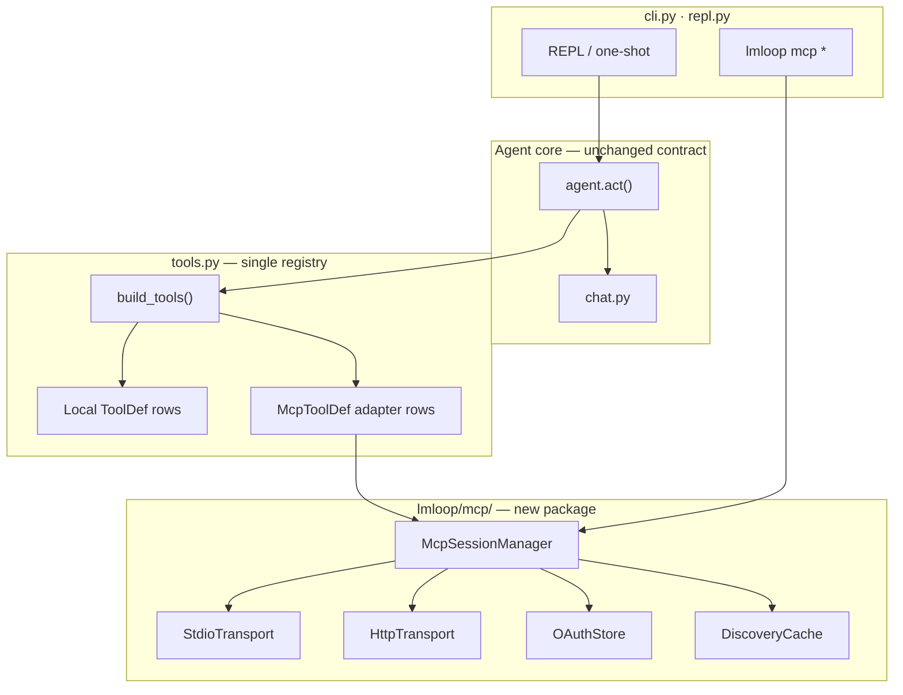

# Design: Claude Code–class terminal agent (MCP and harness parity)

**Status:** proposed — feature parity target for interactive coding agents; no code in this doc.  
**Date:** 2026-10-11  
**Depends on:** [ARCHITECTURE.md](ARCHITECTURE.md), [DESIGN_SANDBOX_AND_VERIFICATION.md](DESIGN_SANDBOX_AND_VERIFICATION.md), [DESIGN_CONTINUAL_HARNESS_AND_SANDBOX_EVOLUTION.md](DESIGN_CONTINUAL_HARNESS_AND_SANDBOX_EVOLUTION.md), [FINDINGS_OPEN_SOURCE_AGENT_HARNESSES.md](FINDINGS_OPEN_SOURCE_AGENT_HARNESSES.md)  
**Related:** [DESIGN_MULTI_AGENT_COMPANY.md](DESIGN_MULTI_AGENT_COMPANY.md) (remote multi-agent), [DESIGN_COMMAND_CONSOLIDATION.md](DESIGN_COMMAND_CONSOLIDATION.md) (slash vocabulary)

---

## 0. Mental model

**Claude Code** is a productized terminal coding agent: OpenAI-style tool loop, rich **permission harness**, first-class **MCP** (stdio + remote HTTP/SSE, OAuth, lazy tool discovery), project rules, hooks, subagents, shell integration, and session controls (`/rewind`, diff awareness). The implementation is TypeScript-heavy and tied to Anthropic’s model stack.

**lmloop** today is a **local-first** Python agent on the same core shape (multi-round `act()`, `ToolDef` registry, confirm gates, skills, `@path`, memory JSONL, `until` / `graph`, optional Docker). It already matches several Claude Code **ideas** under different names:

| Claude Code concept | lmloop today |
|---------------------|--------------|
| Project rules | `steer/*.md`, `<workspace>/.lmloop/steer/` |
| Skills | `skills/*.md`, `~/.lmloop/skills/`, `/skill`, `skills new` |
| Permission prompts | `confirm_shell`, `GatePolicy`, `autonomous_gates` |
| Long-running autonomy | `/until`, `/graph`, `campaign` |
| Context from files | `@path`, `read_file`, git-aware index |
| Side work without polluting thread | Side sessions (`/compact`, `/memory audit`, `/memory reconcile`) |
| Multi-agent (remote) | `company run` (Docker + allowlist; not local parallel) |
| MCP | **Not built** — only noted as external gateway in sandbox docs |

This design closes the **product gap** for developers who choose lmloop + LM Studio (or any OpenAI-compatible endpoint) but want **Claude Code–class integrations** without leaving the terminal or the existing memory/graph story.

**North star:** A developer can drop a `.mcp.json` next to their repo, run `lmloop`, approve servers once, and ask the agent to implement from Linear/Jira, query Postgres, or post to Slack—**with the same gate and audit semantics** as `run_shell` and `write_file`.

**Non-star:** Bit-for-bit CLI compatibility with `claude`, Anthropic-only features (managed org MCP, claude.ai connectors, desktop computer-use, plugin marketplace), or replacing lmloop’s file-only memory with opaque cloud state.

---

## 1. Problem statement

### Goals

1. **MCP as a first-class tool transport** — stdio and remote HTTP (SSE optional), OAuth for remote servers, project/user/local scopes, team-shareable `.mcp.json`.
2. **Unified permission model** — MCP tool calls go through the same **recoverable / irreversible** tiering and batching as file tools and shell; autonomous modes respect `GatePolicy`.
3. **Context discipline** — Do not explode small local context windows by registering 200 MCP tool schemas up front; **lazy discovery** (load schemas on search or first use).
4. **Operational parity** — CLI + REPL to add/list/remove servers; `/mcp` panel; `lmloop mcp login` for headless OAuth where possible.
5. **Stay lmloop** — Single process default, stdlib-first HTTP, optional extra deps only for MCP client protocol; no second tool registry.

### Non-goals

| Item | Why |
|------|-----|
| Plugin marketplace / `mcp-server-dev` scaffolding | Out of scope; document “import Cursor/Claude Desktop JSON” instead |
| WebSocket MCP + push **channels** | Defer until HTTP tool loop is stable; hooks cover most “react to CI” cases |
| In-process `"type": "sdk"` MCP | lmloop is not an SDK host |
| Built-in browser / computer-use servers | Different trust model; user can attach via MCP if needed |
| Managed enterprise MCP (`managedMcpServers`) | Document env/json hook for future; no control plane |
| Replacing `ToolDef` with MCP-only tools | Local shell/file/search tools remain canonical offline path |
| Default parallel subagents on one local GPU slot | Align with [DESIGN_ROADMAP.md](DESIGN_ROADMAP.md): sequential default |

### Success criteria (acceptance)

- Connect at least one **stdio** and one **remote HTTP** reference server from the [MCP examples](https://modelcontextprotocol.io/examples) in a fixture test (no network in CI: stdio only; HTTP behind `unittest.skipUnless`).
- MCP tool invocation appears in session JSONL with `server`, `tool`, latency, and truncated result hash (not necessarily full body).
- Denied MCP call returns `DENIED:` consistent with shell gates; autonomous run batches denials once per maker step.
- With 50+ MCP tools configured, first turn **does not** send all schemas to the model when `mcp_tool_mode: lazy` (default).
- Project `.mcp.json` in an untrusted clone requires explicit approval (mirror Claude Code trust).

---

## 2. Feature parity matrix

Priority: **P0** = needed for “comparable”; **P1** = expected soon after; **P2** = nice; **—** = intentional gap.

| Feature | Claude Code | lmloop today | Target | Priority |
|---------|-------------|--------------|--------|----------|
| MCP stdio servers | Yes | — | Yes | P0 |
| MCP HTTP / streamable-http | Yes | — | Yes | P0 |
| MCP SSE (legacy) | Yes | — | Best-effort | P1 |
| OAuth remote MCP | Yes | — | Yes (browser or device code) | P0 |
| `.mcp.json` project scope | Yes | — | Yes | P0 |
| User/local MCP config | Yes | — | `~/.lmloop/mcp.json` + per-project overrides | P0 |
| `/mcp` status UI | Yes | — | REPL + `lmloop mcp list` | P0 |
| Tool search / deferred schemas | Yes | — | Lazy list + optional `tool_search` meta-tool | P0 |
| MCP + permissions | Yes | Partial (local only) | Extend `GatePolicy` | P0 |
| `!` shell → model responds | Yes | — | Opt-in `shell_respond true` | P1 |
| `/add-dir` extra roots | Yes | Workspace only | MCP `roots/list` + `@path` | P1 |
| Hooks (Pre/Post tool) | Yes | — | Subprocess hooks config | P1 |
| Subagents / Task tool | Yes | Side sessions only | `task` tool → headless `act()` | P1 |
| `/rewind` before `/new` | Yes | `/restore`, `/undo` partial | Checkpoint stack + rewind | P1 |
| Plan mode (read-only explore) | Yes | `/investigate` skill | `lmloop plan` or `/plan` flag on session | P2 |
| Diff / changed-files panel | Yes (GUI) | — | `/diff` text panel + `@` changed files | P1 |
| `.claude` rules | Yes | `steer/` + `.lmloop/steer` | Document + optional `AGENTS.md` import | P1 |
| Background long MCP calls | Yes | — | Async tool slot + `/tasks` list | P2 |
| MCP output file spill | Yes | `max_tool_output` truncate | Same + path in result | P1 |
| Session export | Yes | `/copy transcript` | Keep; add JSON export | P2 |
| Model switching mid-session | Yes | `/model` | Already shipped | — |
| Skills marketplace | Plugins | Packaged + user skills | Keep file-based skills | — |
| Git snapshot rollback | Partial | `refs/lmloop/*` | Already shipped | — |
| Docker sandbox | Optional product | `--docker` opt-in | Keep; MCP stdio **host** by default | — |

---

## 3. Architecture overview



**Invariants (from [DEVELOPMENT.md](../DEVELOPMENT.md)):**

- MCP tools are **`ToolDef` rows** produced inside `build_tools()` (or a dedicated `mcp_tools.py` that returns rows merged once). No parallel OpenAI schema list.
- `commands.py` owns **`mcp`** subcommand names; `cli.py` dispatches.
- `agent.py` does not import MCP transports directly — only `tools.run_tool_calls`.
- OAuth tokens live under `~/.lmloop/credentials/mcp/` (mode 0700), never in project git.

---

## 4. MCP subsystem

### 4.1 Configuration scopes

Align with Claude Code semantics for portability of user configs.

| Scope | File / store | Shared in git | Loads when |
|-------|----------------|---------------|------------|
| **project** | `<workspace>/.mcp.json` | Yes (servers only; no secrets) | Workspace session start |
| **user** | `~/.lmloop/mcp.json` | No | Every session |
| **local** | `~/.lmloop/projects/<slug>/mcp.local.json` | No | That project only |

**JSON shape** (compatible with Claude Desktop / Cursor `mcpServers` wrapper):

```json
{
  "mcpServers": {
    "github": {
      "type": "http",
      "url": "https://api.example.com/mcp",
      "headers": { "Authorization": "Bearer ${GITHUB_MCP_TOKEN}" }
    },
    "postgres": {
      "command": "npx",
      "args": ["-y", "@modelcontextprotocol/server-postgres", "${DATABASE_URL}"],
      "env": { "NODE_OPTIONS": "--no-warnings" }
    }
  }
}
```

**Rules:**

- Entries with `url` **must** include `"type": "http"` or `"sse"` (reject at load with actionable error — same failure mode Claude Code documents).
- `${VAR}` expansion in `command`, `args`, `env`, `url`, `headers`; missing required vars → warning + skip server (do not expand to empty secrets silently).
- Set `LMLOOP_PROJECT_DIR` in stdio child env to workspace root (Claude Code’s `CLAUDE_PROJECT_DIR`).
- **Reserved names:** `workspace` (lmloop built-in file tools alias) — reject collisions at load.

**Approval (trust):**

- First load of project `.mcp.json` in a workspace: REPL shows server list; user accepts once per slug → record in `~/.lmloop/projects/<slug>/mcp.approved.json` (hash of normalized config).
- Optional `disabledMcpServers` in project `.lmloop/config.json` or user config (list of server keys).

### 4.2 Transports

| Transport | v1 | Notes |
|-----------|----|-------|
| **stdio** | Required | Subprocess with timeout; kill tree on session exit |
| **http** (streamable-http) | Required | POST + SSE read; urllib + manual JSON-RPC framing or thin client |
| **sse** | P1 | Fallback when HTTP upgrade fails |
| **ws** | Defer | Header-only auth; low priority |

**Dependency choice:**

- **Preferred:** add optional extra `mcp>=1.0` (official Python SDK) behind `[project.optional-dependencies] mcp` in `pyproject.toml`, imported only when MCP enabled. Rationale: protocol churn (2026-07-28 revision) is costly to reimplement; still no OpenAI SDK.
- **Fallback path:** minimal stdio JSON-RPC for tests if SDK unavailable — one reference server only.

**Lifecycle:**

- Start servers on first need (lazy) or on `lmloop mcp connect --all` / REPL `/mcp reconnect`.
- Stop stdio children on REPL exit and `SIGTERM`.
- HTTP clients: connection pool per host; retry transient 5xx (max 3) like Claude Code.

### 4.3 Tool surfacing to the model

**Problem:** Local models often have 8k–32k context; 100 MCP tools × 400 tokens each is fatal.

**Default mode: `mcp_tool_mode: lazy` (constant default, not a new config key unless users ask).**

1. At session start, inject a short **MCP catalog block** in system context (not in user message): server names, one-line descriptions, tool counts — no full schemas.
2. Register one meta-tool:

   - **`mcp_find_tools`** — args: `query` (substring), optional `server`. Returns matching tool names + one-line descriptions (from cache).
   - **`mcp_call`** — args: `server`, `tool`, `arguments` (object). Executes via manager; schemas validated server-side.

3. Optional **`mcp_tool_mode: eager`** for remote frontier models with large context: merge selected servers’ full schemas into `build_tools()` like local tools (with global cap `MCP_EAGER_TOOL_CAP = 40` constant).

**Naming:** Callable name `mcp__<server>__<tool>` (sanitize server/tool to `[A-Za-z0-9_-]`). Meta-tools stay unprefixed. Document names for hook matchers and future permission rules.

**Resources / prompts:** P2 — list via `/mcp` and `lmloop mcp resources`; inject resource text only when user or skill requests (do not auto-register as tools).

### 4.4 OAuth

Store per `(server_name, endpoint_fingerprint)`:

- `access_token`, `refresh_token`, `expires_at`, `token_endpoint` metadata.

**Surfaces:**

- REPL `/mcp` → Authenticate → opens system browser or prints URL (headless: `lmloop mcp login <name>` blocks until callback on `http://127.0.0.1:<port>/callback`).

**Security:**

- Token endpoint must be HTTPS or localhost (match Claude Code v2 rule).
- Never log headers or URLs with query secrets; redact in `lmloop mcp get` output.

### 4.5 Discovery cache

- Cache `tools/list` per server under `~/.lmloop/cache/mcp/<fingerprint>.json` with TTL 24h.
- REPL shows `cached · N tools` until live connect.
- Invalidate on `list_changed` notification (HTTP) or manual `/mcp reconnect`.

### 4.6 MCP + gates + sandbox

| Tool class | Gate behavior |
|------------|---------------|
| Read-only MCP (server declares or heuristic: get/list/search) | Auto-approve in `autonomous_gates: files` mode |
| Mutating MCP (create/update/delete/send) | **Irreversible** — batch y/N per maker step in until/graph |
| MCP that runs shell on host | Treat as **shell** — destructive patterns apply |

**Policy file (optional, no new config key):** `<workspace>/.lmloop/mcp.policy.json`

```json
{
  "default": "ask",
  "rules": [
    { "server": "github", "tools": ["create_*"], "action": "deny" },
    { "server": "postgres", "action": "allow" }
  ]
}
```

Evaluated in `GatePolicy` before confirm prompt. Emits `usage.record` events (`mcp.call`, `mcp.denied`) for [DESIGN_CONTINUAL_HARNESS_AND_SANDBOX_EVOLUTION.md](DESIGN_CONTINUAL_HARNESS_AND_SANDBOX_EVOLUTION.md) SIEM-shaped export.

**Sandbox:** MCP stdio servers run on **host** by default (they are user-installed binaries). Document that `--docker` does **not** auto-spawn MCP children inside the container unless `mcp.inherit_sandbox: true` in server entry (advanced, off by default).

---

## 5. Permissions and session controls

### 5.1 Extend `GatePolicy`

Add MCP gate kinds:

- `mcp_call <server>/<tool>` with tier from policy file or default irreversible.
- Respect `confirm_shell false` **does not** disable MCP mutating gates (separate `confirm_mcp` default true — constant until users need a key).

REPL **`/permissions`**: show table of local tool tiers + MCP rules + last denials (mirror Claude Code toast source).

### 5.2 Shell mode `!`

When user submits `! pytest -q` (REPL only):

- Run via existing `run_shell` path with confirm gates.
- If `shell_respond` config true (proposed key **only if** users request; else constant default false initially): append output to thread and trigger one tools-off model pass (document cost).

### 5.3 `/add-dir`

- Append read-only roots for file tools and MCP `roots/list`.
- Persist in session state; `@path` index includes added dirs.
- Writes outside workspace still confirm.

### 5.4 `/rewind`

- Maintain in-memory stack of `{messages_len, checkpoint_id}` before each `/clear` or destructive compact-replace.
- `/rewind [n]` pops stack and truncates messages + in-memory thread; does not delete JSONL (append-only audit stays).

---

## 6. Hooks

**Config:** `~/.lmloop/hooks.json` or `<workspace>/.lmloop/hooks.json`

```json
{
  "PreToolUse": [
    { "matcher": "run_shell", "command": ".lmloop/hooks/pre-shell.sh" }
  ],
  "PostToolUse": [
    { "matcher": "mcp__github__*", "command": ".lmloop/hooks/post-github.sh" }
  ]
}
```

**Contract:** Subprocess, stdin JSON `{ "tool", "args", "cwd", "project_dir" }`, stdout JSON `{ "continue": true }` or `{ "continue": false, "message": "…" }`. Timeout 10s. Non-zero exit → block tool and show stderr.

**Non-goals v1:** `PreModelSwitch`, WASM hooks, remote hook runners.

---

## 7. Subagents (`task` tool)

Reuse patterns from side sessions and company workers:

```python
# Conceptual — not shipped API
task(description: str, prompt: str, model?: str, tools?: "read"|"all"|list)
```

- Spawns headless `act()` with separate message list, same workspace, **no** parent tool spam in parent context — only final assistant text returned.
- Inherits `GatePolicy` from parent unless `tools: read` (read-only subset).
- Counts against `max_rounds` and optional `run_token_budget`.
- Width 1 on local `model_concurrency: 1`; company mode unchanged.

Maps to Claude Code **Task** / subagent isolation per [FINDINGS_OPEN_SOURCE_AGENT_HARNESSES.md](FINDINGS_OPEN_SOURCE_AGENT_HARNESSES.md) §4.3.

---

## 8. Project rules and docs import

| Source | Behavior |
|--------|----------|
| Existing `steer/` | Unchanged precedence |
| `<workspace>/AGENTS.md` | If present, inject after steer (OpenHands / Deep Agents convention) |
| `<workspace>/.lmloop/rules.md` | Optional single-file rules |
| Cursor `.cursor/rules/*.mdc` | **P2** — opt-in importer `lmloop rules import cursor` (copy snippets, do not symlink) |

Do not require Claude’s `.claude/settings.json`; provide **`lmloop mcp add-json`** mirroring `claude mcp add-json` for migration docs.

---

## 9. UX surfaces (CLI + REPL)

### CLI (new subcommand group)

```
lmloop mcp list|get|add|add-json|remove|login|logout|reconnect
```

- `lmloop mcp add --transport stdio NAME -- CMD…`
- `lmloop mcp add --transport http NAME URL [--header …]`
- Scopes: `--scope project|user|local` (default local)

Zsh completion: extend `commands.py` metadata.

### REPL

| Command | Action |
|---------|--------|
| `/mcp` | Full-screen or text panel: servers, status, tool counts, authenticate, enable/disable |
| `/mcp reconnect [name\|all]` | Force reconnect |
| `/permissions` | Gate + MCP policy view |
| `/diff` | Git status + short stat summary; offer `@` insert for changed paths |
| `/plan on\|off` | P2 — read-only tool subset for exploration |

---

## 10. Implementation phases

Tasks are ordered; each phase ships tests + README/ARCHITECTURE updates.

### Phase M0 — Skeleton and config (P0)

| ID | Task | Module |
|----|------|--------|
| M0.1 | Parse `.mcp.json` / user mcp.json; validate types; trust approval file | `mcp/config.py` |
| M0.2 | `lmloop mcp list|get|add|remove` (no connect yet) | `cli.py`, `mcp/cli.py` |
| M0.3 | Document migration from Claude/Cursor JSON | `GUIDE_MCP.md` (new) |

### Phase M1 — Stdio transport + lazy meta-tools (P0)

| ID | Task | Module |
|----|------|--------|
| M1.1 | Stdio subprocess JSON-RPC session | `mcp/stdio.py` |
| M1.2 | `McpSessionManager.call_tool` | `mcp/session.py` |
| M1.3 | `mcp_find_tools` + `mcp_call` ToolDef rows | `tools.py` or `mcp/tools.py` |
| M1.4 | Fixture test with `@modelcontextprotocol/server-everything` or minimal echo server | `tests/test_mcp_stdio.py` |

### Phase M2 — HTTP + OAuth + cache (P0)

| ID | Task | Module |
|----|------|--------|
| M2.1 | HTTP transport (streamable-http) | `mcp/http.py` |
| M2.2 | OAuth PKCE + token store | `mcp/oauth.py` |
| M2.3 | Discovery cache + `/mcp` REPL status | `mcp/cache.py`, `repl.py` |
| M2.4 | GatePolicy integration for mutating tools | `tools.py` |

### Phase M3 — Harness parity (P1)

| ID | Task | Module |
|----|------|--------|
| M3.1 | Hooks runner | `hooks.py` |
| M3.2 | `task` subagent tool | `agent.py`, `tools.py` |
| M3.3 | `/add-dir`, `/diff`, `/permissions` | `repl.py`, `context.py` |
| M3.4 | `lmloop mcp login|logout` | `mcp/cli.py` |

### Phase M4 — Polish (P1–P2)

| ID | Task |
|----|------|
| M4.1 | SSE fallback transport |
| M4.2 | MCP result spill-to-file when > `max_tool_output` |
| M4.3 | `/rewind` stack |
| M4.4 | Optional `shell_respond` for `!` commands |
| M4.5 | Background MCP calls + `/tasks` (only if local models stay responsive) |

### Phase M5 — Enterprise adjacency (optional)

| ID | Task |
|----|------|
| M5.1 | Document external MCP Gateway (single chokepoint) per continual-harness doc |
| M5.2 | Export `usage.jsonl` MCP audit fields for SIEM |
| M5.3 | Import `mcp.policy.json` from Docker AI Governance examples |

---

## 11. Config and constants

Respect [DESIGN_ROADMAP.md](DESIGN_ROADMAP.md) config budget. **Proposed user keys (max 2):**

| Key | Default | Meaning |
|-----|---------|---------|
| `mcp_enabled` | `true` | Master switch; when false, no MCP subprocesses |
| `mcp_tool_mode` | `lazy` | `lazy` or `eager` |

Everything else is **constants** in `mcp/constants.py`: eager tool cap, idle timeout, OAuth callback port range, cache TTL, meta-tool names.

---

## 12. Security summary

- Treat MCP results as **untrusted** (same fence as `fetch_url`) unless server is user-owned and read-only.
- Prompt-injection via issue trackers is a user-visible risk — steer line in packaged `steer/mcp.md`.
- Never execute MCP-returned shell commands without `run_shell` gates.
- Project `.mcp.json` is trust-on-first-use; hash-approved config changes re-prompt.
- Credentials only in user scope or env vars — never commit tokens.

---

## 13. Testing strategy

| Layer | Approach |
|-------|----------|
| Unit | Mock transport; OAuth token refresh; policy matcher |
| Integration | Stdio echo server in CI |
| REPL | Scripted input for `/mcp` approve flow (`tests/test_ui.py` patterns) |
| Regression | Tool count in first `chat` request with lazy mode (assert schema count < threshold) |

---

## 14. Documentation deliverables

When M1 ships:

- `README.md` — MCP quickstart + table row in config keys (if any).
- `ARCHITECTURE.md` — component map entries for `lmloop/mcp/`.
- `docs/GUIDE_MCP.md` — scopes, OAuth, Claude Desktop import, security.
- This file → update **Status** per phase in header.

---

## 15. Open questions

1. **SDK vs hand-rolled HTTP:** Decision gate at M2 — if Python SDK pulls heavy deps, ship HTTP subset stdlib-only for remote and SDK-only for stdio.
2. **Local model tool-calling reliability:** Meta-tool (`mcp_call`) vs eager schemas — measure on Qwen/Llama tool templates; may need skill `mcp.md` playbook.
3. **Company mode + MCP:** Orchestrator-only MCP (shared credentials on host) vs per-worker — default orchestrator-only to avoid N duplicate OAuth flows.
4. **Feature flag parity:** Claude Code’s MCP v2 runtime — track protocol revision annually; lmloop pins supported revision in `mcp/protocol.py`.
5. **Channels:** Revisit when user stories need push CI without polling `fetch_url`.

---

## 16. Comparison summary

After **M0–M2**, lmloop matches Claude Code’s defining integration story: **connect external systems via MCP with OAuth, permissions, and lazy tool loading**, while keeping local-first memory, `until`/`graph` honesty, and optional Docker.company for remote parallelism.

After **M3–M4**, day-to-day terminal UX (hooks, subagents, diff, add-dir, rewind) reaches practical parity for teams standardizing on lmloop instead of Claude Code—without requiring Anthropic models or cloud session state.
