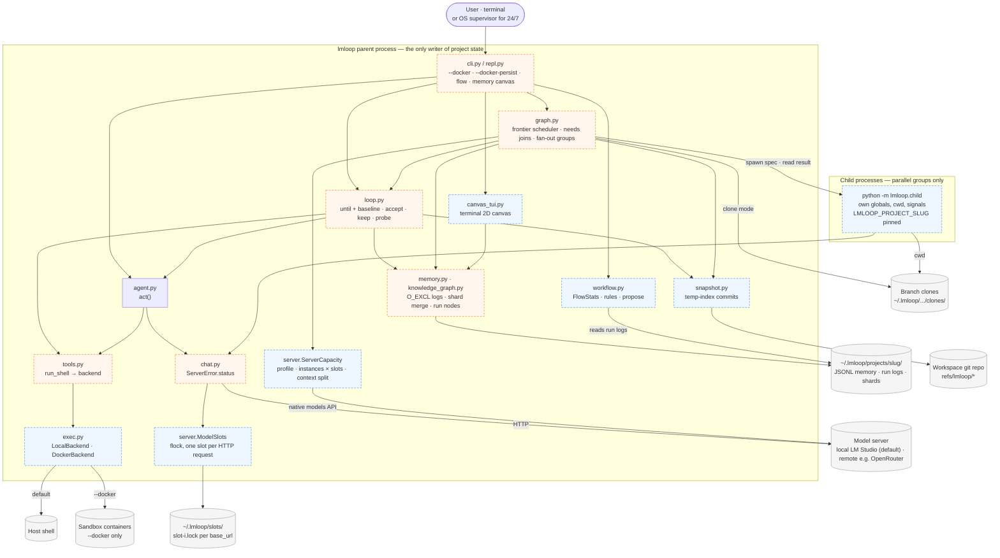
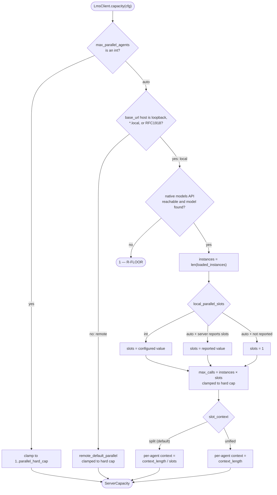
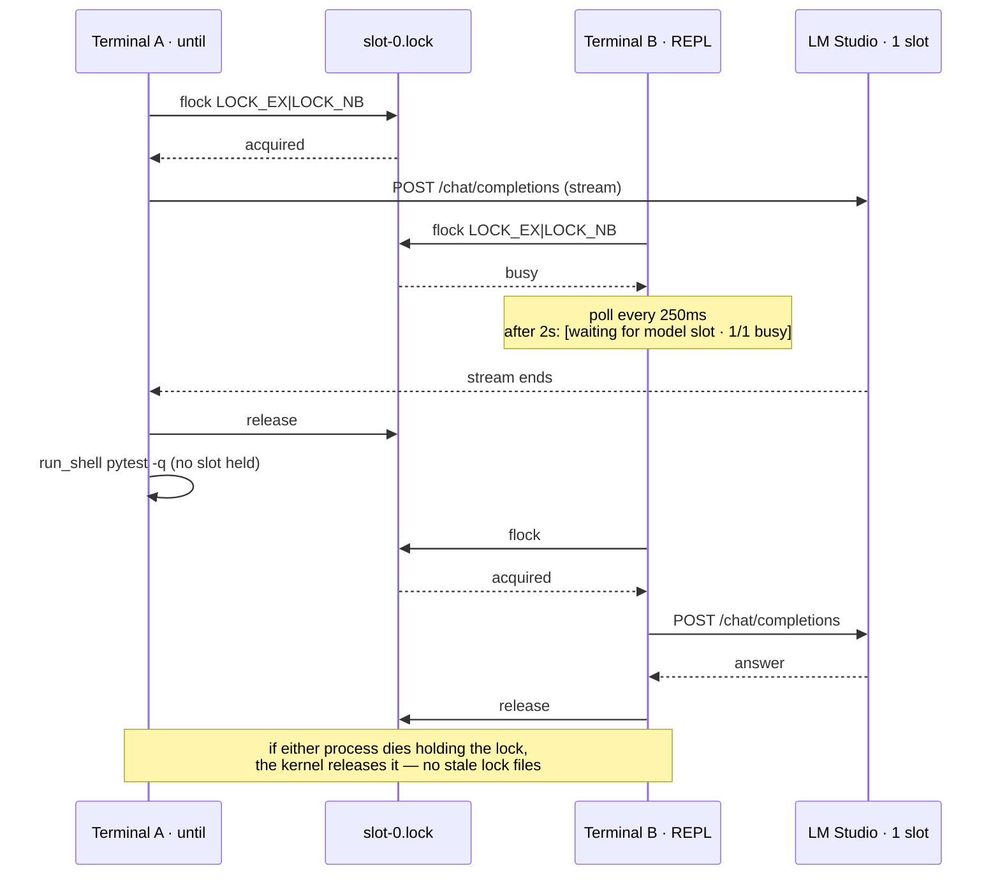
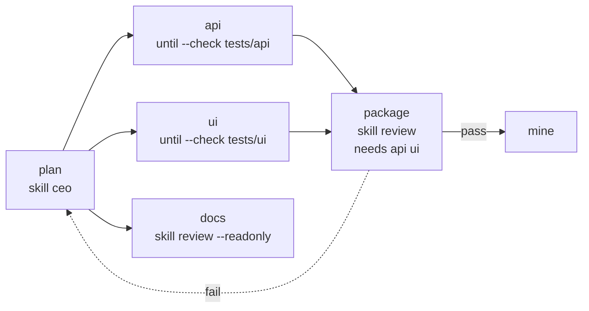
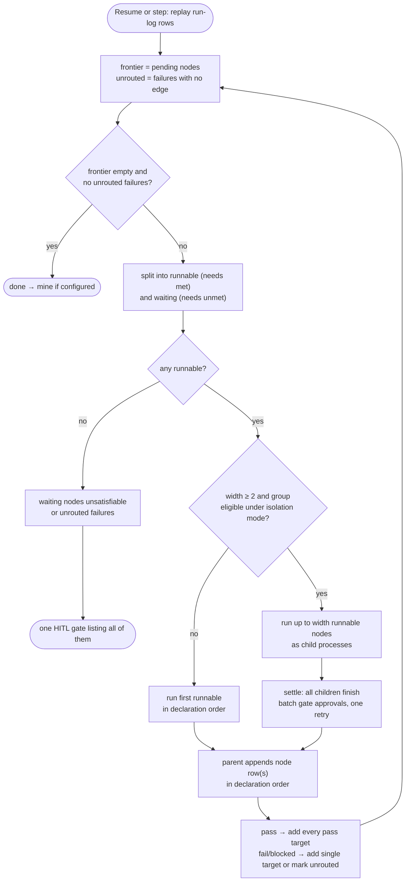
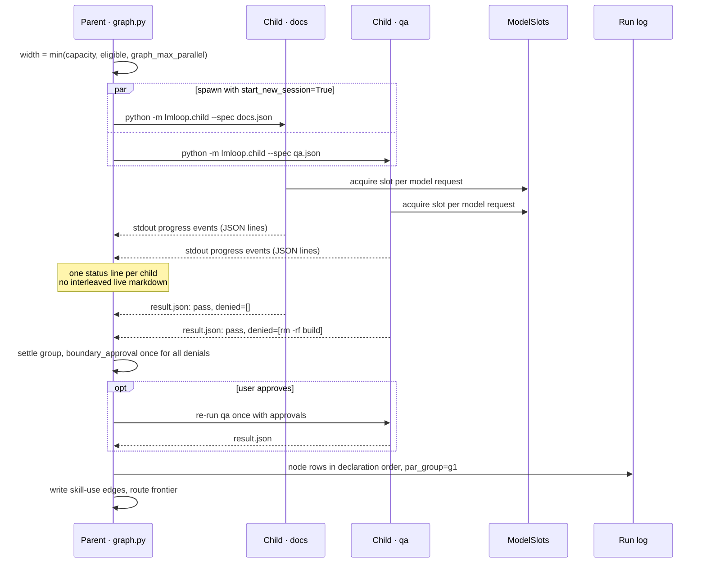
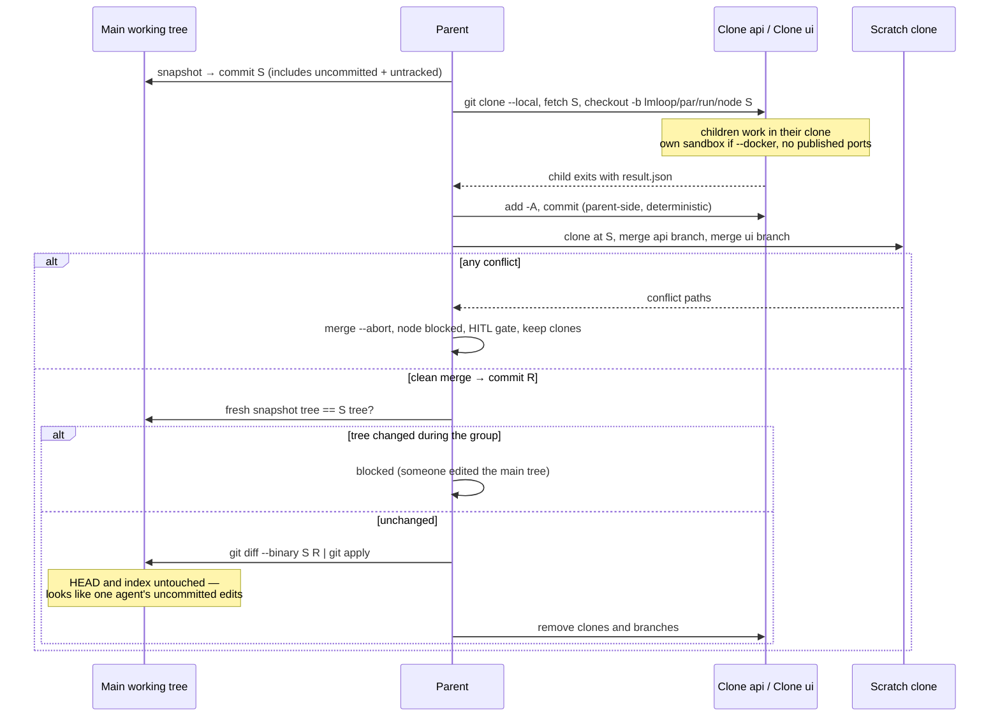
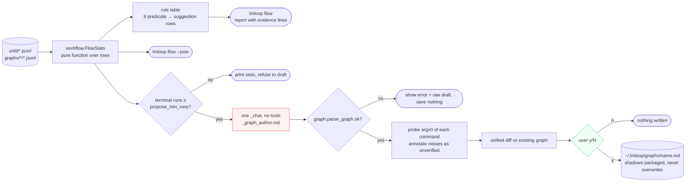

# Design: Capacity-aware DAG workflows, flow mining, and the terminal knowledge canvas

**Status:** proposed (nothing here is implemented)
**Date:** 2026-09-19 · **Revised:** 2026-09-26 (review round 3)
**Depends on:** `graph.py`, `server.py`, `chat.py`, `memory.py`, `knowledge_graph.py`
**Companions:** [DESIGN_SANDBOX_AND_VERIFICATION.md](DESIGN_SANDBOX_AND_VERIFICATION.md) ·
[DESIGN_MEMORY_RETRIEVAL.md](DESIGN_MEMORY_RETRIEVAL.md) (the canvas and parallel children
read memory through the index and `GraphView` defined there)

Four features, in dependency order:

1. **Capacity** — how many model calls this host's server can actually serve at once,
   enforced **host-wide** across every lmloop process, not guessed per process.
2. **DAG fan-out and joins** — a node may start several successors and wait on several
   predecessors.
3. **Bounded parallelism** — fan-out up to capacity, in child processes, with real isolation.
4. **Terminal knowledge canvas** — a 2D map of project memory in the terminal. No browser,
   no listener, no new dependency.

## Review log (round 3)

Defects found by re-auditing revision 2 against the code. Each is fixed in the body.

| # | Sev | Defect in revision 2 | Evidence | Fix (section) |
|---|---|---|---|---|
| 1 | P0 | **Fan-out was unexpressible**, so the parallel design could never run two nodes. The parser rejects two edges with the same `(src, on)`, and traversal follows one edge at a time; the example graph was a straight chain | `graph.py:120-124`, `GraphRun.next_step` | Multi-target `on pass` edges and a frontier computed from the log (§2) |
| 2 | P0 | "Children are threads" over **process-wide state**: `memory._ACTIVE_SESSION` (attributes `in_session` edges), `tools._TOOL_DEFS` / `MAX_OUTPUT` (rewritten by every `build_tools`), `config.project_slug()` (resolved from `Path.cwd()`), and `KeyboardInterrupt` (delivered only to the main thread, so Ctrl-C would hang until every branch finished) | `memory.py:33,440`, `tools.py:958-961`, `config.py:189-191` | Children are subprocesses with their own globals, cwd, and signal handling (§3.2) |
| 3 | P0 | Per-branch trees resolve a **different project slug**: no remote → directory name; a local-clone remote → a filesystem path parsed as `owner-repo`. Branch memory would silently land in another project's directory | `config.project_slug` regex over `remote get-url` | `LMLOOP_PROJECT_SLUG` pins the parent's slug in every child (§3.2) |
| 4 | P0 | Capacity was **per process**: two terminals each resolve 1 and put two concurrent requests on a single-slot laptop | Design gap | Host-wide slot semaphore on `flock`, acquired per HTTP request in `chat.py` (§1.3) |
| 5 | P1 | Capacity counted loaded instances only, ignoring **parallel slots**, and ignored that slot-based servers may **split** the context window across slots. The context bar and the 80% pressure warning would be computed against a window the agent does not have | `LmsClient.context_limit` returns the instance's full `context_length` | Slots config + fail-closed split context (§1.2) |
| 6 | P1 | `git worktree` cannot work inside a per-branch container: a worktree's `.git` file points at an absolute host path in the main repo's `.git/worktrees/`, which does not exist in a container that mounts only the worktree | Git worktree layout | Per-branch `git clone --local` from a snapshot commit; results applied as a verified diff (§3.4) |
| 7 | P1 | Concurrent **session-log creation** races: `new_session_log` checks `exists()` then appends, so two children in the same second can share one file. `record_skill_use` would append to `graph_edges.jsonl` from a child | `memory.py:230-239`, `graph.py:457` | `O_EXCL` creation; children never append to project-level JSONL (§3.3) |
| 8 | P1 | Parallel children cannot answer interactive gates, but `autonomous_gates: none` requires a TTY per request | `GatePolicy` mode `none` | Parallelism disabled under `none`; denials batch to the group boundary (§3.2) |
| 9 | P1 | **No spend ceiling** for remote parallel runs: step budgets bound iterations, not tokens | Design gap | `run_token_budget`, per-role models, cache-stable prefixes, shared frozen clock (§1.5) |
| 10 | P1 | Rate-limit decay needs HTTP status codes, but `ServerError` carries only a message string | `chat.py:50` | `ServerError.status` (§1.4) |
| 11 | P1 | Join semantics "run the first unmet predecessor" jumped over authored edges | Rule analysis | Joins wait in the frontier; an unsatisfiable wait is a gate (§2.2) |
| 12 | P2 | Flow mining referenced data nobody records: declined/dropped gate denials (only approvals are logged), a "banner row" that is display-only, and "no intervening edit" with no tree identity | `loop.boundary_approval`, `run_until` | `denied`, `capacity`, `width`, `tree` fields on rows (§4.1) |
| 13 | P2 | `graph propose` probed commands with `command -v` via `run_shell`, but simple commands exec argv and `command` is a shell builtin | `run_shell` argv path | `shutil.which` on host; `sh -c` under docker (§4.3) |
| 14 | P2 | Canvas text still said "server-side"; `verified_by` concept keys were raw command strings, which can carry tokens (`curl -H 'Authorization: …'`) | Leftover wording; key design | "In the accessor"; hashed command keys (§4.4, §5) |

---

## Architecture overview

Target state with **both** proposals implemented (this doc and
[DESIGN_SANDBOX_AND_VERIFICATION.md](DESIGN_SANDBOX_AND_VERIFICATION.md)). The shipped
system is in [ARCHITECTURE.md](ARCHITECTURE.md#system-overview). Blue dashed boxes are
new modules or types; orange dashed boxes are existing modules that change.



How to read it:

- **Default path** (no flags, local model): `entry → loop/graph → agent → chat → slots →
  model` with `execb → host`. Capacity resolves to 1, so `child` never spawns; the only
  visible change is the slot lock, which also serializes two terminals.
- **Every model call from every process** crosses `ModelSlots`. That is the one place
  host-wide concurrency is enforced, whatever `graph.py` decided.
- **Children never write project state.** Arrows into `state` come only from the parent.

---

## Part 0 — Requirements

| ID | Requirement | Why |
|---|---|---|
| R-HOSTCAP | Concurrency is enforced host-wide, per model server, across all lmloop processes | Two terminals are two agents to a laptop |
| R-FLOOR | Every uncertainty resolves to 1 | An unreachable probe must never license fan-out |
| R-CTX | When slots may split context, each agent's context is `context_length / slots` | The pressure warning must describe the window the agent actually has |
| R-ISO | Parallelism requires isolation: read-only groups, or per-branch clones | One writable tree, many writers = silent corruption |
| R-PROC | Parallel children are processes, never threads | lmloop has process-wide globals, and signals reach only the main thread |
| R-ONEWRITER | Only the parent appends to project-level JSONL; children use `O_EXCL` files or shards | `memory.py` documents a single-writer invariant |
| R-MERGE | Branch results merge only when clean; conflicts block for a human | Silent resolution in an unattended loop is data loss |
| R-SPEND | Remote runs have a token ceiling | Width multiplies cost |
| R-HUMAN | Mined workflows are proposals saved only on `y`, never executed automatically | A mining bug must not become an autonomous action |
| R-TERM | Knowledge canvas is terminal-only | A listener is a security surface this project does not need |
| R-ADD | New node/edge types and row fields are additive | Old binaries must not crash on new data |

### Rejected outright

- **Browser UI on a local port** (R-TERM).
- **Threads for parallel agents** (R-PROC).
- **`git worktree` for isolation** — incompatible with per-branch containers (review #6).
- **Parallel execution without isolation**, and **LLM routing** between nodes.
- **Any new runtime dependency.**

---

## Part 1 — Capacity

### 1.1 Where it lives

`server.py` already owns what the model server is (`LmsClient`, `context_limit`,
vision). Capacity extends that type:

```python
@dataclass(frozen=True)
class ServerCapacity:
    max_calls: int         # concurrent model calls the server should receive, host-wide
    slots_per_instance: int
    profile: str           # "local" | "remote"
    reason: str            # one line for /stats and the run-start banner
```

`LmsClient.capacity(cfg) -> ServerCapacity`, and `LmsClient.context_limit()` divides by
`slots_per_instance` when context is split (§1.2).

### 1.2 Resolution (deterministic, fail-closed)

```
explicit max_parallel_agents: <int>   -> clamp(int, 1, parallel_hard_cap)      # cap default 8
auto + local profile                  -> loaded_instances × slots_per_instance
auto + remote profile                 -> remote_default_parallel (4), clamped
any probe error / missing field       -> 1                                     # R-FLOOR
```

- **Local profile** = `base_url` host is loopback, `*.local`, or RFC1918. That covers the
  shipped LM Studio default, Ollama, and a llama.cpp server on the LAN.
- **`loaded_instances`** = `len(entry["loaded_instances"])` for the configured model in
  the native models response, which `context_limit()` already reads.
- **`slots_per_instance`** = `local_parallel_slots` (`auto` | int, default `auto`).
  `auto` uses a numeric slot/parallel field from the instance's `config` **only if the
  running server reports one**; the field name is confirmed against the server at
  implementation time, never guessed. Absent → 1.
- **Context under slots** (R-CTX): `slot_context` is `split` (default) or `unified`. With
  `split`, each agent's window is `context_length / slots_per_instance`, and that value
  feeds the context bar, the 80% pressure warning, and compaction advice. Fail-closed:
  lmloop assumes split unless the user states otherwise, because overestimating the
  window produces truncation or server errors mid-run, while underestimating only
  compacts early.



For a laptop serving one `qwen3.6-A3B` instance with default settings this resolves to
**1**. A smaller model loaded with four slots resolves to 4 — at a quarter of the window
each unless the server is known to use a unified cache. On local hardware, extra slots
mostly buy batched decoding; prompt processing still contends for the same compute, so
a width of 4 is rarely 4× throughput. `lmloop flow` measures whether it paid (§4.1).

### 1.3 Host-wide enforcement (R-HOSTCAP)

A per-process number cannot stop two terminals from oversubscribing a laptop. A small
leaf type in `server.py` makes the limit real:

```python
class ModelSlots:
    """Host-wide concurrency for one base_url via flock'd slot files."""
    def __init__(self, base_url: str, capacity: int): ...
    def acquire(self, on_wait) -> "Slot": ...     # context manager
```

- Files: `~/.lmloop/slots/<sha8(base_url)>/slot-<i>.lock`, `i` in `[0, capacity)`.
- `acquire` tries `fcntl.flock(LOCK_EX | LOCK_NB)` on each; if all are held, it polls every
  250ms and, after 2s, calls `on_wait` once: `[waiting for model slot · 1/1 busy]`.
- **Crash-safe by construction:** the kernel drops `flock` when a process dies, so there
  are no stale locks to clean up — the reason for `flock` over pid files.
- **Scope is one HTTP request**, acquired inside `chat._chat` / `_chat_stream` (a stream
  holds its slot until the stream ends). An agent running a 60-second `pytest` does not
  hold a model slot; only generation does. This covers every caller uniformly: REPL
  turns, `until`, graph children, `memory mine`, skill drafting.
- `chat.py` stays a leaf: `ModelSlots` lives in `server.py`, which `chat.py` already imports.
Two terminals against a single-slot laptop server. The lock is held only while tokens
are generated, never while tools run:



- Mismatched explicit overrides across processes (one says 2, another 1) yield the larger
  slot set; that is the user's explicit choice, documented as such.
- Non-POSIX platforms (no `fcntl`): capacity is forced to 1 and enforcement is in-process
  only. lmloop's setup targets macOS and Linux.

### 1.4 Rate-limit decay

`ServerError` gains `status: int | None`, set by `chat._raise_http_error` from
`e.code`. During a parallel invocation, a 429 or 503 — reported by a child in its result
(§3.2) — halves the width for all later groups in that invocation, floor 1, with one
status line: `[graph · rate limited — width 4 → 2 for this run]`. Running children are not
killed. Width never re-widens within an invocation.

### 1.5 Spend control (remote profile)

| Lever | Design |
|---|---|
| `run_token_budget` (default `0` = off) | The parent sums `total_tokens` from its own calls and every child's reported usage; crossing the budget pauses the run exactly like `graph_max_steps`, and `/continue` resumes. Step budgets bound iterations; this bounds money |
| Per-role models | `eval_model`, `probe_model`, `mine_model` (empty = main model), same `base_url`. `isolated_act` already takes the model as a parameter. A different checker model also decorrelates the errors that make same-model auditing weak |
| Cache-stable prefixes | The system prompt is assembled volatile-last; parallel siblings receive the **same frozen `clock_now`** from the parent, so their system prompts are byte-identical and one cached prefix serves them all. Revision 2 would have given each child its own clock and a cold cache |
| Explicit cache breakpoints | `prompt_cache: off` (default) \| `system`. `system` marks the system message with a provider cache breakpoint for providers that require explicit annotation; automatic-prefix providers need only stability. Off by default because a one-shot run pays the cache-write premium with no reads |

Ceilings that already exist and stay: `eval_max_rounds` (8) vs `max_rounds` (60), the
repeated-tool-set short-circuit, `max_tool_output`, bounded memory injection, and the
readonly tool set trimming schemas out of eval requests.

### 1.6 Surfacing

```
capacity: 1 · local · 1 instance × 1 slot · sequential
capacity: 4 · local · 1 instance × 4 slots · context 8192/agent (split)
capacity: 4 · remote · max_parallel_agents auto · budget 2.0M tokens
```

Shown in `/stats` and the graph run-start banner, and recorded on the run's meta row.

---

## Part 2 — DAG fan-out and joins

### 2.1 Syntax

Two additive changes to the line format:

```
node plan    skill ceo
node api     until --check 'pytest -q tests/api' implement the API
node ui      until --check 'pytest -q tests/ui' implement the UI
node docs    skill review --readonly check the docs match the API
node package skill review needs api ui
node mine    mine

edge plan    -> api ui docs            # fan-out: multiple targets, pass only
edge api     -> package
edge ui      -> package
edge package -> mine on pass
edge package -> plan on fail
```

- **Multi-target edges** are allowed only for `on pass`. `fail` and `blocked` edges stay
  single-target (parse error otherwise). One edge row per `(src, on)` remains the rule, so
  the existing duplicate-edge check is unchanged; `EdgeDef.dst` becomes `dsts: tuple`.
- **`needs a b`** on a node: it may run only when `a` and `b` each have a latest status of
  `pass` in this run.
- An old binary reading a graph file with a multi-target edge fails at **parse time**
  ("edge extra tokens…") before running anything — fail-closed across versions.

The example graph as the scheduler sees it. Solid edges are `on pass`; `package`
waits in the frontier until both of its `needs` have passed:



### 2.2 Execution model: a frontier, replayed from the log

`GraphRun` computes a **frontier** (set of pending node names) by replaying its rows; no
new persisted state is needed, so resume keeps working the way it does today.

1. Start: frontier = `{start}`.
2. A `node` row `(n, pass)` removes `n` and adds every target of `n`'s pass edge.
3. `(n, fail|blocked)` removes `n` and adds its single `on fail|blocked` target, or records
   an unrouted failure if there is none.
4. A frontier node is **runnable** when its `needs` are all satisfied; otherwise it
   **waits**. Waiting is not an error.
5. Unrouted failures and unsatisfiable waits (a needed predecessor is neither passed, in
   the frontier, nor reachable from it) raise **one** HITL gate listing them all.
6. Frontier empty and nothing waiting → the run is done (then `mine`, as today).
7. `mine` nodes run only when they are the sole runnable frontier member, and running one
   ends the run — today's semantics.



Sequential execution (the default, and always with capacity 1) runs runnable frontier
nodes one at a time in declaration order. A graph without fan-out or `needs` behaves
exactly as it does today; that equivalence is a named test.

### 2.3 Validation (fail closed)

1. `needs` names an unknown node, or the node itself.
2. `needs` forms a cycle through `needs` alone (retry cycles through `edge` stay legal).
3. A `needs` predecessor is unreachable from the start.
4. `mine` nodes have `needs`, or appear in a multi-target edge.
5. A multi-target edge on `fail` or `blocked`.

Kahn's algorithm over `needs` plus a BFS over edges, next to the existing validation.

### 2.4 Join handoff

Each satisfied predecessor's last summary, labeled and clipped to `join_handoff_chars`
(1500), in `needs` order. No model call merges handoffs.

---

## Part 3 — Bounded parallelism

### 3.1 When it happens

Only when **all** hold: capacity ≥ 2, `parallel_isolation` is not `off`,
`autonomous_gates` is not `none`, and the frontier has ≥ 2 runnable nodes eligible under
the isolation mode.

```
width = min(capacity.max_calls, len(eligible_runnable), graph_max_parallel or ∞)
```

The slot semaphore (§1.3) enforces the host-wide limit even if width is misjudged; width
decides how many children to spawn, the semaphore decides how many generate at once.

| `parallel_isolation` | Group composition | Isolation |
|---|---|---|
| `off` (default) | one node | — |
| `readonly` | N nodes marked `--readonly`, **or** one writing node alone — never mixed, since a reader alongside a writer sees torn state | Readonly tool set in the shared workspace |
| `clone` | any nodes | One `git clone --local` per branch (§3.4) |

### 3.2 Child processes (R-PROC)

The parent spawns each group member as
`sys.executable -m lmloop.child --spec <spec.json>` — a module entry point, not a new
CLI stem. The spec carries the node definition, handoff, workspace path, frozen
`clock_now`, model, exec flags (`--docker` etc.), and a result path.

- **Environment:** `LMLOOP_PROJECT_SLUG=<parent slug>` (honored first by
  `config.project_slug`), inherited `LMLOOP_HOME`, cwd = the child's workspace.
- **Isolation of globals:** each child has its own `_ACTIVE_SESSION`, `_TOOL_DEFS`,
  `MAX_OUTPUT`, trash stamp, and cwd. This is the reason for processes: lmloop's
  process-wide state is fine for one agent per process and wrong for several.
- **Signals:** children start with `start_new_session=True`, so a terminal Ctrl-C reaches
  only the parent. The parent sends SIGINT to each child's process group, waits
  `child_grace_s` (10) for them to log and exit, then SIGKILLs, and writes a pause row.
  Revision 2's threads could not be interrupted at all.
- **Gates:** children have no TTY. They run the `GatePolicy` in its autonomous mode;
  recoverable operations auto-approve, irreversible ones are denied and returned in the
  result. After the group settles the parent runs one `boundary_approval` for all
  denials and re-runs each affected node once with its approvals — the same one-retry rule
  skill nodes already have. `autonomous_gates: none` needs a TTY per request, so it
  disables parallelism.
- **Result file:** `{status, summary, session, denied, usage, http_statuses, tree}`.
  The parent reads it; a missing or unparsable result is `blocked`, never `pass`.
- **Progress:** child stdout is a line protocol of small JSON events
  (`{"node":"api","phase":"maker","step":3,"tool":"run_shell pytest -q"}`). Parent-side
  reader threads only update status lines and touch no lmloop globals. Child stderr goes
  to a per-child log file.

One `readonly` group of two, with a denial and a Ctrl-C-free happy path:



On Ctrl-C the parent, which is the only process attached to the terminal's signal,
sends SIGINT to each child's process group, waits `child_grace_s`, SIGKILLs any
survivor, and appends a pause row; resume re-runs the whole group.

### 3.3 One writer per file (R-ONEWRITER)

- The **run log** is written only by the parent, one `node` row per child in declaration
  order after the group settles, each with a `par_group` id. Crash mid-group → the whole
  group re-runs on resume, matching today's "event written last" rule.
- **Session logs** are created with `O_CREAT | O_EXCL` (retrying the suffix on
  `FileExistsError`), fixing the existing check-then-append race that only mattered once
  several processes existed.
- **Skill-use and graph edges** for child nodes are written by the parent from the result,
  not by `record_skill_use` inside the child.
- **Memory writes** in `clone` mode (readonly children cannot write memory) go to shards
  `learnings.<run>.<node>.jsonl` / `decisions.<run>.<node>.jsonl`, selected by
  `LMLOOP_MEMORY_SHARD`. The parent appends shard rows into the canonical files in
  declaration order when the group settles, then deletes the shards.

### 3.4 Clone mode

1. **Base:** the parent takes an R-SNAP snapshot of the main working tree (companion doc
   §1.6) and uses that commit `S` as the base, so branches start from the real working
   state including uncommitted edits. Clones at `HEAD` would silently drop them.
2. **Branches:** `git clone --local --no-checkout <repo> <dir>` (hardlinked objects,
   standalone `.git`), then `git -C <dir> fetch <repo> S && git -C <dir> checkout -b
   lmloop/par/<run>/<node> S`. Directories live under
   `~/.lmloop/projects/<slug>/clones/<run-ts>/<node>`, never inside the project. Under
   `--docker` each clone gets its own container automatically (different realpath hash);
   published ports are disabled for branch containers so ranges cannot collide.
3. **Commit:** after a child exits, the **parent** commits the clone's tree
   (`add -A`, `commit`) — deterministic, not dependent on the agent remembering to.
4. **Integrate** in a scratch clone at `S`: merge each branch in declaration order. Any
   conflict → abort, record `blocked`, raise the gate with the conflicting paths, keep the
   clones for inspection. lmloop never resolves a conflict.
5. **Apply:** verify the main working tree still equals `S` (fresh snapshot tree ==
   `S^{tree}`; nothing runs in the main tree during a clone group). If it differs →
   `blocked`. Otherwise apply `git diff --binary S R | git apply` to the working tree. The
   user's `HEAD` and index are untouched, and the result looks exactly like a single agent's
   uncommitted edits — lmloop's existing contract.
6. **Cleanup:** clones and branches are removed after a successful apply, kept on
   `blocked`, and pruned after 14 days.



### 3.5 Honest defaults

With the shipped local `base_url` and default config: capacity 1, `parallel_isolation:
off`, every graph runs sequentially exactly as today, and the only new behavior is the
slot lock around each request — which, at capacity 1, also stops two terminals from
colliding on a laptop.

---

## Part 4 — Workflow identification and proposal



Only the red node calls a model, and only the green node can write a file.

### 4.1 `lmloop flow` (deterministic)

`workflow.py` (leaf) reads until and graph logs into `FlowStats`. Revision 2 listed
metrics whose inputs were never recorded; these row fields make them computable:

| New field | On | Enables |
|---|---|---|
| `denied: [cmd…]` | maker rows, graph `node` rows | All gate denials, including declined and dropped ones — not just approvals |
| `capacity`, `width` | meta row; `par_group` rows | Whether a run could have fanned out, and whether it did |
| `tree` | every row that took a snapshot (or `HEAD^{tree}` when clean) | Whether files changed between two checks |
| `usage` | maker/eval/node rows | Tokens per node and per run (cost reporting) |

| Metric | Why |
|---|---|
| Outcomes (pass / gate-no / abandoned-paused) | Is the loop finishing? |
| Maker cycles: median, p90, max | p90 near `until_max_steps` means the budget ended runs |
| Check pass rate, cycles to first pass | Flaky or impossible gates |
| Eval `blocked` rate | A checker short on evidence |
| Transition frequencies | Real topology vs authored |
| Denials by command shape | Recurring irreversible needs |
| Wall-clock and tokens per node and group | Where time and money went; whether parallelism paid |

`lmloop flow` prints; `--json` emits. No model calls.

### 4.2 Rule-based suggestions

| Rule | Fires when | Suggestion |
|---|---|---|
| `budget-bound` | p90 cycles ≥ 0.9 × `until_max_steps`, usually paused | Raise the budget or split the goal |
| `weak-gate` | `--check` passes at baseline or on cycle 1 in ≥ 80% of runs | Enable `require_negative_baseline`, or use `--keep` if it is an invariant |
| `flaky-gate` | Same check changes result between two rows with **identical `tree`** | Quarantine it; add a stable `--accept` (disabled when snapshots are off) |
| `blocked-loop` | Eval `blocked` ≥ 30% | Author an `on blocked` edge |
| `repeat-denial` | Same denied shape in ≥ 3 runs | Pre-approve, or move it into an acceptance command |
| `dead-node` | Never entered in ≥ 5 runs | Remove it |
| `hot-cycle` | One `on fail` edge ≥ 50% of transitions | Add `--accept`, not more retries |
| `serial-fanout` | Independent nodes always sequential while capacity ≥ 2 | Fan-out edge + `parallel_isolation: readonly` |
| `slow-parallel` | Group wall-clock ≥ 0.8 × sum of members' solo times | Width isn't paying on this server; lower it |

Each prints its evidence line. Nothing is written.

### 4.3 `lmloop graph propose [name]`

Only with `terminal_runs >= propose_min_runs` (5):

1. Compact factual summary from `workflow.py`.
2. One `_chat`, **no tools**, prompt in `skills/_graph_author.md` (private).
3. Parsed by `graph.parse_graph` before display; failure saves nothing.
4. Each command's `argv[0]` is probed with `shutil.which` on the host, or
   `sh -c 'command -v "$1"' _ <argv0>` under `--docker`; misses are annotated
   `# unverified: <cmd>`.
5. Unified diff against the existing graph of that name.
6. Saved to `~/.lmloop/graphs/<name>.md` only on `y`; packaged graphs are never overwritten.

`propose` becomes a reserved graph name.

### 4.4 Growing the knowledge network

When `use_graph` is on, written by the parent at terminal status, once per run:

| New node | Key |
|---|---|
| `run` | `until:<ts>` / `graph:<name>:<ts>` |
| `goal` | slug of the goal text |
| `concept` (existing type) for a command | `cmd:<argv0>:<sha8(full command)>`, label = `argv0` + first argument |

| New edge | Meaning |
|---|---|
| `ran_node` | `run` → skill/concept entered |
| `verified_by` | `run` → command concept for each check/acceptance command |
| `produced` | `run` → learning mined from it |

Hashed command keys keep a `curl -H 'Authorization: …'` check out of node keys and
labels. About 700 nodes per month of hourly runs, inside the canvas cap.

---

## Part 5 — Terminal knowledge canvas

### 5.1 Data layer

```python
@dataclass(frozen=True)
class CanvasNode:
    id: str; type: str; label: str
    detail: str        # learning/decision text or path — never a transcript
    confidence: int; ts: str; degree: int
    x: float; y: float # deterministic layout

@dataclass(frozen=True)
class CanvasView:
    nodes: tuple[CanvasNode, ...]
    edges: tuple[tuple[str, str, str], ...]
    truncated: bool; total_nodes: int
```


`KnowledgeGraph.canvas_view(query="", types=(), limit=canvas_max_nodes)`. Filtering and
layout happen in the accessor, so the TUI is only a renderer. Layout bands nodes by type
on the y-axis, orders by degree then key, and adds seeded jitter from `sha1(id)` — stable
across sessions, no force simulation.

### 5.2 `lmloop memory canvas` / `/memory canvas`

An `arg_choices` addition to the existing `memory` stem — no new stem. A `prompt_toolkit`
full-screen application:

```
┌ canvas ─────────────────────────────────┬ detail ───────────────┐
│  ·  ·  ▣ ·   ·                          │ learning:venv-python  │
│     ·  ·  ·  ▣  ·   ·                   │ confidence 8 · 3d ago │
│  ·  ▣₃ ·                                │ setup-lmloop.sh reuses│
│  [decisions] [learnings] [files] …      │ an existing venv …    │
├─────────────────────────────────────────┤ neighbors:            │
│ / search  t types  g clusters  r reload │  → session:20260918   │
└─────────────────────────────────────────┴───────────────────────┘
```

- Canvas pane: layout projected to character cells; arrows/`hjkl` pan, `+`/`-` zoom,
  `Tab` cycles, `Enter` selects. Collisions show a count glyph (`▣₃`) whose members are
  listed in the detail pane.
- Detail pane: type, effective confidence, age, source, provenance path, and selectable
  1-hop neighbors for keyboard traversal.
- `/` search, `t` type filter, `g` contradiction clusters, `r` re-read JSONL, `q` quit.
- Viewport culling; redraw on input only; read-only.
- `use_graph` off → `MSG_GRAPH_OFF`; `prompt_toolkit` unavailable → today's
  `/memory graph` text summary.

---

## Part 6 — Config and commands

| Key | Default | Meaning |
|---|---|---|
| `max_parallel_agents` | `auto` | `auto` \| int |
| `local_parallel_slots` | `auto` | `auto` (server-reported only, else 1) \| int |
| `slot_context` | `split` | `split` \| `unified` — how slots share the context window |
| `remote_default_parallel` | `4` | Auto width for a non-local `base_url` |
| `parallel_hard_cap` | `8` | Ceiling for any resolution or override |
| `parallel_isolation` | `off` | `off` \| `readonly` \| `clone` |
| `graph_max_parallel` | `0` | Extra per-invocation cap; `0` = none |
| `child_grace_s` | `10` | Interrupt grace before SIGKILL |
| `run_token_budget` | `0` | Pause after this many tokens; `0` = off |
| `eval_model` / `probe_model` / `mine_model` | `""` | Per-role model on the same endpoint |
| `prompt_cache` | `off` | `off` \| `system` |
| `join_handoff_chars` | `1500` | Per-predecessor clip |
| `propose_min_runs` | `5` | Runs required before drafting |
| `canvas_max_nodes` | `2000` | Canvas cap |

| Command | Effect |
|---|---|
| `lmloop flow [--json]` / `/flow` | Deterministic stats + rule-based suggestions (the one new stem) |
| `lmloop graph propose [name]` | Draft, review, save on `y` |
| `lmloop memory canvas` / `/memory canvas` | Terminal canvas |

---

## Part 7 — Task breakdown

### Phase K — capacity

| ID | Task | Files | Tests | Done when |
|---|---|---|---|---|
| K1 | `ServerCapacity` + resolution rules; local profile detection | `server.py` | Loopback/`.local`/RFC1918 → local; probe error → 1; override clamped | Every uncertain path returns 1 |
| K2 | `loaded_instances` × slots; `slot_context` division in `context_limit` | `server.py` | 1×1 → 1; 1×4 split → context/4; missing slot field → 1 | The pressure warning uses the per-agent window |
| K3 | `ModelSlots` flock semaphore, acquired per request in `_chat` / `_chat_stream` | `server.py`, `chat.py` | Two holders at capacity 1 serialize; a killed holder frees its slot; wait callback fires once after 2s | Two terminals cannot oversubscribe a laptop |
| K4 | `ServerError.status`; decay rule | `server.py`, `chat.py`, `graph.py` | 429 → status 429; decay once per event; never re-widens | Decay is driven by real codes |
| K5 | `run_token_budget`, per-role models, shared `clock_now`, `prompt_cache: system` | `loop.py`, `graph.py`, `chat.py` | Budget pauses and resumes; eval uses `eval_model`; siblings' system prompts byte-identical | Remote spend is bounded |
| K6 | `/stats` + banner + meta-row `capacity` | `ui.py`, `status.py`, `graph.py` | Text states number and reason | Width is never a guess |

### Phase D — fan-out and joins

| ID | Task | Files | Tests | Done when |
|---|---|---|---|---|
| D1 | Multi-target pass edges (`EdgeDef.dsts`), `needs`, validation rules 1–5 | `graph.py` | Each rule fails closed with the node name; `company.md` parses unchanged | Old graphs parse identically |
| D2 | Frontier replay in `GraphRun`; runnable vs waiting; one combined gate; termination | `graph.py` | Chain graph behaves exactly as today (named equivalence test); diamond waits correctly; unsatisfiable wait gates | Resume needs no new persisted state |
| D3 | Join handoff | `graph.py` | Labeled, clipped, ordered | No model merges handoffs |
| D4 | Docs | docs | — | Fan-out and `needs` documented beside `edge` |

### Phase P — parallelism

| ID | Task | Files | Tests | Done when |
|---|---|---|---|---|
| P1 | `lmloop.child` entry, spec/result files, `LMLOOP_PROJECT_SLUG` honored by `project_slug` | `child.py`, `config.py` | Child resolves the parent's slug from any cwd; missing result → `blocked` | Children never write to another project |
| P2 | Spawn, progress protocol, group settle, parent-only run-log rows with `par_group` | `graph.py`, `status.py` | Rows in declaration order; crash mid-group re-runs the group | One writer for the run log |
| P3 | Signals: new sessions, SIGINT fan-out, grace, SIGKILL, pause row | `graph.py` | Simulated Ctrl-C terminates children and pauses | Ctrl-C works during a group |
| P4 | Gate batching + one retry; parallelism off under `autonomous_gates: none` | `graph.py`, `loop.py` | Denials from two children asked once | No child waits on a TTY |
| P5 | `O_EXCL` session logs; parent-written skill edges; memory shards + merge | `memory.py`, `graph.py`, `knowledge_graph.py` | Same-second creation from two processes yields two files; shard merge order deterministic | R-ONEWRITER holds |
| P6 | `readonly` groups (never mixed with a writer) | `graph.py` | Mixed group rejected; readonly members lack write tools | Safe fan-out with no git work |
| P7 | `clone` mode: snapshot base, clones, parent commit, scratch-clone integration, verified apply, cleanup | `graph.py`, `snapshot.py` | Uncommitted base edits present in branches; conflict → blocked, clones kept; main tree changed mid-group → blocked; clean → diff applied, HEAD/index untouched | Parallel writes never share a tree |
| P8 | Docs, "default is sequential" first | docs | — | Defaults unambiguous |

### Phase W — workflow mining

| ID | Task | Files | Tests | Done when |
|---|---|---|---|---|
| W1 | Row fields `denied`, `capacity`, `width`, `tree`, `usage` | `loop.py`, `graph.py` | Present when applicable; old readers ignore them | Every metric has a recorded input |
| W2 | `workflow.py` `FlowStats` | `workflow.py` | Fixture logs → exact values; empty history → empty stats | Pure function over rows |
| W3 | Nine rules as data with evidence | `workflow.py` | Each fires and does not fire; `flaky-gate` off without `tree` | Rules extendable without touching the printer |
| W4 | `lmloop flow` / `/flow` / `--json` | `commands.py`, `cli.py`, `repl.py`, `ui.py` | Routing; stable JSON | Works with `use_graph` off |
| W5 | `graph propose` + reserved name + `which`-based probing | `graph.py`, `skills/_graph_author.md`, `cli.py`, `repl.py`, `commands.py` | Below minimum refuses; unparseable writes nothing; `n` writes nothing; packaged never overwritten | No graph written without `y` |
| W6 | `run`/`goal`/command-concept nodes and edges | `knowledge_graph.py`, `loop.py`, `graph.py` | Once per run; hashed command keys; `use_graph` off → nothing | Runs appear in `/memory graph` |

### Phase C — terminal canvas

| ID | Task | Files | Tests | Done when |
|---|---|---|---|---|
| C1 | `canvas_view()` with filter, cap, layout | `knowledge_graph.py` | Identical coordinates across runs; cap sets `truncated` | Layout is a pure function |
| C2 | Projection, bucketing, culling helpers | `canvas_tui.py` | Collisions counted and listed; culling excludes off-screen | Testable without a terminal |
| C3 | Full-screen app and key bindings | `canvas_tui.py` | Bindings dispatch to helpers; no `agent`/`loop`/`graph` import | Keyboard traversal end to end |
| C4 | `memory canvas` wiring + degradation | `commands.py`, `cli.py`, `repl.py` | Graph off → message; no `prompt_toolkit` → text | No new stem in `/help` |
| C5 | Docs | docs | — | Terminal-only, read-only stated |

### Sequencing

1. **K1–K3** first: on the shipped default they resolve to 1 and add the slot lock, which
   is immediately useful — two terminals stop colliding on a laptop.
2. **D1–D3**: fan-out and joins are useful sequentially.
3. **P1–P6** (`readonly`) before **P7** (`clone`): most of the value, none of the git risk.
4. **W1** early, so logs start recording the fields the rules need; **W2–W4** anytime after.
5. **C1** before C2/C3.
6. **K5**, then **W5** last — the only model-in-the-loop part.

---

## Part 8 — Risk register

| Risk | Sev | Mitigation | Residual |
|---|---|---|---|
| Laptop oversubscribed by several processes | P0 | R-HOSTCAP flock semaphore per request | Explicit mismatched overrides take the larger value |
| Parallel writers corrupt tree or memory | P0 | R-ISO, R-PROC, R-ONEWRITER | `clone` conflicts need a human |
| Branch memory written to the wrong project | P0 | `LMLOOP_PROJECT_SLUG` | None known |
| Silent merge loses work | P0 | R-MERGE + verified apply | Run stalls for a human, by design |
| Mined workflow runs itself | P0 | R-HUMAN | A human can approve a bad graph |
| Context overestimated under slots | P1 | R-CTX fail-closed split | Unified-cache servers compact early until configured |
| Remote spend runaway | P1 | `run_token_budget`, role models, cache-stable prefixes | Budget off by default |
| Rate limiting burns the step budget | P1 | Status-driven decay | Throughput drops for the rest of the invocation |
| Ctrl-C during a group | P1 | New sessions + SIGINT fan-out + grace | Children killed after 10s lose in-flight work (re-run on resume) |
| Hallucinated commands in a draft | P1 | `which` probing + `# unverified` + diff | Human must read the diff |
| Secret displayed in canvas | P1 | No transcripts; hashed command keys | Learning text shows as written |
| New fields/types confuse old readers | P2 | R-ADD; multi-target edges fail at parse time in old binaries | Old `/memory graph` shows unfamiliar types |

---

## Part 9 — What this does not become

Not a workflow engine (no expressions, timers, or retry policies beyond `until`), not a
distributed system (child processes on one machine, bounded by what the model server can
serve), not a dashboard or web app, and not a graph database — traversal stays linear
scans over JSONL a human can still `cat`.
