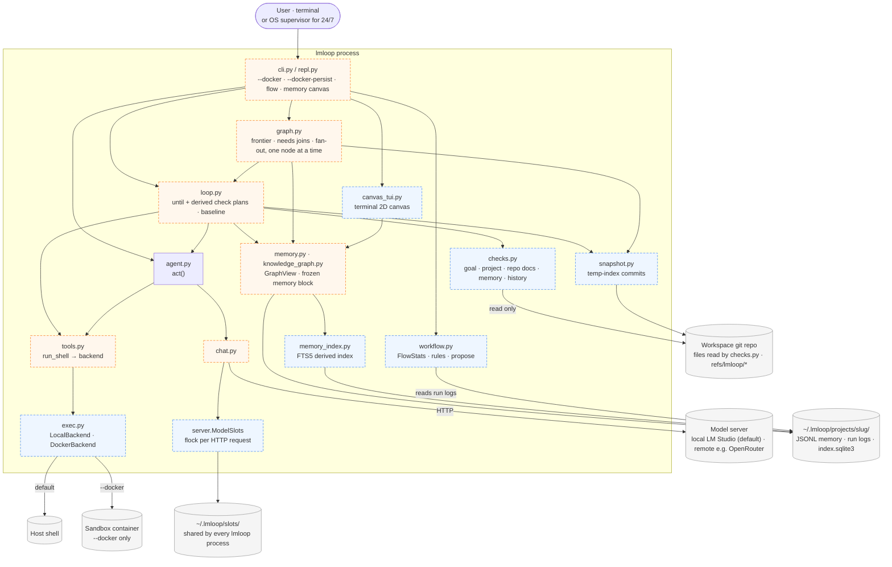
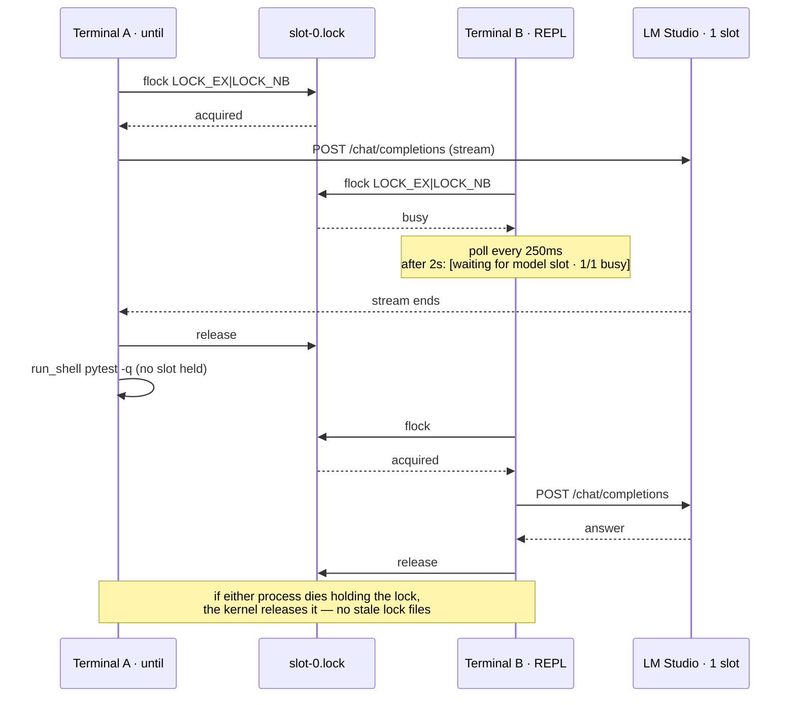
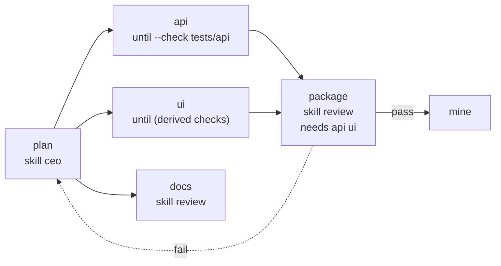
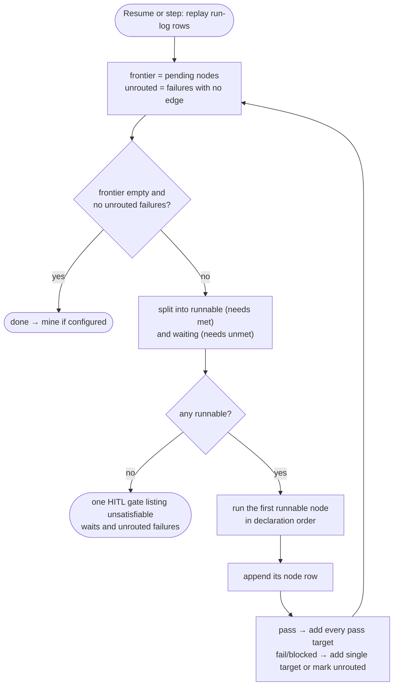
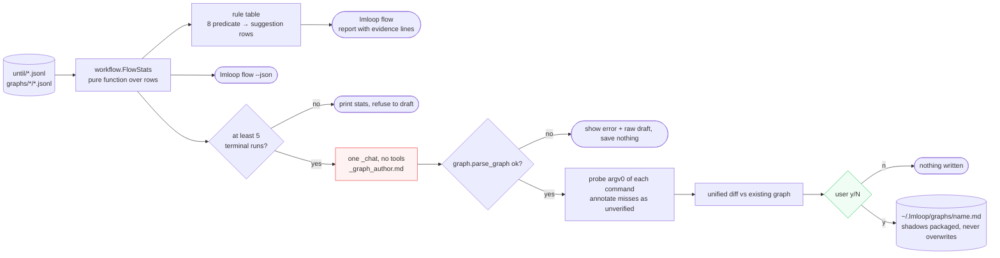
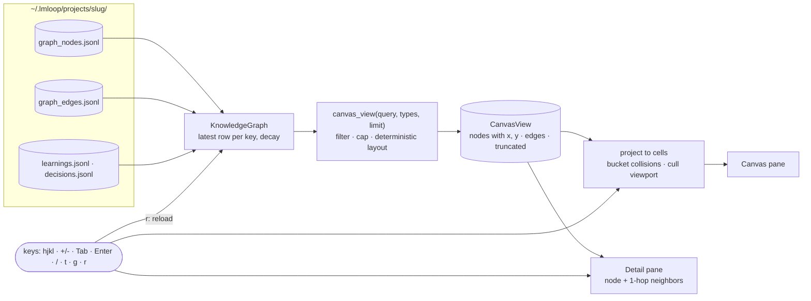

# Design: DAG workflows, flow mining, and the terminal knowledge canvas

**Status:** Phases K, D, W, and C shipped (text canvas and full-screen TUI). Parallel agents (Part 5) stay deferred.
**Date:** 2026-09-19 · **Revised:** 2026-09-26 (round 5: parallel agents deferred)
**Depends on:** `graph.py`, `server.py`, `chat.py`, `memory.py`, `knowledge_graph.py`
**Companions:** [DESIGN_SANDBOX_AND_VERIFICATION.md](DESIGN_SANDBOX_AND_VERIFICATION.md) ·
[DESIGN_MEMORY_RETRIEVAL.md](DESIGN_MEMORY_RETRIEVAL.md) ·
[DESIGN_ROADMAP.md](DESIGN_ROADMAP.md)

Four features, all running **one agent at a time**:

1. **Model concurrency lock** — a host-wide limit on in-flight model requests, so two
   terminals cannot oversubscribe a single-slot laptop server.
2. **DAG fan-out and joins** — a node may start several successors and wait on several
   predecessors. Nodes still run one at a time.
3. **Flow mining** — deterministic statistics over run logs, rule-based suggestions, and a
   human-approved graph draft.
4. **Terminal knowledge canvas** — a 2D map of project memory in the terminal.

**Parallel agents are deferred** (Part 5). On a laptop serving one model they deliver no
speedup, and the review rounds showed how much machinery a correct version needs. The
constraints that work uncovered are recorded so a future design starts from them.

### What shipped (2026-10)

| Phase | Shipped in |
|---|---|
| K1–K3 `model_concurrency`, `ModelSlots`, `run_token_budget`, `eval_model` | `server.py`, `chat.py`, `loop.py`, `graph.py` |
| D1–D3 fan-out, `needs`, join handoffs, frontier replay | `graph.py` |
| W1–W5 run-log fields, `FlowStats`, `lmloop flow`, `graph propose` | `workflow.py`, `loop.py`, `graph.py`, `cli.py` |
| C1–C5 canvas view, projection, full-screen keys, text fallback | `knowledge_graph.py`, `canvas_tui.py`, `cli.py`, `repl.py` |
| W6 run/goal/command-concept nodes | `record_workflow_run` |

**Still deferred:** parallel agents (Part 5).

## Revision history

**Round 5** (this revision):

| Change | Why |
|---|---|
| Parallel agents deferred in **all** modes (`readonly` and `clone`): child processes, isolation modes, memory shards, and branch merging removed from the plan | Capacity is 1 on the target laptop, so the subsystem is dead code there; it was the most complex part of all the design docs |
| Capacity reduced to one key, `model_concurrency`, driving only the host-wide lock; no LM Studio probing | The lock is useful at width 1; instance and slot probing only mattered for parallel width |
| Rate-limit decay and `ServerError.status` dropped | Both existed to shrink a parallel width |
| Config trimmed to the roadmap's budget; everything else is a named constant | 18 proposed keys in revision 4, 3 now |
| Flow mining: parallelism metrics and rules removed (`width`, `par_group`, `serial-fanout`, `slow-parallel`) | Nothing to measure |

**Rounds 3–4, still in force:** fan-out must be expressible (multi-target `on pass` edges
plus a frontier replayed from the log — the parser rejects duplicate `(src, on)` edges
today); join semantics wait in the frontier rather than jumping over authored edges;
graph nodes derive check plans like `/until` (the packaged `company` graph hardcoded
`pytest -q`); flow mining records the row fields its metrics need; `graph propose` probes
commands with `shutil.which`; command concepts in the knowledge graph use hashed keys.

---

## Architecture overview

Target state with every design doc implemented. The shipped system is in
[ARCHITECTURE.md](ARCHITECTURE.md#system-overview). Blue dashed boxes are new modules or
types; orange dashed boxes are existing modules that change. Everything runs in **one
lmloop process**; a second terminal is simply a second process sharing the lock and the
files.



How to read it:

- **Default path** (no flags, local model): `entry → loop/graph → agent → chat → slots →
  model`, with `execb → host`. The only new runtime behavior on that path is the lock,
  the derived check plan, snapshots, and faster memory.
- **Every model request from every lmloop process** crosses `ModelSlots`. It is the one
  place host-wide concurrency is enforced.
- **One writer per project**, as today: the JSONL invariant in `memory.py` is unchanged.

---

## Part 0 — Requirements

| ID | Requirement | Why |
|---|---|---|
| R-HOSTCAP | In-flight model requests are limited host-wide, per `base_url`, across all lmloop processes | Two terminals are two agents to a laptop |
| R-SEQ | Graph nodes run one at a time | Parallel agents are deferred (Part 5) |
| R-SPEND | Remote runs can have a token ceiling | Long unattended runs on a paid endpoint |
| R-HUMAN | Mined workflows are proposals saved only on `y`, never run automatically | A mining bug must not become an autonomous action |
| R-TERM | The knowledge canvas is terminal-only | A network listener is a security surface this project does not need |
| R-ADD | New node/edge types and row fields are additive | Old binaries must not crash on new data |

### Rejected outright

- **Parallel agents, now** — deferred with recorded constraints (Part 5).
- **Browser UI on a local port** (R-TERM).
- **LLM routing between nodes** — edges and `needs` are authored.
- **Any new runtime dependency.**

---

## Part 1 — Model concurrency and spend

### 1.1 The host-wide lock (R-HOSTCAP)

LM Studio accepts concurrent requests, but on a laptop serving one model a second request
either queues (doubling latency variance and risking `timeout_s`) or competes for the same
weights and context. lmloop's context bar also assumes each request has the window to
itself. Today nothing stops a REPL and an `until` run in two terminals from doing exactly
that.

A small type in `server.py` (which `chat.py` already imports, so `chat.py` stays a leaf):

```python
class ModelSlots:
    """Host-wide concurrency for one base_url via flock'd slot files."""
    def __init__(self, base_url: str, limit: int): ...
    def acquire(self, on_wait) -> "Slot": ...     # context manager
```

- Files: `~/.lmloop/slots/<sha8(base_url)>/slot-<i>.lock`, `i` in `[0, limit)`.
- `acquire` tries `fcntl.flock(LOCK_EX | LOCK_NB)` on each; when all are held it polls every
  250 ms and, after 2 s, calls `on_wait` once: `[waiting for model slot · 1/1 busy]`.
- **Crash-safe by construction:** the kernel drops `flock` when a process dies, so there are
  no stale locks to clean up.
- **Scope is one HTTP request**, acquired inside `chat._chat` / `_chat_stream` (a stream holds
  its slot until it ends). An agent running a 60-second `pytest` holds no slot; only
  generation does. REPL turns, `until`, graph nodes, `memory mine`, skill drafting, and
  embedding calls are all covered by the same two call sites.
- Non-POSIX platforms (no `fcntl`): the lock is a no-op and a one-line note is printed.
  lmloop's setup targets macOS and Linux.



### 1.2 How many slots

One key, `model_concurrency` (`auto` | int):

| `base_url` host | `auto` resolves to | Why |
|---|---|---|
| Loopback, `*.local`, or RFC1918 (the shipped LM Studio default, Ollama, a LAN llama.cpp) | **1** | One model instance on one machine is one budget of weights, KV cache, and context |
| Anything else (e.g. OpenRouter) | **4** | A cost and rate-limit choice, not a hardware one |

An explicit integer is clamped to `1..8`. A user who has deliberately configured parallel
slots in their local server can raise it; the README notes that slot-based servers may split
the context window across slots, and that `context_length` should then be set to the
per-slot value so the context bar stays honest. No probing of the server is needed, which
removes a failure mode rather than handling it.

`/stats` shows one line: `model concurrency: 1 · local · lock ~/.lmloop/slots/1a2b3c4d`.

### 1.3 Spend control

| Lever | Design |
|---|---|
| `run_token_budget` (default `0` = off) | The run sums `total_tokens`; crossing the budget pauses it exactly like `until_max_steps`, and `/continue` resumes. Step budgets bound iterations; this bounds money |
| `eval_model` (empty = main model) | The checker, check proposals, and memory mining use it, on the same `base_url`. A different checker model also decorrelates the errors that make same-model checking weak |
| Cache-stable prefixes | The Clock and the memory block are frozen per run ([memory doc](DESIGN_MEMORY_RETRIEVAL.md) Layer C), so the system prompt is a stable prefix from the second cycle. Explicit provider cache breakpoints are deferred until measured |

Ceilings that already exist stay: `eval_max_rounds` (8) vs `max_rounds` (60), the
repeated-tool-set short-circuit, `max_tool_output`, bounded memory injection, and the
readonly tool set trimming schemas out of eval requests.

---

## Part 2 — DAG fan-out and joins

### 2.1 What it buys when nodes run one at a time

Today a graph is a chain: one outcome, one edge. That cannot say "after planning, do the
API, the UI, and the docs; package once API and UI pass". Worse, a chain couples
independent work — if `api` fails, `docs` never runs, even though it does not depend on
`api`. Fan-out plus `needs` lets one run pursue **independent branches with independent
outcomes**, and join where the work genuinely depends. Sequential execution keeps the
single-writer invariant and the terminal output exactly as they are today.

### 2.2 Syntax

Two additive changes to the line format:

```
node plan    skill ceo
node api     until --check 'pytest -q tests/api' implement the API
node ui      until implement the UI
node docs    skill review check the docs match the API
node package skill review needs api ui
node mine    mine

edge plan    -> api ui docs            # fan-out: multiple targets, pass only
edge api     -> package
edge ui      -> package
edge package -> mine on pass
edge package -> plan on fail
```

- **Multi-target edges** are allowed only for `on pass`. `fail` and `blocked` edges stay
  single-target (parse error otherwise). One edge row per `(src, on)` remains the rule, so
  the existing duplicate-edge check is unchanged; `EdgeDef.dst` becomes `dsts: tuple`.
- **`needs a b`** on a node: it may run only when `a` and `b` each have a latest status of
  `pass` in this run.
- **Checks are optional on every node.** `api` pins a narrow check because that node owns
  one test directory; `ui` states only its goal and gets a derived plan (companion doc
  §2.1). Pin a check when a node's scope is narrower than the project's test suite;
  otherwise let lmloop derive it.
- An old binary reading a graph file with a multi-target edge fails at **parse time**
  ("edge extra tokens…") before running anything — fail-closed across versions.

The example graph as the scheduler sees it. Solid edges are `on pass`; `package` waits
until both of its `needs` have passed:



### 2.3 Execution: a frontier replayed from the log, one node at a time

`GraphRun` computes a **frontier** (set of pending node names) by replaying its rows. No new
persisted state is needed, so resume works the way it does today.

1. Start: frontier = `{start}`.
2. A `node` row `(n, pass)` removes `n` and adds every target of `n`'s pass edge.
3. `(n, fail|blocked)` removes `n` and adds its single `on fail|blocked` target, or records
   an unrouted failure if there is none.
4. A frontier node is **runnable** when its `needs` are all satisfied; otherwise it
   **waits**. Waiting is not an error.
5. The next node to run is the first runnable one in **declaration order** — deterministic,
   and easy to predict from the graph file.
6. Unrouted failures and unsatisfiable waits (a needed predecessor is neither passed, in
   the frontier, nor reachable from it) raise **one** HITL gate listing them all.
7. Frontier empty and nothing unrouted → the run is done (then `mine`, as today).
8. `mine` nodes run only when they are the sole runnable frontier member, and running one
   ends the run — today's semantics.



A graph without fan-out or `needs` behaves exactly as it does today; that equivalence is a
named test.

### 2.4 Validation (fail closed, before any model call)

1. `needs` names an unknown node, or the node itself.
2. `needs` forms a cycle through `needs` alone (retry cycles through `edge` stay legal —
   `qa -> build on fail` must keep working).
3. A `needs` predecessor is unreachable from the start.
4. `mine` nodes have `needs`, or appear in a multi-target edge.
5. A multi-target edge on `fail` or `blocked`.

Kahn's algorithm over `needs` plus a BFS over edges, next to the existing validation in
`graph.py`.

### 2.5 Join handoff

Each satisfied predecessor's last summary, labeled and clipped to 1500 characters, in
`needs` order. No model call merges handoffs.

---

## Part 3 — Workflow identification and proposal



Only the red node calls a model, and only the green node can write a file.

### 3.1 `lmloop flow` (deterministic)

`workflow.py` (leaf) reads until and graph logs into `FlowStats`. These row fields make its
metrics computable:

| New field | On | Enables |
|---|---|---|
| `denied: [cmd…]` | maker rows, graph `node` rows | All gate denials, including declined and dropped ones — not just approvals |
| `tree` | every row that took a snapshot (or `HEAD^{tree}` when clean) | Whether files changed between two checks |
| `usage` | maker/eval/node rows | Tokens per node and per run |

| Metric | Why |
|---|---|
| Outcomes (pass / gate-no / abandoned-paused) | Is the loop finishing? |
| Maker cycles: median, p90, max | p90 near `until_max_steps` means the budget ended runs |
| Check pass rate, cycles to first pass | Flaky or impossible gates |
| Eval `blocked` rate | A checker short on evidence |
| Transition frequencies | Real topology vs authored |
| Denials by command shape | Recurring irreversible needs |
| Wall-clock and tokens per node | Where time and money went |
| Check-plan outcomes per source and tier | Which sources (Makefile, `DEVELOPMENT.md`, memory, history, model) yield checks that discriminate (fail → pass), get dropped at baseline, or only ever act as keeps |

`lmloop flow` prints; `--json` emits. No model calls.

### 3.2 Rule-based suggestions

| Rule | Fires when | Suggestion |
|---|---|---|
| `budget-bound` | p90 cycles ≥ 0.9 × `until_max_steps`, usually paused | Raise the budget or split the goal |
| `checker-only` | ≥ 50% of runs finish on eval because no check could prove the goal | The project lacks goal-level tests; document a narrow test command in `AGENTS.md` / `DEVELOPMENT.md`, or add tests |
| `flaky-gate` | Same check changes result between two rows with **identical `tree`** | Quarantine it; prefer a narrower, stable check (disabled when snapshots are off) |
| `blocked-loop` | Eval `blocked` ≥ 30% | Author an `on blocked` edge |
| `repeat-denial` | Same denied shape in ≥ 3 runs | Pre-approve it, or make it one of the project's documented checks |
| `dead-node` | Never entered in ≥ 5 runs | Remove it |
| `hot-cycle` | One `on fail` edge ≥ 50% of transitions | That node needs a sharper check (none of its planned checks failed at baseline), not more retries |
| `bad-source` | A source's commands are dropped at baseline (unrunnable or timed out) in ≥ 3 runs | Fix or remove that command where it is documented; it is misleading every inferred plan |

Each prints its evidence line (`build -> qa on fail: 14/26 transitions`). Nothing is
written.

### 3.3 `lmloop graph propose [name]`

Only with at least 5 terminal runs:

1. Compact factual summary from `workflow.py`.
2. One `_chat`, **no tools**, prompt in `skills/_graph_author.md` (private).
3. Parsed by `graph.parse_graph` before display; failure saves nothing.
4. Each command's `argv[0]` is probed with `shutil.which` on the host, or
   `sh -c 'command -v "$1"' _ <argv0>` under `--docker`; misses are annotated
   `# unverified: <cmd>`.
5. Unified diff against the existing graph of that name.
6. Saved to `~/.lmloop/graphs/<name>.md` only on `y`; packaged graphs are never overwritten.

`propose` becomes a reserved graph name.

### 3.4 Growing the knowledge network

When `use_graph` is on, written once per run at terminal status:

| New node | Key |
|---|---|
| `run` | `until:<ts>` / `graph:<name>:<ts>` |
| `goal` | slug of the goal text |
| `concept` (existing type) for a command | `cmd:<argv0>:<sha8(full command)>`, label = `argv0` + first argument |

| New edge | Meaning |
|---|---|
| `ran_node` | `run` → skill/concept entered |
| `verified_by` | `run` → command concept for each planned check, with its source and tier on the edge note |
| `produced` | `run` → learning mined from it |

Hashed command keys keep a `curl -H 'Authorization: …'` check out of node keys and labels.
About 700 nodes per month of hourly runs, inside the canvas cap.

---

## Part 4 — Terminal knowledge canvas

### 4.1 Data layer

```python
@dataclass(frozen=True)
class CanvasNode:
    id: str; type: str; label: str
    detail: str        # learning/decision text or path — never a transcript
    confidence: int; ts: str; degree: int
    x: float; y: float # deterministic layout

@dataclass(frozen=True)
class CanvasView:
    nodes: tuple[CanvasNode, ...]
    edges: tuple[tuple[str, str, str], ...]
    truncated: bool; total_nodes: int
```



`KnowledgeGraph.canvas_view(query="", types=(), limit=2000)`, built on the memory doc's
`GraphView` (one scan per operation). Filtering and layout happen in the accessor, so the
TUI is only a renderer. Layout bands nodes by type on the y-axis, orders by degree then
key, and adds seeded jitter from `sha1(id)` — stable across sessions, no force simulation.

### 4.2 `lmloop memory canvas` / `/memory canvas`

An `arg_choices` addition to the existing `memory` stem — no new stem. A `prompt_toolkit`
full-screen application:

```
┌ canvas ─────────────────────────────────┬ detail ───────────────┐
│  ·  ·  ▣ ·   ·                          │ learning:venv-python  │
│     ·  ·  ·  ▣  ·   ·                   │ confidence 8 · 3d ago │
│  ·  ▣₃ ·                                │ setup-lmloop.sh reuses│
│  [decisions] [learnings] [files] …      │ an existing venv …    │
├─────────────────────────────────────────┤ neighbors:            │
│ / search  t types  g clusters  r reload │  → session:20260918   │
└─────────────────────────────────────────┴───────────────────────┘
```

- Canvas pane: layout projected to character cells; arrows/`hjkl` pan, `+`/`-` zoom, `Tab`
  cycles, `Enter` selects. Collisions show a count glyph (`▣₃`) whose members are listed in
  the detail pane.
- Detail pane: type, effective confidence, age, source, provenance path, and selectable
  1-hop neighbors for keyboard traversal.
- `/` search, `t` type filter, `g` contradiction clusters, `r` re-read, `q` quit.
- Viewport culling; redraw on input only; **read-only** — it never appends to memory, so it
  is safe to open in a second terminal beside a running agent.
- `use_graph` off → `MSG_GRAPH_OFF`; `prompt_toolkit` unavailable → today's `/memory graph`
  text summary.

---

## Part 5 — Deferred: parallel agents

**Decision:** not now. With `model_concurrency` resolving to 1 on a laptop serving one model,
parallel agents cannot run faster than sequential ones. On a remote endpoint they could, but
the correct design turned out to be the most complex part of every doc, and there is no
evidence yet that users have independent write-heavy branches worth it.

**Revisit when** `lmloop flow` shows, on a remote endpoint, that graph runs regularly have two
or more runnable frontier nodes at once and that sequential waiting dominates wall-clock.
The frontier (Part 2) already computes the runnable set, and the lock (Part 1) already
enforces host-wide limits, so the measurement is free.

**Constraints any future design must meet**, found in review rounds 3–4 against the code:

| Constraint | Evidence |
|---|---|
| Agents must be **processes, not threads** | `memory._ACTIVE_SESSION`, `tools._TOOL_DEFS` / `MAX_OUTPUT`, and `config.project_slug()` (from `Path.cwd()`) are process-wide; `KeyboardInterrupt` reaches only the main thread |
| Children must pin the parent's project slug | A branch checkout without the GitHub remote resolves to a different slug, so memory would land in another project |
| One writer per JSONL file | `new_session_log` checks `exists()` then appends (a race across processes); `record_skill_use` appends from the node runner |
| No interactive gates in children | A child has no TTY; denials must batch to a group boundary, and `autonomous_gates: none` is incompatible |
| Isolation for writers: per-branch **clones**, not `git worktree` | A worktree's `.git` file points at a host path that does not exist inside a per-branch container |
| Branch results start from the real working state and merge only when clean | Clones at `HEAD` drop uncommitted edits; conflicts must block for a human, never auto-resolve |
| Rate limits need HTTP status codes | `ServerError` carries only a message today |
| Slot-based servers may split context across slots | The context bar would otherwise describe a window the agent does not have |

---

## Part 6 — Config and commands

Three user-facing keys, per the roadmap's config budget:

| Key | Default | Meaning |
|---|---|---|
| `model_concurrency` | `auto` | `auto` (local 1, remote 4) \| int, clamped to 1..8 |
| `run_token_budget` | `0` | Pause a run after this many tokens; `0` = off |
| `eval_model` | `""` | Model for the checker, check proposals, and mining; empty = main model |

Named constants, not config: remote auto concurrency 4, concurrency cap 8, join handoff clip
1500 chars, `graph propose` minimum 5 terminal runs, canvas cap 2000 nodes.

| Command | Effect |
|---|---|
| `lmloop flow [--json]` / `/flow` | Deterministic stats + rule-based suggestions (the one new stem) |
| `lmloop graph propose [name]` | Draft, review, save on `y` |
| `lmloop memory canvas` / `/memory canvas` | Terminal canvas |

---

## Part 7 — Task breakdown

### Phase K — concurrency lock and spend

| ID | Task | Files | Tests | Done when |
|---|---|---|---|---|
| K1 | `model_concurrency` resolution from the `base_url` profile; `/stats` line | `server.py`, `ui.py` | Loopback / `.local` / RFC1918 → 1; other hosts → 4; int clamped | No server probe involved |
| K2 | `ModelSlots` flock lock, acquired per request in `_chat` / `_chat_stream` | `server.py`, `chat.py` | Two holders at limit 1 serialize; a killed holder frees its slot; the wait note fires once after 2 s; no-op without `fcntl` | Two terminals cannot oversubscribe a laptop |
| K3 | `run_token_budget` pause/resume; `eval_model` for checker, proposals, and mining | `loop.py`, `graph.py`, `repl.py` | Budget pauses and `/continue` resumes; eval requests carry `eval_model` | Remote spend is bounded |

### Phase D — fan-out and joins

| ID | Task | Files | Tests | Done when |
|---|---|---|---|---|
| D1 | Multi-target pass edges (`EdgeDef.dsts`), `needs`, validation rules 1–5 | `graph.py` | Each rule fails closed with the node name; `company.md` parses unchanged | Old graphs parse identically |
| D2 | Frontier replay in `GraphRun`; runnable vs waiting; declaration-order selection; one combined gate; termination | `graph.py` | Chain graph behaves exactly as today (named equivalence test); `docs` still runs when `api` fails; diamond waits correctly; unsatisfiable wait gates | Resume needs no new persisted state |
| D3 | Join handoff | `graph.py` | Labeled, clipped, ordered | No model merges handoffs |
| D4 | Docs | docs | — | Fan-out and `needs` documented beside `edge` |

### Phase W — workflow mining

| ID | Task | Files | Tests | Done when |
|---|---|---|---|---|
| W1 | Row fields `denied`, `tree`, `usage` | `loop.py`, `graph.py` | Present when applicable; old readers ignore them | Every metric has a recorded input |
| W2 | `workflow.py` `FlowStats` | `workflow.py` | Fixture logs → exact values; empty history → empty stats | Pure function over rows |
| W3 | Eight rules as data with evidence | `workflow.py` | Each fires and does not fire; `flaky-gate` off without `tree` | Rules extendable without touching the printer |
| W4 | `lmloop flow` / `/flow` / `--json` | `commands.py`, `cli.py`, `repl.py`, `ui.py` | Routing; stable JSON | Works with `use_graph` off |
| W5 | `graph propose` + reserved name + `which`-based probing | `graph.py`, `skills/_graph_author.md`, `cli.py`, `repl.py`, `commands.py` | Fewer than 5 runs refuses; unparseable writes nothing; `n` writes nothing; packaged never overwritten | No graph written without `y` |
| W6 | `run` / `goal` / command-concept nodes and edges | `knowledge_graph.py`, `loop.py`, `graph.py` | Once per run; hashed command keys; `use_graph` off → nothing | Runs appear in `/memory graph` |

### Phase C — terminal canvas

| ID | Task | Files | Tests | Done when |
|---|---|---|---|---|
| C1 | `canvas_view()` with filter, cap, layout, on `GraphView` | `knowledge_graph.py` | Identical coordinates across runs; cap sets `truncated` | Layout is a pure function |
| C2 | Projection, bucketing, culling helpers | `canvas_tui.py` | Collisions counted and listed; culling excludes off-screen | Testable without a terminal |
| C3 | Full-screen app and key bindings | `canvas_tui.py` | Bindings dispatch to helpers; no `agent` / `loop` / `graph` import | Keyboard traversal end to end |
| C4 | `memory canvas` wiring + degradation | `commands.py`, `cli.py`, `repl.py` | Graph off → message; no `prompt_toolkit` → text | No new stem in `/help` |
| C5 | Docs | docs | — | Terminal-only, read-only stated |

### Sequencing

K1–K2 first (small, and immediately useful with two terminals). D1–D3 next. W1 early so logs
start recording what the rules need; W2–W4 after. C1 before C2/C3, and after the memory doc's
`GraphView`. K3 and W5 last. The cross-doc order is in [DESIGN_ROADMAP.md](DESIGN_ROADMAP.md).

---

## Part 8 — Risk register

| Risk | Sev | Mitigation | Residual |
|---|---|---|---|
| Laptop oversubscribed by several lmloop processes | P0 | R-HOSTCAP flock lock per request | Non-POSIX platforms have no lock |
| Mined workflow runs itself | P0 | R-HUMAN | A human can approve a bad graph |
| Fan-out changes behavior of existing graphs | P1 | Chain-graph equivalence test; multi-target edges fail at parse time in old binaries | None known |
| Remote spend runaway | P1 | `run_token_budget`, `eval_model`, cache-stable prefixes | Budget off by default |
| Hallucinated commands in a draft | P1 | `which` probing + `# unverified` + diff | The human must read the diff |
| Secret displayed in the canvas | P1 | No transcripts; hashed command keys | Learning text shows as written |
| A raised `model_concurrency` on a multi-slot local server shrinks per-request context | P2 | README note to set `context_length` per slot | Users who raise it without reading the note |
| New fields/types confuse old readers | P2 | R-ADD | Old `/memory graph` shows unfamiliar types |

---

## Part 9 — What this does not become

Not a workflow engine (no expressions, timers, or retry policies beyond `until`), not a
parallel or distributed system (one agent at a time, bounded host-wide by the lock), not a
dashboard or web app, and not a graph database — traversal stays linear scans over JSONL a
human can still `cat`.
