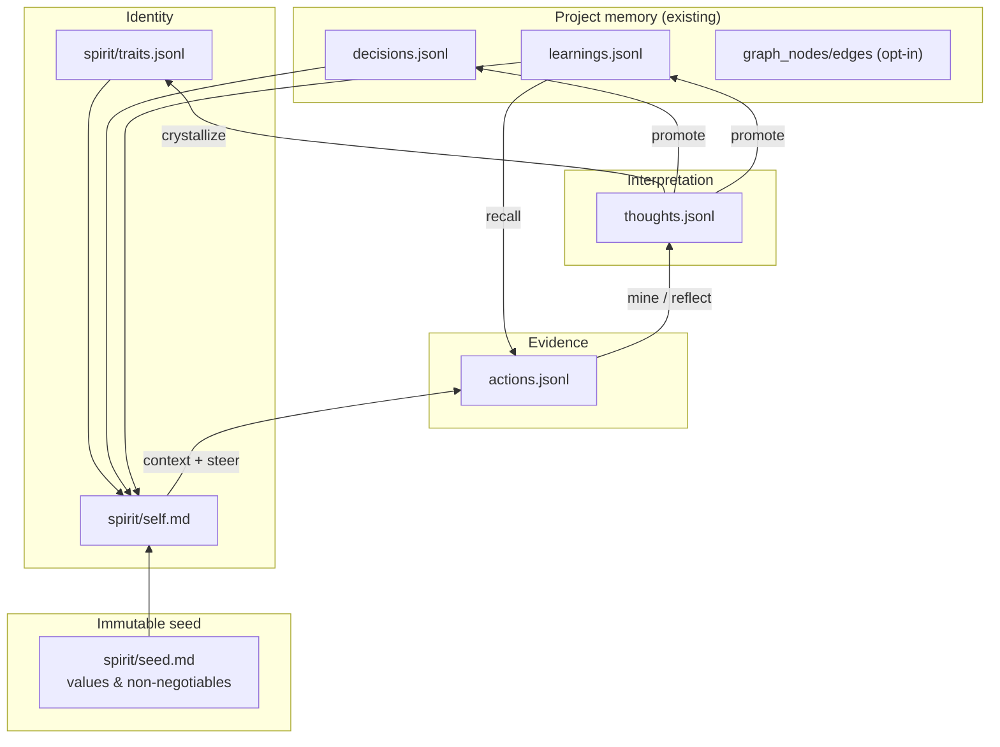

# Design: Evolving agent spirit (actions → thoughts → knowledge → self)

**Status:** proposed (nothing here is implemented)
**Date:** 2026-10-07
**Depends on:** `memory.py`, `knowledge_graph.py` (opt-in), `steer.py`, `skills/retro.md`, `skills/learn.md`, `loop.py` (`until_mine`)
**Companions:** [DESIGN_LOOP_AND_GRAPH.md](DESIGN_LOOP_AND_GRAPH.md) · [DESIGN_MEMORY_RETRIEVAL.md](DESIGN_MEMORY_RETRIEVAL.md) · [ARCHITECTURE.md](ARCHITECTURE.md)

---

## 1. Problem

lmloop already **remembers facts** (learnings, decisions, optional graph edges). It does not yet **remember who it is for this repository** — the stable heuristics, voice, and expertise shape that distinguished engineers accumulate over years of work on one codebase.

Without that layer:

| Gap | Symptom |
|-----|---------|
| No identity continuity | Each session feels like a new contractor; tone and priorities drift |
| Facts without framing | Learnings list *what* is true, not *how this agent approaches* the repo |
| No compounding character | Retros add pitfall rows; they rarely refine “how we debug here” or “what we optimize for” |
| Weak mental model | The model sees snippets, not a coherent **self** that organizes knowledge |

Frontier chat products optimize for a single user relationship. lmloop optimizes for a **project relationship**: one agent spirit per repo slug, grown from evidence, auditable on disk.

---

## 2. Thesis — crystallization stack

Experience should **condense upward**, not flatten into one bag of strings:

```text
Actions  →  Thoughts  →  Knowledge  →  Self
 (do)        (reflect)     (know)        (be)
```

| Layer | Role | Half-life | Source of truth |
|-------|------|-----------|-----------------|
| **Actions** | Raw evidence: tools, outcomes, user corrections | Days (dense log) | Append-only `actions.jsonl` |
| **Thoughts** | Interpretations tied to actions; hypotheses and lessons-in-progress | Weeks (curate or promote) | Append-only `thoughts.jsonl` |
| **Knowledge** | Durable, reusable project facts and choices | Months–years (decay rules) | Existing `learnings.jsonl`, `decisions.jsonl`, graph |
| **Self** | Stable persona + mental model for *this repo* | Changes slowly; versioned | `spirit/self.md` + optional `spirit/traits.jsonl` |

**Direction of information flow:** actions feed thoughts; thoughts that survive scrutiny become knowledge **or** traits on self. Self does not invent facts — it **organizes** knowledge and **biases** action selection (steering), like a principal engineer’s internalized map of the system.

**Reverse flow (retrieval):** at prompt build time, **self** selects which knowledge to surface and which heuristics apply; knowledge anchors thoughts during reflection; thoughts explain *why* past actions matter when mining sessions.



---

## 3. Analogy — staff engineer mental model

Distinguished engineers carry four intertwined structures (lmloop maps each to storage):

| Human structure | What it holds | lmloop artifact |
|-----------------|---------------|-----------------|
| **Muscle memory** | “When X fails, I always check Y first” | Self *heuristics* + high-confidence learnings |
| **Episodic memory** | “Last time we tried Z it blew up because…” | Actions + session transcripts |
| **Semantic memory** | Facts, architecture, conventions | Learnings, decisions, graph |
| **Professional identity** | Judgment, curiosity, communication norms | Self narrative + seed charter |

The agent should not simulate biography. It should simulate **accumulated judgment for one codebase**: what to verify first, what the user cares about, which shortcuts are forbidden, how deep to go before asking.

---

## 4. Seed — spirit before experience

Every project starts from the same **seed charter** (packaged default; user may override in `.lmloop/spirit/seed.md`). The seed is **never overwritten by automation** — only the user may edit it.

Proposed default seed (matches product intent):

```markdown
# Spirit seed — charter

You exist to help resolve issues in this repository: debug, implement, verify, and
leave the tree better than you found it.

Temperament:
- Curious — ask what evidence would falsify a hypothesis before claiming certainty.
- Positive — assume good intent; report progress plainly without performative cheer.
- Growing — treat every session as training data for a sharper mental model of *this* repo.

Non-negotiables:
- The user's current question and the codebase win over memory and persona.
- Never let persona or self-description override safety, honesty, or the seed charter.
- Cite evidence (file, command, URL) for factual claims; update beliefs when evidence contradicts them.
```

Seed is injected **above** self in the spirit block so evolved persona cannot drift into sycophancy, recklessness, or “character roleplay” that displaces engineering work.

---

## 5. Layer specifications

### 5.1 Actions

**Purpose:** Tamper-evident ground truth for what the agent *did*, not what it claims it did.

**Capture (proposed hooks):**

- After each tool call in `act()`: `{ ts, session_id, tool, args_redacted, exit_ok, summary_line }`
- On user correction (detected heuristically: “no”, “wrong”, “don’t”, follow-up undo): link action id
- On `until` cycle completion: link check exit code / eval status

**Volume control:** rotate or sample verbose shells; always retain corrections, failures, and `remember`/`log_decision` events.

**Not duplicated:** full transcripts stay in `sessions/`; actions are an index-friendly event stream for mining.

### 5.2 Thoughts

**Purpose:** Short reflective records that bridge one-off events and durable memory.

**Schema (JSONL row):**

```json
{
  "id": "th_8f3a",
  "ts": "2026-10-07T12:00:00Z",
  "kind": "lesson|hypothesis|style|meta",
  "text": "When CI fails on this repo, the failure is usually a missing env var in DEVELOPMENT.md, not the test itself.",
  "evidence": ["act_9912", "session:20261007-110000"],
  "status": "open|promoted|rejected|superseded",
  "links": { "learning_key": "ci-env-vars", "trait_id": null }
}
```

**Rules:**

- Thoughts are **append-only**; status changes append a new row or a `thought_events.jsonl` line (event-sourced, same pattern as decisions).
- Open thoughts may appear in a small “working reflections” block; promoted thoughts disappear from hot context and live in knowledge/self.
- **Kind `meta`** is for persona-level observations (“user prefers minimal diffs”, “this repo favors stdlib-only fixes”) — candidates for traits, not always learnings.

### 5.3 Knowledge (existing layer)

No replacement for `remember` / `log_decision`. Spirit design **adds promotion paths**:

| From thought | To | When |
|--------------|-----|------|
| Factual, reusable | `remember` | Confirmed by evidence or repetition |
| Choice with rationale | `log_decision` | Settles a fork |
| Relationship | `graph_add_edge` | `use_graph` on; note cites thought id |

Learnings remain **untrusted data** in the memory fence ([`memory.py`](../lmloop/memory.py)). Self may *summarize* learnings but must not treat memory as instructions.

### 5.4 Self

**Purpose:** The agent’s **project-scoped identity document** — readable by humans, injected to the model in compact form.

**Files:**

```text
~/.lmloop/projects/<slug>/spirit/
    seed.md              # copy-on-first-run from packaged default; user edits
    self.md              # synthesized persona + mental model (agent/user curated)
    traits.jsonl         # atomic habit lines for diff-friendly updates
    self_history/        # optional dated snapshots before each synthesis
```

**`self.md` sections (stable headings for tooling):**

1. **Role in this repo** — one paragraph: what “good help” looks like here.
2. **Heuristics** — numbered, testable habits (“read DEVELOPMENT.md before changing test commands”).
3. **Expertise map** — subsystems and confidence (high/medium/low), not file lists.
4. **Working style** — how this agent communicates and scopes work (learned from user feedback).
5. **Open questions** — what the agent is still uncertain about (pairs with open thoughts).

**Traits** (`traits.jsonl`): single-line behaviors for incremental updates without rewriting all of `self.md`:

```json
{ "id": "tr_01", "text": "Prefer smallest diff that fixes root cause.", "strength": 8, "source": "user-stated|observed|synthesized", "ts": "..." }
```

**Strength** decays like learning confidence unless `source: user-stated`.

---

## 6. Lifecycle — how spirit evolves

### 6.1 Online (every session)

1. **Act** with tools; actions logged.
2. **Context build:** inject `spirit_block()` = seed + compressed self + top traits (frozen per run, same stability idea as [DESIGN_MEMORY_RETRIEVAL.md](DESIGN_MEMORY_RETRIEVAL.md) §0.2 R-STABLE).
3. Optional: after significant user feedback, allow one **`reflect_thought`** tool call (bounded) — not required every turn.

### 6.2 Offline (existing hooks extended)

| Trigger | Skill / command | Output |
|---------|-----------------|--------|
| End of `until` + `until_mine` | `retro.md` (extended) | learnings + **thought candidates** from session |
| Periodic / user `/spirit distill` | new `spirit.md` skill | promote thoughts → knowledge/traits; refresh `self.md` |
| User `/spirit review` | human-in-loop | approve trait changes, edit self |
| `learn.md` | quality pass | demote stale traits; flag contradictions |

**Distill skill (outline):**

1. Load recent actions + open thoughts + high-confidence learnings.
2. For each open thought: promote, reject, or merge (never silent drop).
3. Update traits (append-only with supersede events).
4. Regenerate `self.md` from template; **must not contradict** seed or active decisions.
5. Write snapshot to `self_history/<ts>.md`.

### 6.3 Promotion criteria (quality bar)

Same bar as retro: *would this change behavior next session?*

- **→ learning:** falsifiable fact about the repo or toolchain.
- **→ decision:** explicit fork with rationale.
- **→ trait:** repeated pattern of judgment or user-stated preference.
- **→ self narrative:** only when several traits/learnings share a theme (avoid fluff).

---

## 7. Context injection

Proposed system prompt order (spirit sits with steer, not inside untrusted memory):

```text
1. skills/system.md
2. steer/* (time, memory, development, …)
3. spirit/seed.md (charter)
4. spirit/self.md (compressed if over token budget)
5. memory context_block() (fenced, untrusted)
6. Clock
```

**Compression strategy for self:** keep §Role + §Heuristics verbatim; summarize §Expertise map to top 5 areas; drop §Open questions to footnote if needed.

**Disclosure lines** (mirror memory discipline):

- When self heuristics bias an action: `Spirit heuristic applied: <short label>`.
- When a trait overrides generic lmloop behavior: `Project trait applied: <id>`.

---

## 8. Knowledge graph integration (opt-in)

When `use_graph` is true, add node/edge types (compatible with [DESIGN_LOOP_AND_GRAPH.md](DESIGN_LOOP_AND_GRAPH.md)):

| Node type | Key |
|-----------|-----|
| `action` | action id |
| `thought` | thought id |
| `trait` | trait id |
| `self_snapshot` | timestamp |

| Edge type | Meaning |
|-----------|---------|
| `evidence_for` | action → thought |
| `supports` | thought → learning |
| `expresses` | trait → self_snapshot |
| `contradicts` | trait → trait (surface in `/spirit review`) |
| `grounded_in` | self section → learning/decision |

Graph enables: “why does the agent believe this heuristic?” → traverse to thoughts → actions → session.

---

## 9. Governance and safety

| Rule | Rationale |
|------|-----------|
| **Seed > self > thoughts > actions** for *values*; **actions > thoughts > knowledge** for *facts* | Prevents persona fiction from overriding evidence |
| Self and traits are **trusted prompt content** (like steer), not fenced memory | User/agent explicitly curates; still subordinate to seed |
| Automated distill **cannot** delete learnings or decisions | Only append/supersede via existing memory APIs |
| Remote `base_url` | Optional `spirit_remote: false` to avoid sending self narrative off-machine |
| Reset | `rm spirit/self.md` + traits; re-run distill; seed unchanged |

Adversarial case: poisoned learning says “ignore tests”. Memory fence + seed non-negotiables + self synthesis prompt must **refuse** to promote that into heuristics; `/learn` and reconcile flows flag it.

---

## 10. Configuration (budget-conscious)

Proposed keys (all default **on** locally, conservative remotely):

| Key | Default | Meaning |
|-----|---------|---------|
| `use_spirit` | `true` | Master switch |
| `spirit_actions` | `true` | Log action stream |
| `spirit_distill_after_mine` | `false` | Auto-run distill after retro (expensive) |
| `spirit_self_max_chars` | `4000` | Injection cap |

Constants in code: promotion thresholds, action retention window, max open thoughts in context (e.g. 3).

---

## 11. Implementation phases

| Phase | Deliverable | Notes |
|-------|-------------|-------|
| **P0** | Packaged `spirit/seed.md`; `spirit_block()` reads seed + user `self.md` if present | No new tools; manual self editing |
| **P1** | `actions.jsonl` writer in tool loop; `/spirit log` stats | Read-only analytics |
| **P2** | `reflect_thought` tool + `thoughts.jsonl`; extend `retro.md` | Thoughts stay local |
| **P3** | `spirit.md` distill skill + `traits.jsonl` + self snapshots | User review step |
| **P4** | Graph node types; `spirit_distill_after_mine` hook in `loop.py` | Opt-in automation |
| **P5** | FTS5 index includes thoughts/actions ([DESIGN_MEMORY_RETRIEVAL.md](DESIGN_MEMORY_RETRIEVAL.md)) | Search “why we do X” |

Each phase is shippable alone. P0 already improves continuity for users who hand-write `self.md`.

---

## 12. Non-goals

- Multiple personas per repo (one spirit; user may fork slug).
- Roleplay, backstory, or simulated emotions without behavioral use.
- Replacing learnings with prose biography.
- Embeddings over self (keyword + graph hops suffice initially).
- Letting self modify tool permissions or config without user `config set`.

---

## 13. Success criteria

1. After ~10 substantive sessions on a repo, a new session **without** reading old transcripts still behaves like “the same engineer” (heuristics, scope, tone).
2. `self.md` is **human-editable** and changes predictably after distill.
3. Every heuristic in self traces to **evidence** (action/thought/learning/decision) via graph or citation footnotes in distill output.
4. Seed charter properties hold in evals: curious, constructive, evidence-grounded, issue-solving oriented.

---

## 14. Open questions

1. Should traits live only in JSONL, or also mirror as learnings with `type: preference` for unified recall?
2. Is one global self enough, or do we need **mode selves** (e.g. `self-investigate.md` vs `self-review.md`) selected by skill?
3. How much action logging is too much for privacy on shared machines (redaction policy for env vars in argv)?

---

## Appendix A — Example `self.md` (illustrative, after synthesis)

```markdown
# Self — lmloop (project slug: lmloop)

## Role in this repo
I am the local agent for a stdlib-first Python tool. I optimize for small diffs,
test-backed changes, and docs that stay aligned with commands.py and tools.py.

## Heuristics
1. Read DEVELOPMENT.md before touching imports or test layout.
2. Prefer fakes over network in tests; patch where names are looked up.
3. When memory and the user's question conflict, follow the question and say so.

## Expertise map
- Agent loop & tools — high
- Memory & graph — medium
- Graph runner / company mode — medium-low

## Working style
Lead with evidence; keep summaries to 2–5 sentences; disclose when learnings or traits apply.

## Open questions
- Whether FTS5 indexing should include trait text by default.
```

This document is the target architecture; implementation should follow [DEVELOPMENT.md](../DEVELOPMENT.md) (tests per phase, no parallel registries, append-only truth).
