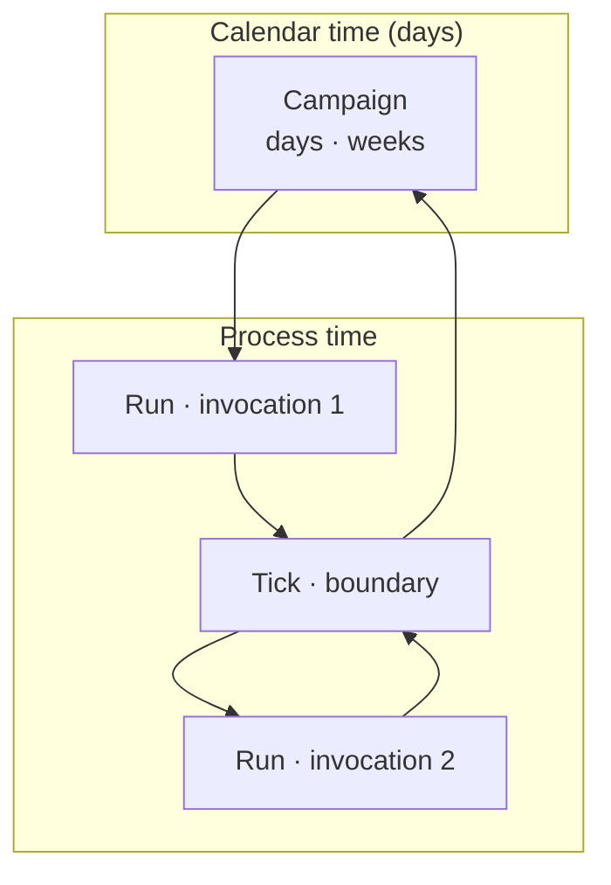
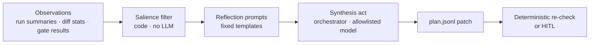

# Design: Long-horizon planning, reflection, and multi-day coordination

**Status:** shipped — campaign store, plan block, board, daily tick, end-of-day, max days. Plan injection cap is the constant 4000. Open questions in §10 remain.  
**Date:** 2026-10-08  
**Depends on:** [DESIGN_MULTI_AGENT_COMPANY.md](DESIGN_MULTI_AGENT_COMPANY.md), [DESIGN_SANDBOX_AND_VERIFICATION.md](DESIGN_SANDBOX_AND_VERIFICATION.md), [DESIGN_DAG_AND_KNOWLEDGE_CANVAS.md](DESIGN_DAG_AND_KNOWLEDGE_CANVAS.md), [DESIGN_MEMORY_RETRIEVAL.md](DESIGN_MEMORY_RETRIEVAL.md), [DESIGN_EVOLVING_SPIRIT.md](DESIGN_EVOLVING_SPIRIT.md), [ARCHITECTURE.md](ARCHITECTURE.md)  
**Extends:** company orchestrator, `--docker-persist`, milestone retro — with **campaigns** that survive calendar days and **planning memory** distinct from pitfall learnings.

---

## 0. Why this doc exists

lmloop already has strong **single-session** control flow (`until`, authored **graphs**, deterministic checks) and a proposed **multi-agent company** layer (Docker workers, manifest, milestone gates). What is missing is an explicit design for:

| Need | Today | Gap |
|------|-------|-----|
| **Multi-day work** | Runs pause/resume within one process day; `--docker-persist` is for 24/7 supervisors but not tied to a durable **plan** | No first-class **campaign** object spanning days |
| **Planning** | `ceo` skill reviews a proposal once; graph nodes are fixed at author time | No **living plan** updated after reflection |
| **Reflection** | `retro` / `memory mine` at graph end or milestones | No cadence for **daily** or **inter-agent** synthesis |
| **Coordination** | Handoff clips + orchestrator frontier (proposed) | No shared **blackboard** for blockers across roles over time |
| **Memory vs plan** | Learnings/decisions are facts | Plans are **intent + schedule + open questions** — different retention and injection rules |

This document names those layers and binds them to existing modules so implementation does not fork a second orchestrator.

### Lineage (research → lmloop mapping)

| Idea | Paper / framework | lmloop embodiment |
|------|-------------------|-------------------|
| Reason ↔ act loop | **ReAct** | Existing `act()` gather/answer + `until` check/eval |
| Tool APIs | **Toolformer** | `tools.py` registry; unchanged |
| Memory → reflection → planning | **Generative Agents** | **Campaign plan store** + orchestrator-only reflect ticks (§4–§5) |
| Programmable multi-agent chat | **AutoGen**-style orchestration | **Company orchestrator** + manifest roles (not an LLM router) |
| Persistent context safety | **OpenClaw**-class warnings | §8 — untrusted web/memory poisons **plans** and **tools**; gates on whole workflows |

---

## 1. Mental model: campaign, run, tick



| Term | Definition | Persists where |
|------|------------|----------------|
| **Campaign** | User-facing effort with a stable id, goal, phases, and budgets across **multiple calendar days** | `~/.lmloop/projects/<slug>/campaigns/<id>/` |
| **Run** | One OS process invocation: `until`, `graph`, or `company run/resume` | Existing JSONL run logs + campaign `runs.jsonl` index |
| **Tick** | Orchestrator boundary: end-of-run, **daily**, budget exhausted, milestone pass/fail, human HITL | Append-only `campaign/ticks.jsonl` |

**Rule:** Workers and makers never append campaign state. Only the **host orchestrator** (or interactive user via explicit `/campaign` commands) writes plan and board rows — same single-writer discipline as company JSONL today.

---

## 2. Campaign store (on-disk contract)

```
~/.lmloop/projects/<slug>/campaigns/<campaign_id>/
├── meta.json              # goal, created_at, manifest_sha pin, status
├── plan.jsonl             # planning memory (§3)
├── board.jsonl            # coordination blackboard (§6)
├── ticks.jsonl            # reflect/plan/gate events
├── runs.jsonl             # pointers to until/graph/company run paths
└── daily/
    └── YYYY-MM-DD.md      # optional human-readable digest (orchestrator-generated)
```

**Campaign id:** slug from goal text + timestamp, or user-supplied `--campaign my-feature`.

**Lifecycle:**

1. **Start:** `lmloop campaign start --goal "…" [--docker-persist] [--company]` creates meta + empty plan with one `phase` row.  
2. **Work:** Each invocation attaches to the open campaign (`--campaign <id>` or “latest open”).  
3. **Pause:** Run ends with `status: paused` on meta; containers may stay up (`--docker-persist`).  
4. **Resume:** Supervisor or user runs `lmloop campaign resume <id>` — reloads plan, frontier, board; **frozen clock** advances to new OS `now` (steer/time.md still applies).  
5. **Complete:** Milestone gates pass + optional human ack; meta `status: done`.

**Monorepo option:** mirror read-only plan digest at `<workspace>/.lmloop/campaign.md` for visibility in PRs (orchestrator writes; not hand-edited).

---

## 3. Planning memory (not learnings)

**Planning memory** holds *what we intend to do next*, not *what we learned about the codebase*.

| Field | Purpose |
|-------|---------|
| `phase` | Named stage (e.g. M1 vertical slice, M2 hardening) |
| `objective` | One sentence outcome for the phase |
| `acceptance` | List of check commands or eval criteria (ties to CheckPlan) |
| `next_actions` | Ordered bullets with optional `role` (manifest role id) |
| `open_questions` | Blocking unknowns; cleared only by decision row or HITL |
| `risks` | Curated from ceo/retro, not raw tool noise |
| `revision` | Monotonic int; every reflect tick bumps |

**Append-only `plan.jsonl` row types:**

| `type` | Writer | When |
|--------|--------|------|
| `phase` | orchestrator / user | Campaign start, milestone promotion |
| `patch` | orchestrator | After reflect tick — replaces `next_actions`, updates questions |
| `decision` | orchestrator after HITL or `log_decision` ingest | Resolves an open question |
| `defer` | orchestrator | Explicitly parks work to a later calendar day |

**Injection (prompt Tier B — stable within a run day for a role):**

- Orchestrator builds `plan_block(plan, role)` from latest `phase` + `patch` rows filtered to that role’s `next_actions` and shared `open_questions`.  
- **Exclude** full board history and other roles’ private queues.  
- Aligns with [DESIGN_MEMORY_RETRIEVAL.md](DESIGN_MEMORY_RETRIEVAL.md) Layer C: plan block is **frozen per worker invocation**, hashed in the task packet.

**Distinction from learnings:**

| | Planning memory | Learnings / decisions |
|--|-----------------|----------------------|
| Question answered | What should we do **next**? | What is **true** about the repo? |
| Updates | Reflect ticks, ceo/plan nodes | retro, mine, remember |
| Staleness | Superseded by newer `patch` row | Dedup by key, decay |
| Worker write | **Never** | Never in company mode (orchestrator ingests) |

---

## 4. Reflection architecture (Generative Agents–inspired, deterministic shell)

Unconstrained “think for a while” loops do not ship. Reflection is **scheduled**, **bounded**, and **always followed by gates or human ack** before plan patches apply.



### 4.1 Observations (no LLM)

Collected by orchestrator from:

- Last N run envelopes (company workers or until/graph meta rows)  
- Git diff stat on integration worktree  
- Milestone gate stdout/stderr (truncated)  
- Board rows since previous tick (`blocker`, `decision_request`)

### 4.2 Reflection ticks (when)

| Tick kind | Trigger | LLM? | Output |
|-----------|---------|------|--------|
| **run_end** | Single run terminal (pass/fail/pause) | Optional short summary if company mode | Board `status` row |
| **daily** | Calendar date change **or** cron supervisor | Yes — `skill retro` + **plan patch** prompt | `daily/YYYY-MM-DD.md`, `plan patch` |
| **milestone** | Manifest milestone gates pass | Yes — ceo + mine (existing §9 company doc) | Learnings + plan `phase` advance |
| **handoff** | Before spawning worker after join | No — clip only | Task packet handoff field |
| **blocked** | Worker `blocked` or gate fail twice same node | Yes — narrow “unblock” template | Board `blocker` + proposed `next_actions` |

### 4.3 Synthesis prompts (skills)

Reuse and extend packaged skills — no new magic strings in Python:

| Skill | Role in campaign |
|-------|------------------|
| `ceo` | Phase review: objectives vs diff; approves scope changes → `decision` rows |
| `retro` | Harvest patterns → learnings (existing) |
| **`plan`** (new skill file, proposed) | Input: observation bundle + current plan JSON; output: **strict JSON** `patch` matching schema; orchestrator validates before append |

The **`plan`** skill output is validated (schema + max row sizes). Invalid JSON → tick marked `fail`, plan unchanged, board alerts HITL.

### 4.4 Tie-in to Evolving Spirit

[DESIGN_EVOLVING_SPIRIT.md](DESIGN_EVOLVING_SPIRIT.md) **`thoughts.jsonl`** holds in-progress interpretations; **plan patches** hold committed intent. Promotion path:

- Repeated reflections on the same theme → `remember` / spirit trait (orchestrator-only)  
- Plan `open_questions` cleared → optional `log_decision` for durable choice

---

## 5. Multi-day Docker and supervisors

Long-horizon work uses the sandbox doc’s **persist** mode for **environment continuity**, not for hiding state inside the container.

| Mode | Container | Campaign state |
|------|-----------|----------------|
| `lmloop --docker until …` | Ephemeral | Host `~/.lmloop/…` only |
| `lmloop --docker-persist until …` | Reattach daily | Same — plan on host |
| `lmloop company run --docker …` | Ephemeral per worker | Orchestrator on host |
| `lmloop company run --docker-persist …` | Optional persist per worktree | Plan/board on host; WT mounts unchanged |

**Supervisor pattern (recommended for multi-day):**

```bash
# systemd timer or cron — not an in-process daemon
lmloop campaign resume ship-feature-x --docker-persist --autonomous-gates all
```

Each invocation:

1. Reattach persist container if digest + config hash match ([sandbox §1.2](DESIGN_SANDBOX_AND_VERIFICATION.md)).  
2. Load campaign plan + graph/until frontier.  
3. Run until **pause** (budget, end-of-day tick, or graph wait).  
4. Exit 0; supervisor fires again next window.

**End-of-day tick:** If `meta.end_of_day_utc` configured (default off), orchestrator stops after finishing the current node, runs **daily reflect**, writes digest, sets meta `paused_until` next calendar date — prevents runaway overnight spend.

**Company + multi-day:** Orchestrator process may exit; **campaign id** links disjoint company runs via `runs.jsonl`. Manifest `manifest_sha` pinned at campaign start; mid-campaign manifest bumps require explicit `campaign manifest-refresh` HITL.

---

## 6. Multi-agent coordination

Company mode ([DESIGN_MULTI_AGENT_COMPANY.md](DESIGN_MULTI_AGENT_COMPANY.md)) supplies **parallel workers** and **handoff clips**. Campaign layer adds a **blackboard** for async coordination across days.

### 6.1 Board messages (`board.jsonl`)

| `type` | Meaning |
|--------|---------|
| `status` | Role/node completion summary (from result envelope) |
| `blocker` | Needs another role or human |
| `decision_request` | Open question reference id |
| `ack` | Human/orchestrator cleared a blocker |
| `spawn` | Orchestrator assigned node → worker (audit) |

**No LLM merge:** Join nodes still concatenate clipped handoffs; board is for **orchestrator eyes** on reflect ticks and for **task packet** excerpts (`board_since_last_tick` capped at 800 chars).

### 6.2 Coordination loop (extends company §7)

```text
1. Read manifest frontier + campaign plan next_actions
2. Match actions to runnable nodes (authored graph — no LLM router)
3. If blocker row unresolved for node → skip or escalate HITL
4. Spawn workers with: handoff + plan_block(role) + board clip
5. On envelope: append board status; if blocked → reflect tick blocked
6. Milestone / daily tick → reflect → plan patch → resume later
```

### 6.3 Roles over time

| Role | Typical placement | Multi-day note |
|------|-------------------|----------------|
| **ceo / plan** | Host orchestrator | Runs on daily/milestone ticks; updates plan |
| **build / qa** | Docker workers | One node per invocation; fresh task packet each day |
| **retro / mine** | Host orchestrator | After gates; feeds learnings + plan risks |

Read-only parallel roles stay on host (company open question §15.5) — **required** for plan integrity.

---

## 7. CLI and config (proposed)

| Command | Description |
|---------|-------------|
| `lmloop campaign start --goal …` | New campaign |
| `lmloop campaign resume [<id>]` | Continue open campaign (default latest) |
| `lmloop campaign status [<id>]` | Plan phase, next actions, blockers |
| `lmloop campaign board [<id>]` | Print board (TTY) |
| `lmloop company run --campaign <id> …` | Company run bound to campaign |

**Config keys (campaign mode only — budget discipline):**

| Key | Default | Meaning |
|-----|---------|---------|
| `campaign_daily_reflect` | true | Run daily tick on date change |
| `campaign_end_of_day_utc` | *(empty)* | Optional stop hour (UTC) |
| `campaign_max_days` | 30 | Hard stop requiring HITL to extend |
| `campaign_plan_inject_max_chars` | 4000 | Cap plan block in worker packets |

Reuse: `run_token_budget`, `until_max_steps`, `graph_max_steps`, company keys from multi-agent doc.

---

## 8. Safety and trust (persistent context)

Long-horizon agents accumulate **attack surface**:

| Vector | Mitigation |
|--------|------------|
| Poisoned web → `remember` / plan | Learnings require retro quality bar; **plan patches** schema-validated, no raw web paste fields |
| Worker lies in summary | Integration worktree gate re-run (company §7) |
| Stale plan drives wrong work | `revision` in packet; worker refuses stale `plan_revision` |
| Cross-role leakage | Board clips filtered by role; no full transcripts in packets |
| Runaway multi-day spend | `campaign_max_days`, `run_token_budget`, end-of-day pause |

Evaluate **whole workflows** (fetch → remember → plan patch → spawn) in threat models, not isolated tools.

---

## 9. Phased delivery

| Phase | Delivers | Depends on |
|-------|----------|------------|
| **H0** | Campaign store + `status`/`resume` without LLM plan skill | JSONL helpers in `memory.py` pattern |
| **H1** | `plan.jsonl` + inject block in until/graph meta | H0 |
| **H2** | Daily tick + `daily/*.md` digest + supervisor docs | Sandbox S4 persist |
| **H3** | Board + company run `--campaign` binding | Company P4 |
| **H4** | `plan` skill + reflect tick validates patches | H1, company P5 retro |
| **H5** | End-of-day UTC + `campaign_max_days` gates | H2 |

**Roadmap placement:** After **sandbox S1–S6** and **company P1–P3**; parallel with **memory Layer C** (frozen blocks). Full multi-agent + multi-day **H3** requires company workers.

---

## 10. Open questions

1. Should **plan** live in-repo (`<workspace>/.lmloop/plan.jsonl`) for team visibility vs only under `~/.lmloop`?  
2. Is **daily reflect** one LLM call or `retro` + `plan` sequentially (cost vs quality)?  
3. Should graph authoring gain an optional **`node plan`** (orchestrator-only) before `build`?  
4. Campaign **fork** (experiment branch) — copy plan with new id or version branch inside same campaign?  
5. Integration with **FTS5** ([memory doc](DESIGN_MEMORY_RETRIEVAL.md)): index `board.jsonl` and `plan.jsonl` for `/memory` search?

---

## 11. Relationship to other docs

| Doc | Update when this ships |
|-----|--------------------------|
| [DESIGN_MULTI_AGENT_COMPANY.md](DESIGN_MULTI_AGENT_COMPANY.md) | §9 milestones consume campaign plan phases; `--campaign` flag |
| [DESIGN_SANDBOX_AND_VERIFICATION.md](DESIGN_SANDBOX_AND_VERIFICATION.md) | Supervisor examples reference `campaign resume` |
| [DESIGN_ROADMAP.md](DESIGN_ROADMAP.md) | New track “Long-horizon campaigns” after sandbox |
| [ARCHITECTURE.md](ARCHITECTURE.md) | Campaign store diagram |
| [README.md](../README.md) | User-facing table row |
| [GUIDE_DOCKER_AND_OPENROUTER.md](GUIDE_DOCKER_AND_OPENROUTER.md) | Multi-day supervisor recipe |

---

## Appendix — Example: three-day company campaign

```text
Day 1 — lmloop campaign start --goal "Ship auth slice" --company --docker
        ├─ plan phase M1 created
        ├─ company run: ceo (host) → plan patch next_actions [build, qa]
        ├─ workers: build completes; board status
        └─ daily tick: digest day-1.md; pause (budget)

Day 2 — lmloop campaign resume --docker-persist
        ├─ reattach container; plan_block(build) injected
        ├─ qa worker; gate fail → board blocker
        ├─ reflect tick blocked → plan patch (fix tests listed)
        └─ build worker half budget → pause

Day 3 — lmloop campaign resume
        ├─ build pass; qa pass
        ├─ milestone M1 gates on integration WT
        └─ milestone reflect → learnings + plan phase M2
```
