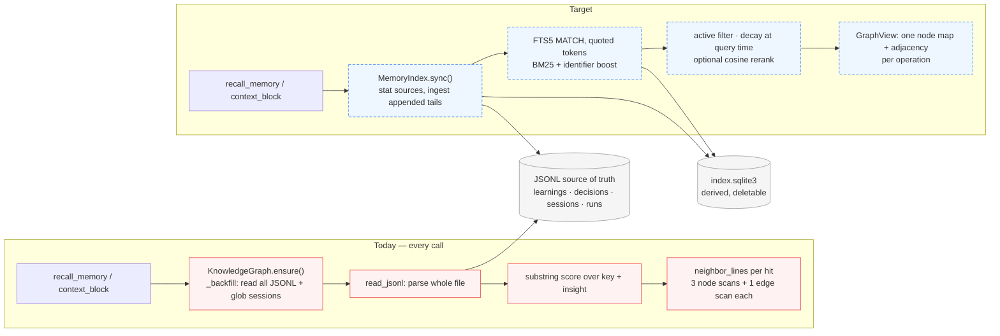
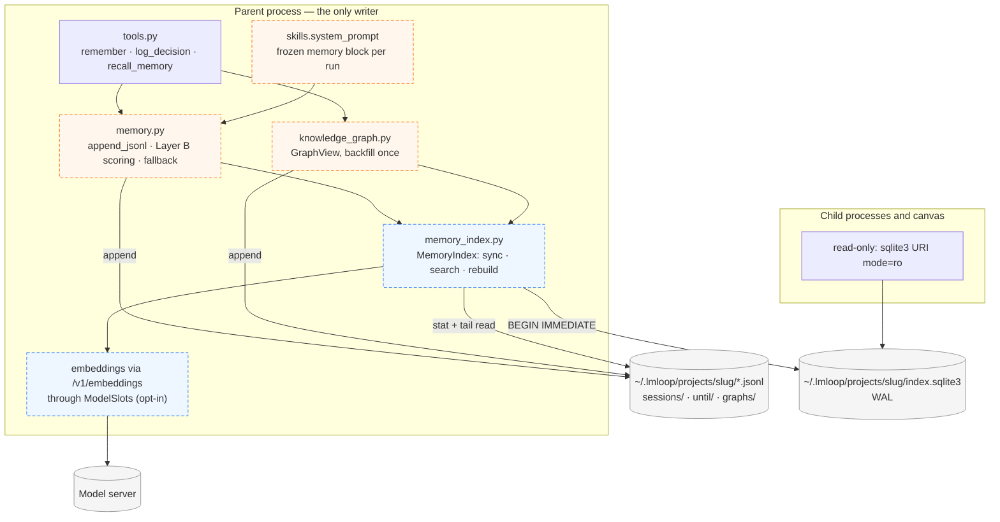
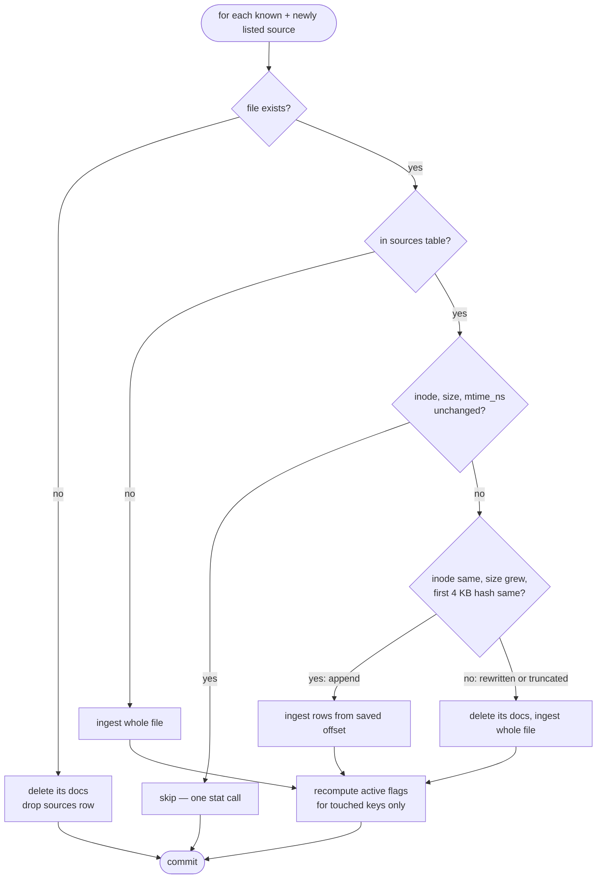
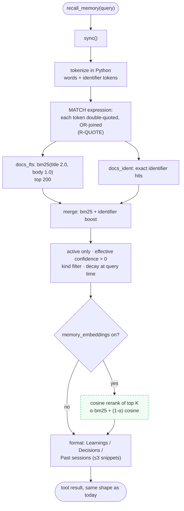

# Design: Fast, ranked memory retrieval

**Status:** proposed (nothing here is implemented)
**Date:** 2026-09-26
**Depends on:** `memory.py`, `knowledge_graph.py`, `skills.system_prompt`, `loop.isolated_act`
**Companions:** [DESIGN_SANDBOX_AND_VERIFICATION.md](DESIGN_SANDBOX_AND_VERIFICATION.md) ·
[DESIGN_DAG_AND_KNOWLEDGE_CANVAS.md](DESIGN_DAG_AND_KNOWLEDGE_CANVAS.md)

The question: what can the persistence layer do so that recall is fast and good enough
to feel like a frontier tool's memory — without giving up what makes lmloop's memory
trustworthy (append-only, human-readable JSONL, one writer, nothing leaves the machine)?

The answer comes in five layers, cheapest first. Each layer is independently useful, and
none of them changes the source of truth.

| Layer | What it fixes | New artifact | New dependency |
|---|---|---|---|
| **A. Hot-path fixes** | Quadratic and repeated full scans in the knowledge-graph path | none | none |
| **B. Matching and ranking** | Substring false positives, no term weighting, narrow decision search | none | none |
| **C. Prompt-stable injection** | Memory block changes between `until` cycles and defeats prefix caching | none | none |
| **D. FTS5 derived index** | Linear scans; sessions and run handoffs are not searchable at all | `index.sqlite3` (deletable) | none (stdlib `sqlite3`) |
| **E. Semantic rerank (opt-in)** | Paraphrases: "flaky test" vs "intermittent failure" | vectors table in the same index | none (pure-Python cosine) |

---

## Part 0 — Evidence and adversarial review

### 0.1 Measurements (synthetic data, this machine, current code)

**Flat path** — `get_learnings("docker timeout")`, knowledge graph off:

| Learnings rows | File | Query |
|---|---|---|
| 1,000 | 0.2 MB | 14 ms |
| 10,000 | 1.9 MB | 70 ms |
| 100,000 | 19.6 MB | 700 ms |

Linear in **history**, not in the active set: every key update appends a row, so a 24/7
loop grows the file long after the set of live learnings stops growing.

**Graph path** — `use_graph: true`:

| Learnings / decisions / sessions / edges | `context_block` | `recall_memory` | `remember` | `/memory graph` (`stats`) |
|---|---|---|---|---|
| 200 / 50 / 100 / 500 | 67 ms | 49 ms | 4 ms | **1.5 s** |
| 1,000 / 200 / 500 / 3,000 | 381 ms | 277 ms | 22 ms | **41.9 s** |
| 3,000 / 500 / 2,000 / 10,000 | **1.27 s** | 921 ms | 64 ms | not run |

The graph path is the real problem, and it is algorithmic, not a storage choice:

- `KnowledgeGraph.ensure()` runs `_backfill()` on **every** call. That re-reads the node
  file, the whole learnings and decisions files, and globs every session file. It fires
  from `context_block`, `search_memory`, `on_learning`, `on_decision`, and
  `record_skill_use`.
- `neighbor_lines()` calls `nodes()` and `edges()`, and `edges()` calls `nodes()` again —
  three node scans and one edge scan **per neighbor lookup**. `context_block` does one
  lookup per injected decision and learning (14 by default); `search` does one per hit.
- `stats()` calls `neighbor_lines()` once **per node**: O(N × (N + E)). That is the 42 s.
- `context_block` runs on every system-prompt build, and `loop.isolated_act` builds a
  fresh system prompt for **every maker and eval cycle**. At 3k learnings that is 1.3 s
  of pure bookkeeping per cycle, before a single token is generated.

**Matching quality** (verified):

- `"test" in "use the latest venv"` is `True` — `get_learnings` scores by substring.
- No stemming: "timeouts" does not match "timeout".
- No term weighting: a hit on "the" counts the same as a hit on "docker" (only a
  3-character minimum filters stopwords).
- Decisions: only the **last 50** active decisions are searched, and only the `decision`
  field — the `rationale`, where the *why* lives, is ignored.
- Session transcripts and until/graph handoffs are **not searchable at all**, which is
  exactly the "what did we try last week for this?" question frontier tools answer.

### 0.2 Tempting shortcuts, and why each is rejected

| # | Shortcut | Consequence | Requirement |
|---|---|---|---|
| 1 | "Add an index" before fixing the graph path | The quadratic `stats()` and per-call `_backfill()` survive underneath any index; the index hides the symptom for search and leaves `/memory graph` at 42 s | **R-ALGO**: fix Layer A first; it is the biggest win and needs no new artifact |
| 2 | Make SQLite the source of truth | Loses append-only, `cat`-able, hand-editable memory — the property that makes it auditable and safe to repair | **R-TRUTH**: JSONL stays authoritative; every derived artifact is deletable and rebuildable |
| 3 | Trust the index blindly | A user hand-edits `learnings.jsonl` or deletes a session file; the index keeps serving the old text, including something the user deliberately removed | **R-FRESH**: every query syncs sources first; a rewrite or deletion forces re-ingest of that source |
| 4 | Pass the query string to `MATCH` | Verified: `loop.py` and `it's` are FTS5 **syntax errors**. A model-issued `recall_memory("fix loop.py")` would fail | **R-QUOTE**: tokenize in Python, quote every token, never pass raw text to `MATCH` |
| 5 | Assume FTS5 exists | It is compiled into essentially every modern build, but not guaranteed | **R-FALLBACK**: no FTS5 → Layer B scan path, same output format |
| 6 | Index transcripts and search them everywhere | Recall snippets go into the prompt. With a **remote** `base_url` that sends months-old transcript text — including anything pasted into it — to a third party | **R-PRIV**: session recall defaults on for the local profile, off for remote |
| 7 | Parallel children writing the index | Concurrent writers break the single-writer invariant and contend on locks | **R-ONEWRITER**: only the parent writes; children open read-only |
| 8 | A vector database, or numpy for cosine | A daemon or a native dependency for a problem that fits in one file. Verified: pure-Python cosine over 200 × 768 candidates is ~7 ms | **R-STDLIB**: stdlib only; rerank a bounded candidate set |
| 9 | Embeddings on by default | On a laptop the embedding model competes for the single slot and the RAM (capacity floors to 1); on remote it costs money and ships memory text off the machine | **R-OPTIN**: embeddings off by default; remote embeddings need a second explicit flag |
| 10 | Rebuild the memory block for every cycle "so it's fresh" | The system prompt changes whenever a maker `remember`s, which defeats provider prefix caching (billed) and local prompt caching (seconds of re-prefill on a laptop) | **R-STABLE**: freeze the memory block per run, like the clock |
| 11 | Store decayed confidence in the index | Decay is a function of *now*; a stored value is wrong the next day | Store `ts` and base confidence; compute effective confidence at query time, as today |
| 12 | SQLite WAL on a network filesystem | WAL needs shared memory; on NFS/SMB it corrupts or refuses | `memory_index: auto` detects failure to enter WAL and falls back to the scan path |

---

## Part 1 — Architecture

### 1.1 Read path today vs target



### 1.2 Components and process roles



`memory_index.py` is a new leaf-adjacent module: it may import `memory` (paths, JSONL
helpers, decay) and `config`; `memory.py` imports it lazily inside functions, the same
pattern already used for `knowledge_graph`. It must not import `agent`, `tools`, `loop`,
or `graph`.

---

## Part 2 — Layer A: hot-path fixes (no storage change)

| Fix | Today | After |
|---|---|---|
| **Backfill once.** `ensure()` records a fingerprint of what it last backfilled — sizes of the learnings and decisions files and the session directory's mtime — and skips when unchanged. Backfill itself only inspects rows past the last seen offset | Full re-read + session glob on every call | One `stat` triple per call |
| **`GraphView`.** A frozen snapshot built once per operation: `nodes` map, `edges` list, and adjacency. `neighbor_lines(view, ident)`, `search`, `context_block`, and `stats` all take the view | 3 node scans + 1 edge scan per lookup | One scan of each file per operation |
| **`stats()` linear.** Iterate the adjacency once | O(N × (N + E)) | O(N + E) |
| **Write path.** `on_learning` / `on_decision` / `record_skill_use` check existence against a view rather than calling `nodes()` before each `add_node`/`add_edge` | Several full scans per `remember` | One |
| **Parse cache.** `read_jsonl` keeps parsed rows per path keyed on `(inode, size, mtime_ns)` plus a hash of the first 4 KB; if the file only grew, parse the tail from the saved offset | Full parse on every call | Tail parse; cold only once per process |

The parse cache is per process. That is fine for the parent; parallel children start cold,
which is one reason Layer D is persistent.

**Expected effect** on the measured 3k-learning case: `context_block` from 1.27 s to tens
of milliseconds, and `/memory graph` from quadratic to linear. These are targets for the
task's benchmark test, not promises.

---

## Part 3 — Layer B: matching and ranking (no storage change)

This is the fallback path when there is no index, and the scoring rules the index mirrors.

**Tokenizer** (one function, shared by query and documents):

- Split on non-alphanumerics into lowercase words (`run_shell` → `run`, `shell`).
- Also keep **identifier tokens** intact: runs of `[A-Za-z0-9_./-]` that contain `_`, `.`,
  or `/` (`run_shell`, `loop.py`, `lmloop/loop.py`) — exact matches on code identifiers are
  the single most common useful recall in a coding agent.
- Drop words shorter than `MIN_TERM_LEN` (3) and a small fixed stopword set.
- Match on **whole tokens**, never substrings. Light suffix folding (`s`, `es`, `ed`, `ing`)
  so "timeouts" finds "timeout"; not a full stemmer.

**Score** for a learning or decision:

```
relevance  = Σ over query tokens t present:  idf(t) × (2 if t in key/decision else 1)
             + 1.5 × idf(t) for each identifier-token exact match
idf(t)     = ln(1 + N / (1 + df(t)))          # N = active docs of that kind
final      = relevance × (0.6 + 0.4 × clamp(effective_confidence / 10, 0, 1))
ties       → newer ts first, then key
```

**Decisions:** search the **whole active set**, across `decision` **and** `rationale`.

**Output:** unchanged (`format_learning_line` / `format_decision_line`), so the model sees
the same shape and existing tests' expectations on format hold.

---

## Part 4 — Layer C: prompt-stable memory injection

`loop.isolated_act` already accepts `clock_now` so the Clock block is identical across
cycles. The memory block gets the same treatment:

- `run_until` / `run_graph` compute `memory_block = memory.context_block(cfg)` **once** at
  run start and pass it to every `isolated_act`, alongside `clock_now`.
  `skills.system_prompt(..., memory_block=...)` uses it verbatim when given.
- Parallel children receive the parent's frozen block in their spec, so siblings' system
  prompts are byte-identical (the companion doc's shared-clock rule, extended).
- Ordering inside the block is deterministic: confidence, then key.
- The REPL is unchanged: it already builds its system prompt once per session.

Pros: the whole system prompt becomes a stable prefix for the run, so provider prefix
caching and LM Studio's prompt reuse apply from the second cycle. Cons: a learning written
mid-run is not in later cycles' *prompt*; it is still returned by `recall_memory`, and the
next run's block includes it.

---

## Part 5 — Layer D: FTS5 derived index

### 5.1 File, schema, and what is indexed

`~/.lmloop/projects/<slug>/index.sqlite3`, WAL mode, `busy_timeout` 2000 ms.

```sql
CREATE TABLE sources (
  path TEXT PRIMARY KEY, inode INTEGER, size INTEGER, mtime_ns INTEGER,
  offset INTEGER, prefix_sha TEXT               -- sha1 of first 4 KB: rewrite detection
);
CREATE TABLE docs (
  id INTEGER PRIMARY KEY, kind TEXT, key TEXT, source TEXT, line INTEGER,
  ts TEXT, confidence REAL, src TEXT, active INTEGER, title TEXT, body TEXT
);
CREATE INDEX docs_kind_key ON docs(kind, key);
CREATE VIRTUAL TABLE docs_fts   USING fts5(title, body, content='docs', content_rowid='id',
                                          tokenize='porter unicode61');
CREATE VIRTUAL TABLE docs_ident USING fts5(title, body, content='docs', content_rowid='id',
                                          tokenize="unicode61 tokenchars '_./-'");
CREATE TABLE meta (k TEXT PRIMARY KEY, v TEXT);  -- schema_version, built_by version
```

Two FTS tables because FTS5 has one tokenizer per table: `docs_fts` gives stemming and
BM25 over words; `docs_ident` keeps `run_shell` and `lmloop/loop.py` whole for exact
identifier hits. Both were verified against sqlite 3.45.

| `kind` | Source | One doc per | `active` |
|---|---|---|---|
| `learning` | `learnings.jsonl` | row | latest row per key only |
| `decision` | `decisions.jsonl` | decide row | not retired by a later supersede |
| `checkpoint` | `checkpoints/*.md` | file | always |
| `turn` | `sessions/*.jsonl` | user or assistant message (tool and system rows skipped — truncated, noisy) | always |
| `handoff` | `until/*.jsonl`, `graphs/*/*.jsonl` | maker / node summary, and each `check` row's per-command `results` | always |

`handoff` docs are the cheapest high-value addition: each is a model-written summary of
what a cycle changed and what remains — exactly "what did we try".

### 5.2 Freshness (R-FRESH)

`MemoryIndex.sync()` runs before every search and classifies each source:



- Listing cost: known sources are `stat`ed each sync; directories are re-listed only when
  their mtime changes (file creation changes it; appends do not). A full sweep also runs
  every `index_full_sweep_s` (60) and on `lmloop memory reindex`.
- Hand edits and deletions therefore propagate on the next query. **Forgetting works
  through the source of truth**: remove the row or file, and the index follows.
- A partial trailing line (a writer mid-append) is left for the next sync: the saved offset
  only advances past complete `\n`-terminated lines.

### 5.3 Query pipeline



- **R-QUOTE:** tokens are produced in Python and emitted as `"tok"` (embedded `"` doubled),
  joined with `OR`. The model's text never reaches FTS5 syntax. Verified: raw `loop.py` and
  `it's` are syntax errors; quoted forms match.
- **Snippets:** `snippet()` with a 12-token window, capped at 300 characters, each labelled
  with session file and timestamp. At most 3 per call, so recall never floods the context.
- **Past sessions** appear only when `recall_sessions` allows it (R-PRIV, §5.5).
- **Graph neighbors:** when `use_graph` is on, hits are decorated from one `GraphView`
  (Layer A), not per-hit scans.

### 5.4 Writers, readers, and failure modes

- **Only the parent writes** (R-ONEWRITER), inside `BEGIN IMMEDIATE`; `sync()` is called
  from the parent's `recall_memory`, `context_block`, and after `remember` / `log_decision`.
- **Children and the canvas** open `file:index.sqlite3?mode=ro` with `uri=True`. A child's
  own appends (in `clone` mode, to shards) are merged by the parent and indexed then.
- **No FTS5, WAL refused (network FS), corrupt file, or schema version mismatch** → log
  one line, delete the index file (it is derived), and use the Layer B scan path for the
  rest of the process. `/stats` shows `memory index: fts5 · 1.2 MB · 4,310 docs` or
  `memory index: scan (reason)`.
- Rebuild from scratch is always correct: `lmloop memory reindex`.

### 5.5 Privacy (R-PRIV)

| `recall_sessions` | Local profile | Remote profile |
|---|---|---|
| `auto` (default) | on | **off** |
| `on` | on | on — transcript snippets are sent to the remote provider |
| `off` | off | off |

Learnings and decisions are already injected into prompts today, so they are unaffected.
The new exposure is transcript text, which can contain anything a user pasted; that is why
remote defaults off. The index file itself sits beside the JSONL it is derived from and
has the same permissions — it creates no new at-rest exposure.

---

### 5.6 Serving check inference

The companion doc derives check plans partly from memory (step 4: `tool` / `operational`
learnings containing a backticked command) and history (step 5: commands that went
fail → pass in earlier runs). Both are queries this index answers directly:

- `MemoryIndex.command_candidates()` — active `learning` docs of type `tool` or
  `operational`, restricted to those whose body has a backtick span that `ShellCommand`
  parses, ordered `user-stated` first, then by effective confidence. The tier comes from
  the learning's `source`, never from the ranking.
- `handoff` docs include each `check` row's per-command `results`, so
  "commands that proved a goal here before" is a filter on indexed run rows, not a new
  scan of every run log.
- The scan fallback (Layer B) answers both by reading the same JSONL, so inference never
  depends on the index existing.

## Part 6 — Layer E: semantic rerank (opt-in)

- `memory_embeddings: off` (default) | `on`. With a remote `base_url`, it additionally
  requires `memory_embeddings_remote: true` (R-OPTIN).
- Endpoint: OpenAI-compatible `/v1/embeddings` on the same server, model
  `embedding_model` (e.g. a small local embedding model in LM Studio). Remote provider
  support for that endpoint is confirmed at implementation time, not assumed.
- Storage: `vectors(doc_id, model, dim, v BLOB)` in the same index, `v` as packed float32
  via `array('f')`. A row whose `model` differs from the configured one is ignored and
  lazily recomputed — model changes never mix vector spaces.
- **Lazy, bounded embedding:** nothing is embedded on `remember`. At query time, the top
  `embed_rerank_k` (200) BM25 candidates lacking vectors are embedded in batches of 32 and
  cached; the query itself is embedded once. Each HTTP call goes through `ModelSlots` from
  the companion doc, so it queues behind generation on a single-slot laptop rather than
  competing with it.
- Rerank: `final = α · bm25_norm + (1 − α) · cosine`, `rerank_alpha` 0.5. Verified cost of
  pure-Python cosine over 200 × 768: ~7 ms.
- It is a **rerank**, never a recall source: a document FTS5 did not surface cannot appear.
  That keeps latency bounded and results explainable (every hit shares at least one token
  with the query).

---

## Part 7 — Pros and cons

| Option | Pros | Cons |
|---|---|---|
| **A. Hot-path fixes** | Largest measured win (seconds → milliseconds on the graph path); no new artifact or dependency; fixes `/memory graph` from quadratic to linear | Still O(history) per cold process; only helps the graph path and repeated reads |
| **B. Matching and ranking** | Removes substring false positives; stemming-lite and IDF; identifier-exact hits; decision rationale searchable; no dependency | Still a full scan per query; no paraphrase matching; hand-rolled scoring must be kept simple |
| **C. Prompt-stable injection** | One contract change; turns the whole system prompt into a cacheable prefix for a run; cuts cost on remote and re-prefill seconds locally | Mid-run learnings reach later prompts only via `recall_memory` |
| **D. FTS5 index** | Millisecond ranked search at any realistic size; phrase/prefix/identifier queries; **makes sessions and run handoffs searchable**; stdlib; derived and deletable; persistent across processes (children start warm) | A binary artifact beside readable files; sync logic to get right (rewrite detection, partial lines); FTS5/WAL not guaranteed everywhere, so the fallback must stay tested; transcript search raises a privacy question (handled by R-PRIV) |
| **E. Semantic rerank** | Paraphrase-level recall, the core of how frontier memory feels; no numpy; lazy and bounded | Competes for the laptop's single slot and RAM; first queries pay embedding latency; vectors tied to a model; remote use costs money and ships text off-machine; cannot find what FTS5 misses |
| *Rejected:* SQLite as source of truth | Simpler queries | Loses append-only, human-readable, hand-repairable memory |
| *Rejected:* vector DB / numpy / sqlite-vec | Faster at millions of vectors | A daemon or native dependency for thousands of rows; violates the dependency rule |
| *Rejected:* embedding the codebase | Semantic code search | Expensive to keep current; ripgrep in `search_files` already covers exact search; least valuable for small-context local models |

---

## Part 8 — Config and commands

| Key | Default | Meaning |
|---|---|---|
| `memory_index` | `auto` | `auto` (FTS5 if available and WAL works, else scan) \| `on` (fail loudly if unavailable) \| `off` |
| `recall_sessions` | `auto` | `auto` = on for local profile, off for remote \| `on` \| `off` |
| `recall_session_snippets` | `3` | Max transcript snippets per recall |
| `index_full_sweep_s` | `60` | Minimum seconds between full directory sweeps |
| `memory_embeddings` | `off` | `off` \| `on` |
| `memory_embeddings_remote` | `false` | Required in addition when `base_url` is remote |
| `embedding_model` | `""` | Model id for `/v1/embeddings` |
| `embed_rerank_k` | `200` | Candidates reranked |
| `rerank_alpha` | `0.5` | BM25 weight in the blend |

Commands extend the existing `memory` stem's `arg_choices` — no new stem:

| Command | Effect |
|---|---|
| `lmloop memory reindex` / `/memory reindex` | Delete and rebuild `index.sqlite3` from JSONL |
| `lmloop memory index` / `/memory index` | Status: backend (fts5 / scan and why), size, doc counts by kind, last sync, embedding model and coverage |

`recall_memory`'s tool description gains one sentence: it also searches past session turns
and run handoffs when enabled.

---

## Part 9 — Task breakdown

### Phase A — hot paths (land first)

| ID | Task | Files | Tests | Done when |
|---|---|---|---|---|
| A1 | Benchmark test harness with the synthetic generator used in Part 0 (skipped by default, runnable on demand) | `tests/test_memory_perf.py` | Produces the Part 0 tables | Regressions are measurable |
| A2 | Backfill fingerprint + offset-based backfill | `knowledge_graph.py` | Second `ensure()` with no changes reads no files (patched `read_jsonl` call count); new session file is backfilled | `_backfill` no longer runs per call |
| A3 | `GraphView` and view-taking `neighbor_lines` / `search` / `stats` / `context_block` | `knowledge_graph.py`, `memory.py` | Output identical to today on fixtures; `stats` call count linear | `/memory graph` at 1k learnings in well under a second |
| A4 | Write path uses a view | `knowledge_graph.py` | `remember` performs one node scan | Write cost independent of lookups |
| A5 | `read_jsonl` parse cache with tail reads and rewrite detection | `memory.py` | Append → tail only; truncate/rewrite → full; corrupt-line warning preserved | Repeated reads parse only new lines |

### Phase B — matching

| ID | Task | Files | Tests | Done when |
|---|---|---|---|---|
| B1 | Shared tokenizer: words, identifier tokens, stopwords, suffix folding | `memory.py` | `latest` ≠ `test`; `timeouts` = `timeout`; `run_shell` and `loop.py` kept whole | No substring matching remains |
| B2 | IDF scoring with field and identifier weights, confidence blend, deterministic ties | `memory.py` | Ranking fixtures; rare-term hit outranks common-term hit | `get_learnings(query=…)` ranks by the formula |
| B3 | Decisions: full active set, `decision` + `rationale` | `memory.py`, `knowledge_graph.py` | Match found only in rationale; decision older than the last 50 found | Both search paths agree |

### Phase C — prompt stability

| ID | Task | Files | Tests | Done when |
|---|---|---|---|---|
| C1 | `memory_block` parameter on `system_prompt` / `isolated_act`; computed once in `run_until` / `run_graph` | `skills.py`, `loop.py`, `graph.py` | A `remember` in cycle 1 leaves cycle 2's system prompt byte-identical | Stable prefix for the whole run |
| C2 | Children receive the frozen block in their spec | `graph.py`, `child.py` | Sibling system prompts byte-identical | Shared cache prefix across a group |

### Phase D — index

| ID | Task | Files | Tests | Done when |
|---|---|---|---|---|
| D1 | `memory_index.py`: schema, open (WAL, busy timeout), version check, delete-and-fallback on any failure | `memory_index.py` | Missing FTS5 (simulated) → scan path; WAL refusal → scan path; version mismatch → rebuild | Failure is never fatal |
| D2 | Ingest per kind; active flags for learnings and decisions | `memory_index.py` | Latest-per-key active; supersede retires; tool/system turns skipped | Index agrees with `get_learnings(limit=None)` on fixtures |
| D3 | `sync()` freshness classification, complete-line offsets, directory mtime listing, full sweep | `memory_index.py` | Append, rewrite, truncate, delete, partial trailing line, new session file | Hand edits propagate on the next query |
| D4 | Query builder with R-QUOTE, two-table merge, snippets, caps | `memory_index.py` | `loop.py`, `it's`, `"quoted"`, empty query, only stopwords; snippet length cap | No input can produce an FTS5 syntax error |
| D5 | Wire `search_memory` and `context_block` to the index, graph decoration via `GraphView`, `recall_sessions` gating by profile | `memory.py`, `knowledge_graph.py`, `tools.py` | Remote profile + `auto` → no session snippets; local → snippets present | Same output shape as today plus "Past sessions" |
| D6 | Read-only access for children and canvas; parent-only writes | `memory_index.py`, `child.py`, `canvas_tui.py` | A read-only connection cannot write; concurrent read during parent write succeeds under WAL | R-ONEWRITER holds |
| D7 | `memory reindex` / `memory index` commands, `/stats` line | `commands.py`, `cli.py`, `repl.py`, `ui.py` | Routing; status fields | Users can see and reset the index |
| D8 | `command_candidates()` and proven-history query for check inference, with scan fallback | `memory_index.py`, `memory.py` | `user-stated` learning ranked first; unparsable backtick span excluded; identical results with index off | Check inference reads memory in milliseconds |

### Phase E — semantic rerank (opt-in)

| ID | Task | Files | Tests | Done when |
|---|---|---|---|---|
| E1 | `/v1/embeddings` client through `ModelSlots`, batched, with `ServerError.status` | `chat.py` | Fake server; batch size; slot acquired per request | Embedding calls queue behind generation |
| E2 | `vectors` table, model-tagged, lazy fill of top-K candidates | `memory_index.py` | Model change ignores old vectors; only candidates embedded | No embedding on the write path |
| E3 | Blend rerank and remote double opt-in | `memory_index.py`, `config.py` | Off by default; remote without the second flag → disabled with a one-line note | Paraphrase fixture ranks above lexical-only |

### Docs (same diff as each phase)

README: config rows, `memory reindex` / `memory index`, privacy note on `recall_sessions`.
ARCHITECTURE: memory section (index as a derived view; freshness; fallback), component map
row for `memory_index.py`. DEVELOPMENT: module ownership and the lazy-import rule.

### Sequencing

1. **A1–A5** — biggest measured win, no new artifact, protects every later measurement.
2. **C1** — one contract change with an immediate latency and cost win on every `until` run.
3. **B1–B3** — better recall everywhere, and the fallback path the index needs anyway.
4. **D1–D7** — the index, built on B's tokenizer and A's `GraphView`.
5. **E1–E3** — only after D exists, and only for users who opt in.

---

## Part 10 — Risk register

| Risk | Sev | Mitigation | Residual |
|---|---|---|---|
| Index serves text the user deleted | P0 | R-FRESH sync before every query; rewrite/delete detection | A query racing a concurrent hand edit may see the old text once |
| Transcript snippets sent to a remote provider | P0 | R-PRIV: `recall_sessions` off for remote by default | Users who set `on` accept it explicitly |
| Model text breaks FTS5 syntax | P1 | R-QUOTE: Python tokenization, quoted tokens | None known |
| Index unavailable or corrupt | P1 | Delete-and-fallback to the scan path; `reindex` | Scan path is slower at very large histories |
| Parse cache returns stale rows | P1 | `(inode, size, mtime_ns)` + prefix hash; tail-only on pure growth | Same-size in-place rewrite within one mtime tick: prefix hash catches most, `reindex` the rest |
| Embeddings starve generation on a laptop | P1 | Opt-in; lazy; through `ModelSlots` | Rerank adds latency on first queries |
| Vector space mixing after a model change | P1 | Model-tagged vectors, ignored on mismatch | Recompute cost after a change |
| Mid-run learnings missing from later prompts | P2 | Documented; `recall_memory` still finds them | Behavior change for `until` runs |
| Index file growth | P2 | One doc per turn, tool rows skipped; `reindex` compacts | Very long-lived projects grow the file linearly with transcripts |

---

## Part 11 — What this does not become

Not a database product: JSONL stays the truth and the index is disposable. Not a vector
store: embeddings only rerank what full-text search already found. Not a code indexer:
ripgrep remains the code search. Not a sync service: one machine, one writer, and nothing
leaves it unless the user points `base_url` elsewhere and opts in.
