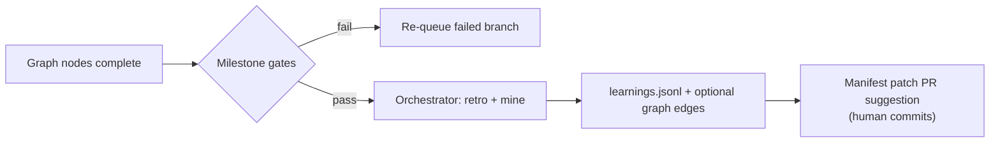

# Design: Multi-agent company (Docker sandbox + OpenRouter)

**Status:** proposed — for review and critique before implementation  
**Date:** 2026-10-05  
**Depends on:** [DESIGN_SANDBOX_AND_VERIFICATION.md](DESIGN_SANDBOX_AND_VERIFICATION.md), [DESIGN_DAG_AND_KNOWLEDGE_CANVAS.md](DESIGN_DAG_AND_KNOWLEDGE_CANVAS.md), [DESIGN_GRAPH_ENGINEERING.md](DESIGN_GRAPH_ENGINEERING.md), [DESIGN_LONG_HORIZON_PLANNING.md](DESIGN_LONG_HORIZON_PLANNING.md), [ARCHITECTURE.md](ARCHITECTURE.md)  
**Supersedes (when built):** “Parallel agents — deferred” in DAG Part 5 for the **Docker + remote allowlist** path only; sequential local LM Studio stays the default.

---

## 0. Mental model (what exists today)

| Piece | Repo / path | Role today |
|-------|-------------|------------|
| **environment-setup** | This monorepo root | Dev shell (tmux, vim, nvim, zsh), `./setup.sh`, embeds **lmloop** |
| **lmloop** | `lmloop/` | Single-process agent: `act()` tool loop, `until` goal loop, authored **graphs** (`company`: ceo → build → qa → mine), file JSONL memory, optional knowledge graph |
| **Execution** | Host `run_shell` | No container isolation unless `--docker` (proposed in sandbox doc) |
| **Models** | `base_url` → LM Studio default | Local, one slot; OpenRouter mentioned only as “remote” for concurrency/spend keys |
| **Honesty** | Eval `STATUS:`, `--check` exit codes | Maker cannot self-certify; derived check plans proposed but not all shipped |
| **Company metaphor** | `graphs/company.md` + skills (`ceo`, `qa`, …) | **Sequential** one node at a time; hardcoded `pytest -q` is a known defect |

This design adds an **orchestrator** on the host that can run **multiple headless workers** in **Docker sandboxes**, each on a **git worktree**, driven by a **monorepo manifest**, talking only to **allowlisted OpenRouter models**, with **deterministic gates** and **milestone reflection**—without pretending unconstrained agents stay correct for dozens of steps.

---

## 1. Problem statement

**Goal:** Optional **multi-agent availability on local machines** when the user opts into **Docker workspace sandbox**, so lmloop can operate a **MetaGPT-like company** (role-specialized agents, structured handoffs, QA loops) with **minimal human intervention**, while:

1. **Controlling cost** — required context only, prompt-cache-friendly prefixes, token budgets.  
2. **Controlling risk** — sandboxed shell, git snapshots, exit-code gates, no model-chosen “I’m done”.  
3. **Controlling memory** — many agents must not each load a full local LLM; workers are thin processes + small containers.  
4. **Controlling supply chain** — in autonomous multi-agent mode, **only OpenRouter models on an explicit allowlist** may be called (no arbitrary model IDs from worker config or prompts).

**Non-goals:**

- Replacing LangGraph/CrewAI inside lmloop (still **authored graphs**, no LLM router).  
- Fully autonomous merges to `main` without human or CI (orchestrator may **propose** integration; gates decide).  
- Self-modifying weights or runtime prompt optimization (DSPy-style) in v1.  
- Running multiple **local** LM Studio slots as “agents” (unchanged: local default stays sequential, one slot).

---

## 2. Production reality (marketing vs engineering)

Unconstrained tool loops **compound error**: even 95% per-step success is ~46% after 15 steps. This design **does not** rely on open-ended agency.

| Layer | Mechanism |
|-------|-----------|
| **Runtime isolation** | One Docker sandbox per active **writer** worker; orchestrator on host |
| **Deterministic gatekeepers** | Derived/`--check` commands, linters, tests; eval only when no check can *prove* the goal |
| **State journaling** | Existing until/graph JSONL + git `refs/lmloop/*` snapshots + manifest version in every run row |
| **Budget enforcers** | `run_token_budget`, `until_max_steps`, `graph_max_steps`, per-worker step caps, orchestrator kill switch |

**Self-improvement** here means **reflection at milestones** (retro skill, learnings, graph mine, manifest/version bumps)—not the model rewriting its own weights.

---

## 3. Activation and trust boundaries

Multi-agent company mode is **opt-in and flag-gated** (extends sandbox doc’s “CLI flag only” principle):

| Invocation | Behavior |
|------------|----------|
| `lmloop …` (default) | Unchanged: one agent, host shell, local or any `base_url` |
| `lmloop --docker …` | Single agent, one container (sandbox doc) |
| `lmloop --docker --company …` **or** `lmloop company run` | **Orchestrator + N workers** (this doc) |

Additional requirements when `--company` is set:

| Requirement | Rationale |
|-------------|-----------|
| `base_url` host is **not** loopback **or** user sets `company_remote: true` | Multi-agent economic win needs remote parallelism; local single-slot does not |
| `base_url` must match **OpenRouter** (or explicit compatible aggregator URL) | Central place to enforce allowlist + caching headers |
| Manifest present and valid (see §5) | No implicit company topology |
| `autonomous_gates: all` or orchestrator-owned gate batching | Workers have no TTY |

**Model allowlist (hard enforcement in `chat.py`):**

- Config: `company_models_allowlist: string[]` (model IDs as OpenRouter expects them).  
- Optional manifest override: `manifest.models.<role>` ⊆ allowlist.  
- Any request with a model not in the effective allowlist → **`ServerError` before HTTP**, logged on orchestrator row. Workers cannot override via env or tool calls.  
- **Orchestrator-only models** (e.g. planner/checker): `eval_model` and milestone `retro` must also be on the allowlist when `--company` is active.

**OpenRouter autonomy set:** Document a curated default list (cheap + strong tool-call reliability) shipped as `lmloop/company/openrouter_autonomous.yaml`; users extend via config, never bypass.

---

## 4. Architecture overview

```mermaid
flowchart TB
  classDef host fill:#f0fdf4,stroke:#22c55e
  classDef ctr fill:#eef6ff,stroke:#3b82f6
  classDef remote fill:#fef2f2,stroke:#ef4444

  user(["Human · optional HITL"]):::host

  subgraph hostproc["Host · one orchestrator process"]
    orch["company/orchestrator.py<br/>frontier · manifest · merge · gates"]:::host
    graph["graph.py · loop.py<br/>unchanged semantics, drives frontier"]:::host
    mem["~/.lmloop · JSONL<br/>one writer orchestrator only"]:::host
    chat_o["chat.py · allowlist check"]:::host
  end

  subgraph repo["Monorepo git"]
    main["branch main / integration"]
    manifest[".lmloop/company/manifest.yaml"]
    wt1[".lmloop/worktrees/builder/"]
    wt2[".lmloop/worktrees/qa/"]
  end

  subgraph workers["Worker processes · headless"]
    w1["lmloop worker<br/>--docker · one node"]:::ctr
    w2["lmloop worker<br/>--docker · one node"]:::ctr
  end

  c1[("Container builder")]:::ctr
  c2[("Container qa")]:::ctr
  or_api[("OpenRouter<br/>allowlisted models only")]:::remote

  user --> orch
  orch --> graph
  orch --> mem
  orch -->|"spawn, task packet"| w1
  orch -->|"spawn, task packet"| w2
  w1 --> c1
  w2 --> c2
  w1 --> chat_o
  w2 --> chat_o
  chat_o --> or_api
  c1 --> wt1
  c2 --> wt2
  wt1 --> repo
  wt2 --> repo
  orch -->|"worktree add/rm · merge proposal"| repo
  manifest --> orch
```

**Division of responsibility:**

| Component | Runs where | Holds state | Calls LLM |
|-----------|------------|-------------|-----------|
| **Orchestrator** | Host | Graph/until run log, manifest version, merge queue, gate batch | Milestone retro, optional ceo/plan node, eval_model checks |
| **Worker** | Host process + **one** Docker sandbox | Nothing durable (read-only manifest slice + handoff packet) | Role model from manifest, bounded `act()` / `run_until` |
| **Container** | Linux sandbox | Ephemeral FS except bind mount + shadow volumes | Never (agent is host-side Python driving `docker exec`) |

Workers are **`lmloop worker run`** (new subcommand): no REPL, no prompt_toolkit; stdin is a JSON **task packet**; stdout/stderr structured **result envelope** for orchestrator.

---

## 5. Manifest-first monorepo contract

The **manifest is the source of truth** for company topology, models, resources, and milestones. It lives **in the monorepo** so every change is reviewed like code.

**Path (convention):** `.lmloop/company/manifest.yaml` (or `manifest.json` if the repo already standardizes on JSON).

**Versioning:**

1. Any change to roles, edges, budgets, or allowlisted models → **commit to manifest first** on branch `main` (or integration branch named in manifest).  
2. Orchestrator records `manifest_git_sha` on the company run meta row.  
3. Workers receive **`manifest_sha` + role id**; they refuse to start if HEAD is behind orchestrator’s locked sha (orchestrator checks out manifest at run start).

**Minimal schema (v1):**

```yaml
version: 1
integration_branch: main

models:
  default: anthropic/claude-3.5-sonnet  # must ⊆ config allowlist
  eval: anthropic/claude-3.5-haiku
  roles:
    ceo: anthropic/claude-3.5-sonnet
    build: deepseek/deepseek-chat
    qa: anthropic/claude-3.5-haiku

resources:
  max_parallel_workers: 3
  worker_memory: 1g          # docker --memory per worker
  worker_cpus: "1"
  worker_pids_limit: 256

graph: company                # packaged or ~/.lmloop/graphs/company.md override path

milestones:
  - id: M1
    name: "Vertical slice shipped"
    gates:
      - cmd: "make test"      # or derived; same CheckPlan machinery
        role: authoritative
  - id: M2
    name: "Retro + learning harvest"
    on_pass: retro          # skill retro + mine, orchestrator-only

roles:
  builder:
    worktree: builder
    graph_nodes: [build]
  qa:
    worktree: qa
    graph_nodes: [qa]
```

**Mapping to existing graphs:** The manifest **does not replace** `graphs/company.md` initially—it **binds** graph node names to worktrees, models, and parallelism. Long term, `graph propose` + human approval may emit manifest fragments.

**This repository:** Today there is no root manifest; tests live in `lmloop/DEVELOPMENT.md`. A bootstrap manifest would point checks at `unittest` via derived plans (sandbox doc V10), not hardcoded pytest.

---

## 6. Git worktrees (inside the monorepo mount)

Earlier review rejected worktrees when `.git` pointed **outside** the Docker bind mount. This design **requires worktrees under the repo root**:

```
monorepo/
├── .git/
├── .lmloop/
│   ├── company/manifest.yaml
│   └── worktrees/
│       ├── builder/          # git worktree
│       └── qa/
```

**Creation (orchestrator on host):**

```bash
git worktree add -B lmloop/builder .lmloop/worktrees/builder <base-sha>
```

Each worktree’s `.git` **file** references `.git/worktrees/<name>/`, both under the same bind mount (`-v $REPO_ROOT:$REPO_ROOT` with identical host/container path, or `-v $REPO_ROOT:/workspace` with **forced** `worktree` paths under `/workspace/.lmloop/worktrees/…` only).

**Rules:**

| Rule | Why |
|------|-----|
| Worktrees only under `.lmloop/worktrees/*` | Keeps docker mount self-contained |
| One **writer** role per worktree at a time | Avoids JSONL and git races |
| Orchestrator serializes **merge to integration branch** | No auto-merge on conflict |
| Base SHA pinned at company run start | Reproducible diffs |
| Integration uses **merge --no-ff** or PR branch | Audit trail |

**Alternative (fallback):** If path parity cannot be guaranteed (exotic Docker setups), orchestrator falls back to **`git clone --reference`** per role (heavier disk, same semantics). Manifest flag `isolation: clone|worktree`.

---

## 7. Orchestration loop (MetaGPT-like, but gated)

Reuse **DAG frontier** from [DESIGN_DAG_AND_KNOWLEDGE_CANVAS.md](DESIGN_DAG_AND_KNOWLEDGE_CANVAS.md) Part 2:

1. Load manifest + graph → compute **runnable frontier** (`needs` satisfied).  
2. While frontier non-empty and budgets allow:  
   - Pick up to `min(|runnable|, max_parallel_workers)` nodes whose roles differ **or** whose worktrees differ.  
   - Spawn worker per node with **task packet** (goal, skill/until spec, handoff clip, check plan slice, `manifest_sha`, worktree path, model id).  
   - Wait for envelopes; append **graph run rows** from orchestrator (workers return summaries, not append JSONL).  
3. On terminal pass/fail: run **milestone** hooks from manifest.  
4. **Reflection phase** (orchestrator, not workers): `/memory mine`, `skill retro`, optional `ceo` review on milestone boundary—writes learnings only after deterministic gates pass.

**Handoffs:** Same as today: last assistant summary per node, clipped (1500 chars), concatenated at joins—**no LLM merge**.

**Verification per worker:**

- Same stack as sandbox doc: snapshot → maker → derived checks → eval if needed.  
- Orchestrator re-runs **authoritative checks on integration worktree** before marking milestone pass (workers might lie; **git diff + CI** cannot).

---

## 8. Memory and cost minimization

### 8.1 Why OpenRouter + thin workers

Local multi-agent with LM Studio duplicates **weights/RAM** per process. Remote inference moves RAM cost to the provider; local RAM goes to **containers + git + orchestrator**.

### 8.2 Container footprint

| Knob | Default (company) | Single-agent sandbox doc |
|------|-------------------|---------------------------|
| `worker_memory` | 1g | 4g |
| `worker_cpus` | 1 | 2 |
| Image | Same slim Debian digest-pinned | Same |
| Shadow volumes | Per worktree path hash | Per workspace |

Workers run **tests and shell**, not LM Studio. Orchestrator never enters worker containers.

### 8.3 Context discipline (per worker packet)

| Include | Exclude |
|---------|---------|
| Role skill + steering | Full company thread |
| Join handoff clips | Other workers’ tool transcripts |
| Check plan for **this node only** | Whole-repo `@` attachments |
| Frozen clock + **manifest hash block** | Unbounded session history |

Orchestrator stores full transcripts in **per-worker session logs** under `~/.lmloop/projects/<slug>/company/<run>/workers/<node>-<ts>.jsonl` for audit, not re-injected wholesale.

### 8.4 Prompt caching (OpenRouter / provider)

Design for **stable prefixes** (aligns with DAG doc “cache-stable prefixes”):

1. **Tier A — static:** packaged `system.md` + role skill + steering (hash per role).  
2. **Tier B — run-stable:** manifest sha, check plan text, frozen memory block ([DESIGN_MEMORY_RETRIEVAL.md](DESIGN_MEMORY_RETRIEVAL.md) Layer C).  
3. **Tier C — volatile:** handoff, user goal, tool results.

Orchestrator orders messages so Tier A+B are identical across cycles for a given role. Optional future: explicit cache breakpoint API when measured savings &gt; complexity.

### 8.5 Concurrency and slots

Reuse **`ModelSlots`** with `model_concurrency: auto` → **4** on OpenRouter ([DAG doc §1.2](DESIGN_DAG_AND_KNOWLEDGE_CANVAS.md)). Cap parallel workers at `min(max_parallel_workers, model_concurrency - orchestrator_reserve)`.

---

## 9. Milestones and company-level reflection

**Multi-day campaigns:** When `--campaign <id>` is set (see [DESIGN_LONG_HORIZON_PLANNING.md](DESIGN_LONG_HORIZON_PLANNING.md)), milestone ids align with **plan phases**, daily/end-of-day ticks update `plan.jsonl`, and disjoint company invocations append to the same campaign `runs.jsonl`. Reflection cadence is **milestone + daily + blocked-node**, not only terminal graph pass.

**Milestone** = manifest-declared checkpoint with **deterministic gates** + optional **retro**.



| Activity | Who | LLM? |
|----------|-----|------|
| Gate commands | Orchestrator on integration WT | No |
| Retro / mine | Orchestrator | Yes, allowlisted eval model |
| Manifest update | Human PR | No (orchestrator may draft markdown file → worker `write_file` forbidden; host writes proposal) |

**Major milestone:** bump `manifest.version`, append `CHANGELOG` entry template, run `ceo` skill against **diff stat + gate results** only—not full code dump.

---

## 10. Worker protocol (sketch)

**Task packet (JSON stdin):**

```json
{
  "manifest_sha": "abc123",
  "run_id": "graph:company:20261005T120000Z",
  "node": "build",
  "worktree": ".lmloop/worktrees/builder",
  "model": "deepseek/deepseek-chat",
  "mode": "until",
  "goal": "…",
  "handoff": "…",
  "checks": [{"cmd": "…", "role": "check", "tier": "authoritative"}],
  "budgets": {"max_rounds": 40, "token_budget": 80000}
}
```

**Result envelope (JSON stdout):**

```json
{
  "status": "pass|fail|blocked",
  "summary": "…",
  "tree_sha": "…",
  "usage": {"total_tokens": 12345},
  "denied": ["rm -rf …"],
  "session_log": "relative/path under ~/.lmloop"
}
```

Workers **never** call `remember` / `log_decision` directly; orchestrator ingests summaries into project memory after gates pass (prevents polluted learnings from a bad branch).

---

## 11. Module layout (proposed)

```
lmloop/lmloop/
├── company/
│   ├── __init__.py
│   ├── manifest.py      # parse/validate manifest.yaml
│   ├── orchestrator.py  # frontier, spawn, merge, milestones
│   ├── worker_cli.py    # headless entry
│   └── openrouter_autonomous.yaml
├── exec.py              # from sandbox doc (shared)
└── …
```

**Import graph:** `company/*` may import `graph`, `loop`, `exec`; `graph`/`loop` must **not** import `company`. CLI wires `lmloop company run` in `cli.py` only.

---

## 12. Phased delivery

| Phase | Delivers | Depends on |
|-------|----------|------------|
| **P0** | Shipped defects (env errors → blocked, derived checks, snapshots) | [DESIGN_ROADMAP.md](DESIGN_ROADMAP.md) step 0–2 |
| **P1** | Manifest parse + validate; example manifest in monorepo; no workers | — |
| **P2** | Worktree lifecycle on host; single-worker `--docker` running one graph node | Sandbox S1–S6, DAG D1–D3 |
| **P3** | `ModelSlots` + OpenRouter allowlist enforcement + `run_token_budget` | DAG K1–K3 |
| **P4** | Worker subcommand + task packet + orchestrator spawn **max_parallel=2** | P2–P3 |
| **P5** | Milestones + reflection + integration re-check | Sandbox checks V1–V6 |
| **P6** | Prompt-cache ordering metrics in `lmloop flow` | Memory Layer C |

**Revisit parallel width:** Start with **2** workers; raise only when `lmloop flow` shows frontier wait time dominates and gates stay green.

---

## 13. Config additions (budget)

Proposed **new** user-facing keys (company mode only):

| Key | Default | Meaning |
|-----|---------|---------|
| `company_models_allowlist` | list from `openrouter_autonomous.yaml` | Autonomous mode model IDs |
| `company_max_parallel` | 2 | Cap concurrent workers |
| `company_orchestrator_model` | `eval_model` or manifest default | Planner/retro |
| `company_remote` | false | Allow `--company` against loopback (discouraged) |

Existing keys reused: `run_token_budget`, `eval_model`, `model_concurrency`, `sandbox_*`, `autonomous_gates`, `autonomous_snapshot`.

---

## 14. Risk register

| Risk | Sev | Mitigation |
|------|-----|------------|
| Compounding agent errors | P0 | Deterministic checks; integration re-run; eval only when needed |
| Worker bypasses allowlist via crafted `base_url` | P0 | Allowlist checked in `chat.py` on every `_chat`; workers inherit orchestrator config snapshot |
| Git corruption across worktrees | P0 | One writer per WT; orchestrator-only merge; snapshots |
| OpenRouter cost spike | P1 | `run_token_budget`, parallel cap, cheap models for qa/eval |
| Manifest drift mid-run | P1 | Pin `manifest_sha` at start |
| Docker path mismatch breaks worktrees | P1 | Enforce `.lmloop/worktrees`; preflight; clone fallback |
| False confidence from same-model check | P2 | `eval_model` ≠ role model; milestone gates are non-LLM |
| “Autonomous company” marketing gap | — | Milestones require human merge to `main` unless CI policy says otherwise |

---

## 15. Open questions (for your critique)

1. **Integration branch policy:** Always open a PR from `lmloop/integration/<run>` vs direct merge when gates pass?  
2. **Manifest vs graph:** Should manifest eventually **embed** the graph DSL, or stay a binding layer?  
3. **Allowlist curation:** Ship one conservative OpenRouter list vs require user to paste models on day one?  
4. **Host path parity:** Require `LMLOOP_REPO_ROOT` env for Docker bind mounts, or detect and refuse?  
5. **Read-only parallel roles:** Should `ceo` / `retro` always run on host orchestrator (recommended) while only `build`/`qa` use workers?  
6. **Monorepo scope:** Is `.lmloop/company/` the right path for **this** environment-setup repo, or should manifest live at repo root `company.manifest.yaml` for visibility?

---

## 16. Relationship to other docs

| Doc | Change when this ships |
|-----|-------------------------|
| [DESIGN_DAG_AND_KNOWLEDGE_CANVAS.md](DESIGN_DAG_AND_KNOWLEDGE_CANVAS.md) Part 5 | Mark parallel **workers** as “shipped for `--company` + Docker + remote only”; sequential default unchanged |
| [DESIGN_SANDBOX_AND_VERIFICATION.md](DESIGN_SANDBOX_AND_VERIFICATION.md) | Add one-container-per-worker naming; loopback publish unchanged |
| [DESIGN_ROADMAP.md](DESIGN_ROADMAP.md) | New build track “Company multi-agent” after sandbox + DAG fan-out |
| [ARCHITECTURE.md](ARCHITECTURE.md) | Trust boundary diagram for orchestrator/worker |
| [DESIGN_LONG_HORIZON_PLANNING.md](DESIGN_LONG_HORIZON_PLANNING.md) | `--campaign`, plan store, board, supervisor multi-day flow |

---

## Appendix A — Example company flow (ASCII)

```
[Manifest commit on main]
        │
        ▼
lmloop company run --docker --goal "Ship feature X"
        │
        ├─ orchestrator: pin manifest_sha, create worktrees
        ├─ frontier: ceo (host, no container) → pass
        ├─ parallel: build@builder-WT, docs@docs-WT (if graph fan-out)
        │     └─ workers: snapshot → until → checks
        ├─ qa@qa-WT on integration cherry-pick or merge preview
        ├─ milestone M1 gates on integration WT (make test)
        └─ retro + mine → learnings (orchestrator)
```

---

## Appendix B — Default OpenRouter autonomy tier (illustrative, not final)

| Tier | Use | Example IDs (placeholders) |
|------|-----|----------------------------|
| **Planner** | ceo, retro | Higher reasoning model |
| **Maker** | build | Strong tool-calling mid tier |
| **Checker** | qa, eval | Fast/cheap model |

Exact IDs must be validated against OpenRouter tool-calling support and updated in `openrouter_autonomous.yaml` without code changes.
