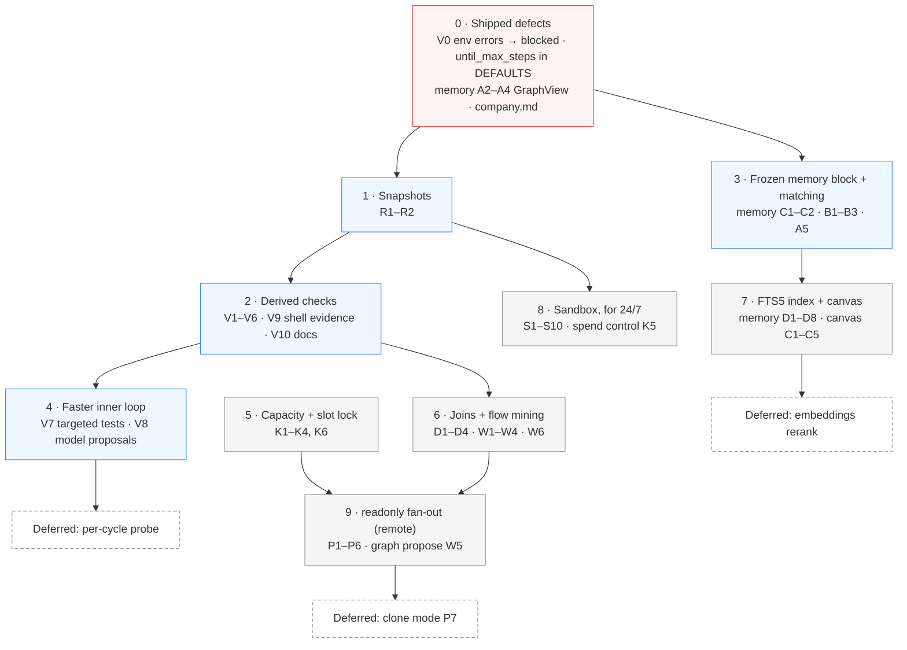

# Design roadmap: final review of the proposals

**Status:** proposed — this file orders and trims the three design docs; it adds no feature
**Date:** 2026-09-26
**Covers:** [DESIGN_SANDBOX_AND_VERIFICATION.md](DESIGN_SANDBOX_AND_VERIFICATION.md) ·
[DESIGN_DAG_AND_KNOWLEDGE_CANVAS.md](DESIGN_DAG_AND_KNOWLEDGE_CANVAS.md) ·
[DESIGN_MEMORY_RETRIEVAL.md](DESIGN_MEMORY_RETRIEVAL.md)

## Verdict

The designs are sound, and **too big**. Taken together they propose 40 new config keys on
top of today's 26, two new command stems, seven new modules, and a parallel-execution subsystem
for a user whose laptop serves one model at a time. Most of the value sits in a small
core:

1. **Derived checks.** A plain-language `until` goal gets a deterministic gate without the
   user typing a command.
2. **Snapshots.** The default mode runs on the host, and nothing else protects the tree
   from a shell `rm`.
3. **Memory hot paths and a frozen memory block.** Measured seconds per cycle today on the
   graph path, and a prompt that defeats caching every cycle.
4. **Four shipped defects** found during review, each a small, independent fix.

Build those first, ship them, measure with `lmloop flow`, and let the data decide how much
of the rest is worth building.

---

## 1. Fix what is broken today (before any proposal)

Each was reproduced against the current code during review.

| # | Defect | Evidence | Fix | Doc |
|---|---|---|---|---|
| 1 | A `--check` command that cannot start is classified `fail`, so the maker loops "fixing" code until `until_max_steps` | `pytest -q` on this repo → `ERROR: [Errno 2] No such file or directory: 'pytest'` → `fail` | Spawn errors and exit 126/127 → `blocked` | Sandbox §2.5, task V0 |
| 2 | The packaged `company` graph hardcodes `--check 'pytest -q'` and can never pass outside pytest projects — lmloop's own tests run under `unittest` | `graphs/company.md`, `DEVELOPMENT.md` | Drop the hardcoded check; derived plan | Sandbox task V10 |
| 3 | `until_max_steps` is documented in the README and read by `loop.py`, but missing from `config.DEFAULTS`, so `lmloop config set until_max_steps …` is rejected | `coerce_config_value('until_max_steps', '5')` → `None`; `graph_max_steps` → `5` | Add it to `DEFAULTS` with a test that every README config row round-trips through `config set` | This file |
| 4 | Knowledge-graph memory re-scans everything on every call: `/memory graph` is quadratic (42 s at 1,000 learnings) and `context_block` costs 1.3 s at 3,000 learnings on **every** until cycle | Memory §0.1 measurements | `GraphView`, backfill fingerprint, linear `stats` | Memory tasks A2–A4 |

Defect 3's test is the durable fix: it makes "a documented config key that cannot be set"
impossible to reintroduce, which is the same class of drift DEVELOPMENT.md forbids ("config
keys with no reader, or readers with no README line").

---

## 2. Opinions

**Derived checks are the most valuable change in all three docs.** They turn the default
`until` experience from "the model grades itself" into "exit codes decide", for users who
never learn a flag. The repo-docs source matters more than it looks: this repository has
no manifest at all, and its test command lives only in a fenced block in `DEVELOPMENT.md`.
A manifest-only design would have found nothing here.

**The strongest honesty mechanism is the baseline, not the auditor.** Running the plan once
before any work, and reclassifying already-passing checks as invariants, catches the most
common hallucinated success — a gate that passes before anything changed — with no extra
model call. That is why the per-cycle probe is deferred.

**Parallelism delivers nothing on this user's laptop.** Capacity resolves to 1, so Phase P
is dead code locally. Build only the parts that are useful at width 1:

- The **slot lock** (it also stops two terminals from colliding).
- **Joins** (they are useful sequentially).
- **`readonly` fan-out** later, for remote endpoints.

**Defer `clone` mode indefinitely.** It needs snapshots, local clones, parent-side commits,
scratch merges, verified patch application, memory shards, and conflict gates. It is the
most complex part of all three docs for the least local value. Revisit it only if
`lmloop flow` shows remote users with independent write-heavy branches.

**The sandbox is a 24/7 feature, not a default one.** For interactive work, snapshots plus
the existing gates give most of the safety at a fraction of the cost. `--docker-persist`
earns its keep under an unattended supervisor; build Phase S when that is actually wanted.

**Memory work pays twice.** Layers A and C are pure wins with no new artifact. The FTS5
index is the first thing that makes past sessions searchable, and it also serves check
inference (memory and history sources) and the canvas. Embeddings come last, and only if
FTS5 recall proves insufficient in practice.

**Every feature must be latency-neutral on a single-slot laptop.** The derived-check design
passes this bar:

- The baseline costs one run of the plan.
- Targeted tests make the inner loop faster.
- The model proposal is one call per run, not per cycle.
- Freezing the memory block removes a re-prefill every cycle.

Hold later features to the same bar.

---

## 3. Config budget: 40 proposed keys → 12

A key belongs in config only if different users need different values **and** a wrong
default costs them something real. Everything else is a named constant, which is easier to
test and impossible to misconfigure.

| Keep as config (12) | Why a user changes it |
|---|---|
| `check_inference` | Opt out of derived checks |
| `until_baseline` | Opt out of baseline and reclassification |
| `autonomous_snapshot` | Non-git workspaces, or users who do not want refs |
| `sandbox_image` | Project toolchains differ |
| `sandbox_network` | `bridge` vs `none` is a real security choice |
| `max_parallel_agents` | Remote users want more than the default |
| `local_parallel_slots` | Only the user knows how their server is loaded, when it does not report it |
| `parallel_isolation` | Opting into fan-out |
| `run_token_budget` | Remote spend ceiling |
| `eval_model` | A cheaper checker on remote endpoints |
| `memory_index` | Opt out, or require it |
| `recall_sessions` | Privacy on remote endpoints |

| Becomes a constant | Value |
|---|---|
| `sandbox_ports`, `sandbox_memory`, `sandbox_cpus`, `sandbox_pids`, `sandbox_shadow_dirs` | The documented defaults |
| `sandbox_persist_restart`, `sandbox_persist_max_age_d`, `sandbox_persist_disk_warn_gb` | `unless-stopped`, 7 days, 5 GB (warnings only) |
| `sandbox_docker_bin` | `docker`, overridable with the environment variable `LMLOOP_DOCKER` for Podman users |
| `snapshot_max_file_mb` | 20 |
| `remote_default_parallel`, `parallel_hard_cap` | 4, 8 |
| `slot_context` | `split` (fail-closed) |
| `graph_max_parallel`, `child_grace_s`, `join_handoff_chars` | none, 10 s, 1500 |
| `mine_model` | Uses `eval_model` |
| `propose_min_runs`, `canvas_max_nodes` | 5, 2000 |
| `recall_session_snippets`, `index_full_sweep_s` | 3, 60 s |

| Deferred with its feature | |
|---|---|
| `prompt_cache` | Explicit cache breakpoints: wait for a measured need; prefix stability (memory Layer C) is the prerequisite and is free |
| `memory_embeddings`, `memory_embeddings_remote`, `embedding_model`, `embed_rerank_k`, `rerank_alpha` | Semantic rerank (memory Layer E) |
| `sandbox_env_passthrough` | Until someone needs a variable inside the container |

The individual design docs keep their full tables as the specification of each value; this
table decides which ones are exposed.

---

## 4. Build order

| Step | Why here |
|---|---|
| 0 · Shipped defects | Live bugs; each is a small diff with a regression test |
| 1 · Snapshots | The default mode is the host; this is its only undo for shell damage |
| 2 · Derived checks | The UX change users feel, and the honesty upgrade for plain-language goals; depends on 0's error classification |
| 3 · Frozen block + matching | Pure latency and quality wins with no new artifact |
| 4 · Faster inner loop | Targeted tests shrink cycle time; model proposals cover goals no project command can prove |
| 5 · Capacity + slot lock | Useful even at width 1: two terminals stop colliding on a laptop |
| 6 · Joins + flow mining | Sequentially useful; flow produces the data that decides steps 7–9 |
| 7 · FTS5 + canvas | Past sessions become searchable; canvas reads through the same accessor |
| 8 · Sandbox | Build when an unattended 24/7 run is actually wanted |
| 9 · `readonly` fan-out | Only pays on remote endpoints |

---

## 5. Open questions (resolve during implementation, not before)

- **LM Studio slot count:** which field, if any, the native models API exposes for parallel
  slots on the version in use. Until confirmed, `local_parallel_slots` defaults to 1.
- **FTS5 on users' Pythons:** present on this machine's sqlite 3.45; the scan fallback must
  stay tested because it is not guaranteed everywhere.
- **Repo-doc conventions:** which of `AGENTS.md`, `CLAUDE.md`, and `.cursor/rules` users
  actually keep current. `lmloop flow`'s per-source check quality will answer it; drop any
  source that mostly produces dropped or keep-only commands.

## 6. Keeping the docs honest

When a step ships, its section moves into `ARCHITECTURE.md` (behavior) and `README.md`
(user-facing), and the design doc's status flips to `shipped`, per DEVELOPMENT.md. Deferred
items stay in the design docs as non-goals with their reason, so the next reviewer does not
re-propose them without the evidence that changed.
