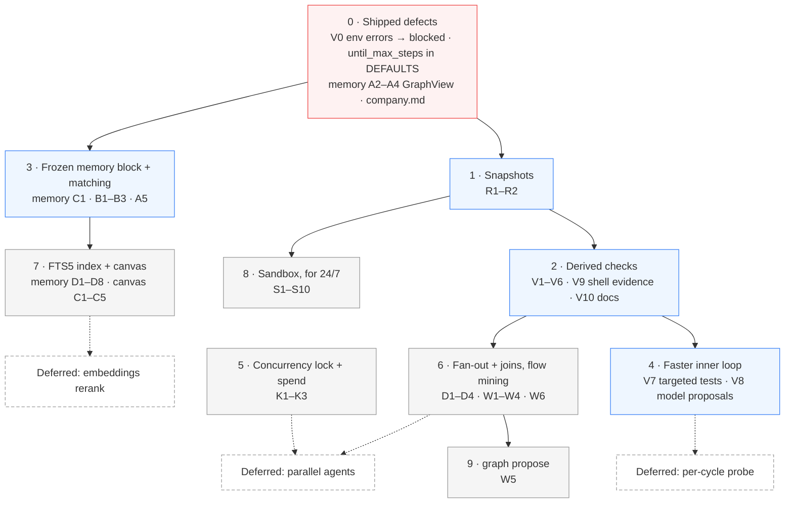

# Design roadmap: final review of the proposals

**Status:** proposed — this file orders and trims the three design docs; it adds no feature
**Date:** 2026-09-26 · **Revised:** 2026-09-26 (round 5: cuts applied to the design docs)
**Covers:** [DESIGN_SANDBOX_AND_VERIFICATION.md](DESIGN_SANDBOX_AND_VERIFICATION.md) ·
[DESIGN_DAG_AND_KNOWLEDGE_CANVAS.md](DESIGN_DAG_AND_KNOWLEDGE_CANVAS.md) ·
[DESIGN_MEMORY_RETRIEVAL.md](DESIGN_MEMORY_RETRIEVAL.md) ·
[DESIGN_MULTI_AGENT_COMPANY.md](DESIGN_MULTI_AGENT_COMPANY.md) (proposed)

## Verdict

The designs were sound and **too big**. Revision 4 proposed 40 new config keys on top of
today's 26, and a parallel-execution subsystem for a user whose laptop serves one model at a
time. Round 5 applies the cuts to the design docs themselves:

- **10 user-facing config keys**, not 40; the rest are named constants.
- **Parallel agents deferred entirely**, in every mode. lmloop runs one agent at a time; the
  constraints a future parallel design must meet are recorded, not built.
- **Per-cycle probe and semantic rerank deferred** until usage data asks for them.

What remains is a small, high-value core:

1. **Derived checks.** A plain-language `until` goal gets a deterministic gate without the
   user typing a command.
2. **Snapshots.** The default mode runs on the host, and nothing else protects the tree from a
   shell `rm`.
3. **Memory hot paths and a frozen memory block.** Seconds per cycle today on the graph path,
   and a prompt that defeats caching every cycle.
4. **Four shipped defects**, each a small, independent fix.

Build those first, ship them, and let `lmloop flow` data decide how much of the rest is worth
building.

---

## 1. Fix what is broken today (before any proposal)

Each was reproduced against the current code during review.

| # | Defect | Evidence | Fix | Doc |
|---|---|---|---|---|
| 1 | A `--check` command that cannot start is classified `fail`, so the maker loops "fixing" code until `until_max_steps` | `pytest -q` on this repo → `ERROR: [Errno 2] No such file or directory: 'pytest'` → `fail` | Spawn errors and exit 126/127 → `blocked` | Sandbox §2.5, task V0 |
| 2 | The packaged `company` graph hardcodes `--check 'pytest -q'` and can never pass outside pytest projects — lmloop's own tests run under `unittest` | `graphs/company.md`, `DEVELOPMENT.md` | Drop the hardcoded check; derived plan | Sandbox task V10 |
| 3 | `until_max_steps` is documented in the README and read by `loop.py`, but missing from `config.DEFAULTS`, so `lmloop config set until_max_steps …` is rejected | `coerce_config_value('until_max_steps', '5')` → `None`; `graph_max_steps` → `5` | Add it to `DEFAULTS`, with a test that every README config row round-trips through `config set` | This file |
| 4 | Knowledge-graph memory re-scans everything on every call: `/memory graph` is quadratic (42 s at 1,000 learnings) and `context_block` costs 1.3 s at 3,000 learnings on **every** until cycle | Memory §0.1 measurements | `GraphView`, backfill fingerprint, linear `stats` | Memory tasks A2–A4 |

Defect 3's test is the durable fix: it makes "a documented config key that cannot be set"
impossible to reintroduce — the same drift DEVELOPMENT.md forbids ("config keys with no
reader, or readers with no README line").

---

## 2. Opinions

**Derived checks are the most valuable change in all three docs.** They turn the default
`until` experience from "the model grades itself" into "exit codes decide", for users who
never learn a flag. The repo-docs source matters more than it looks: this repository has no
manifest at all, and its test command lives only in a fenced block in `DEVELOPMENT.md`.

**The strongest honesty mechanism is the baseline, not an auditor.** Running the plan once
before any work, and reclassifying already-passing checks as invariants, catches the most
common hallucinated success — a gate that passes before anything changed — with no extra
model call. That is why the per-cycle probe is deferred.

**Parallel agents: not now, in any mode.** On a laptop serving one model, `model_concurrency`
is 1 and parallel agents cannot be faster than sequential ones. A correct version needs
processes rather than threads, slug pinning, single-writer discipline across processes,
batched gates, per-branch clones, and verified merges — the most complex part of every doc,
for no local gain. What survives costs almost nothing and helps today:

- **The host-wide lock**, which stops two terminals from colliding on a laptop.
- **DAG fan-out and joins, run one node at a time**, which let independent branches have
  independent outcomes (a failing `api` no longer stops `docs`).

The DAG doc records the parallel constraints and a revisit trigger, so the next attempt
starts from evidence rather than repeating the review.

**The sandbox is a 24/7 feature, not a default one.** For interactive work, snapshots plus
the existing gates give most of the safety at a fraction of the cost. `--docker-persist`
earns its keep under an unattended supervisor; build Phase S when that is actually wanted.

**Memory work pays twice.** Layers A and C are pure wins with no new artifact. The FTS5 index
is the first thing that makes past sessions searchable, and it also serves check inference
(memory and history sources) and the canvas. Embeddings wait for evidence that FTS5 misses
paraphrases that matter.

**Every feature must be latency-neutral on a single-slot laptop.** The derived-check design
passes this bar:

- The baseline costs one run of the plan.
- Targeted tests make the inner loop faster.
- The model proposal is one call per run, not per cycle.
- Freezing the memory block removes a re-prefill every cycle.

Hold later features to the same bar.

---

## 3. Config budget

A key belongs in config only if different users need different values **and** a wrong
default costs them something real. Everything else is a named constant. **Applied in round
5** — each design doc's config section now lists exactly these keys.

| Key (10) | Doc | Why a user changes it |
|---|---|---|
| `check_inference` | Sandbox | Opt out of derived checks |
| `until_baseline` | Sandbox | Opt out of baseline and reclassification |
| `autonomous_snapshot` | Sandbox | Non-git workspaces, or users who do not want refs |
| `sandbox_image` | Sandbox | Project toolchains differ |
| `sandbox_network` | Sandbox | `bridge` vs `none` is a real security choice |
| `model_concurrency` | DAG | A remote endpoint, or a local server deliberately given more slots |
| `run_token_budget` | DAG | Remote spend ceiling |
| `eval_model` | DAG | A cheaper or different checker model |
| `memory_index` | Memory | Opt out, or require it |
| `recall_sessions` | Memory | Privacy on remote endpoints |

| Became a constant or environment variable | Value |
|---|---|
| Sandbox ports, memory, CPUs, pids, shadow directories | `3000-3010` + `8000-8010` on loopback, `4g`, 2, 512, `.venv` + `node_modules` |
| Persist restart policy, age and layer-size warnings | `unless-stopped`, 7 days, 5 GB |
| Container runtime | `LMLOOP_DOCKER` environment variable, default `docker` |
| Snapshot untracked-file size limit | 20 MB |
| Remote auto concurrency, concurrency cap | 4, 8 |
| Join handoff clip, `graph propose` minimum runs, canvas node cap | 1500 chars, 5, 2000 |
| Recall snippets, index sweep interval, busy timeout | 3, 60 s, 2000 ms |

| Removed with a deferred or dropped feature | Feature |
|---|---|
| `local_parallel_slots`, `slot_context`, `parallel_isolation`, `graph_max_parallel`, `child_grace_s`, `remote_default_parallel`, `parallel_hard_cap`, `mine_model` | Parallel agents (mining now uses `eval_model`) |
| `require_negative_baseline`, `eval_probe`, `eval_probe_max_cmds`, `probe_min_context` | Now default behavior / deferred probe |
| `prompt_cache` | Explicit cache breakpoints; prefix stability comes free from the frozen memory block |
| `memory_embeddings`, `memory_embeddings_remote`, `embedding_model`, `embed_rerank_k`, `rerank_alpha` | Semantic rerank |
| `sandbox_env_passthrough` | Environment passthrough into the container |

---

## 4. Build order

Dotted edges point at deferred work and name what it would build on.

| Step | Why here |
|---|---|
| 0 · Shipped defects | Live bugs; each is a small diff with a regression test |
| 1 · Snapshots | The default mode is the host; this is its only undo for shell damage |
| 2 · Derived checks | The UX change users feel, and the honesty upgrade for plain-language goals; depends on 0's error classification |
| 3 · Frozen block + matching | Pure latency and quality wins with no new artifact |
| 4 · Faster inner loop | Targeted tests shrink cycle time; model proposals cover goals no project command can prove |
| 5 · Concurrency lock + spend | Two terminals stop colliding on a laptop; remote runs get a token ceiling |
| 6 · Fan-out + joins, flow mining | Independent branches with independent outcomes; flow produces the data for every later decision |
| 7 · FTS5 + canvas | Past sessions become searchable; the canvas reads through the same accessor |
| 8 · Sandbox | Build when an unattended 24/7 run is actually wanted |
| 9 · `graph propose` | The only model-in-the-loop authoring feature; best built on statistics a human has already read |

**Deferred work and its revisit trigger:**

| Deferred | Revisit when |
|---|---|
| Parallel agents (default local path) | `lmloop flow` shows, on a remote endpoint, frequent moments with ≥ 2 runnable frontier nodes and sequential waiting dominating wall-clock |
| Multi-agent company (`--docker --company`, manifest, worktrees) | See [DESIGN_MULTI_AGENT_COMPANY.md](DESIGN_MULTI_AGENT_COMPANY.md); build after sandbox S1–S6 + DAG fan-out D1–D3 + OpenRouter allowlist |
| Per-cycle probe | Runs finish on checker-only `pass` and later regress |
| Embeddings rerank | FTS5 recall demonstrably misses paraphrases users search for |

---

## 5. Open questions (resolve during implementation, not before)

- **FTS5 on users' Pythons:** present on this machine's sqlite 3.45; the scan fallback must
  stay tested because it is not guaranteed everywhere.
- **Repo-doc conventions:** which of `AGENTS.md`, `CLAUDE.md`, and `.cursor/rules` users
  actually keep current. `lmloop flow`'s per-source check quality will answer it; drop any
  source that mostly produces dropped or keep-only commands.
- **Local multi-slot servers:** whether anyone raises `model_concurrency` above 1 locally. If
  so, the README's "set `context_length` to the per-slot value" note may deserve automation.

## 6. Keeping the docs honest

When a step ships, its section moves into `ARCHITECTURE.md` (behavior) and `README.md`
(user-facing), and the design doc's status flips to `shipped`, per DEVELOPMENT.md. Deferred
items stay in the design docs as non-goals with their reason and revisit trigger, so the
next reviewer does not re-propose them without the evidence that changed.
