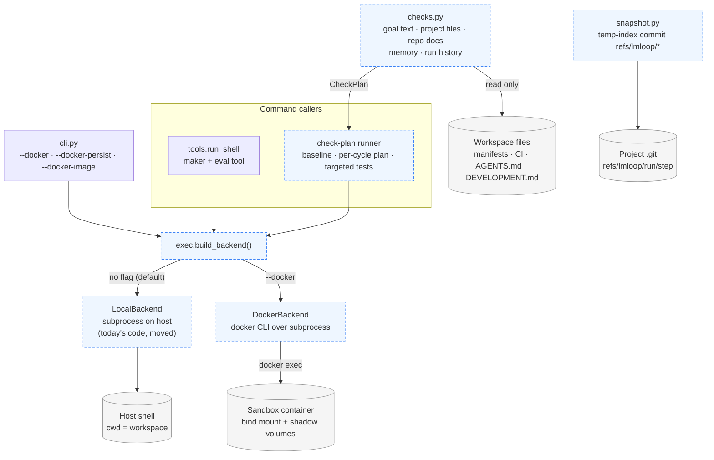
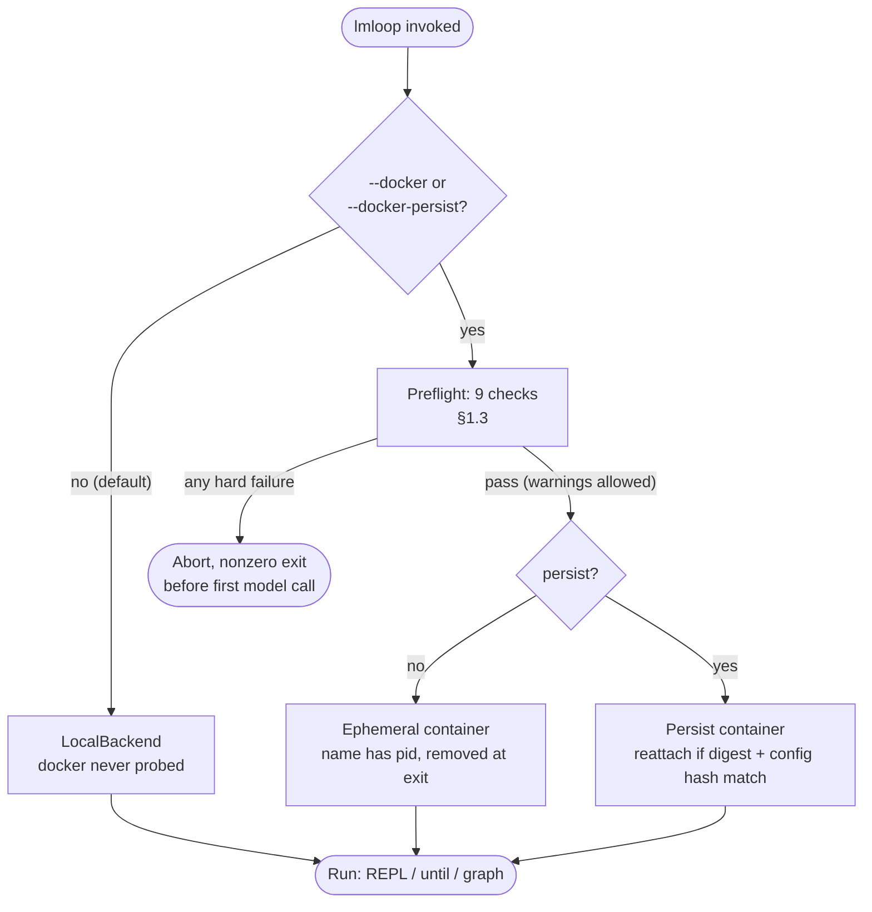
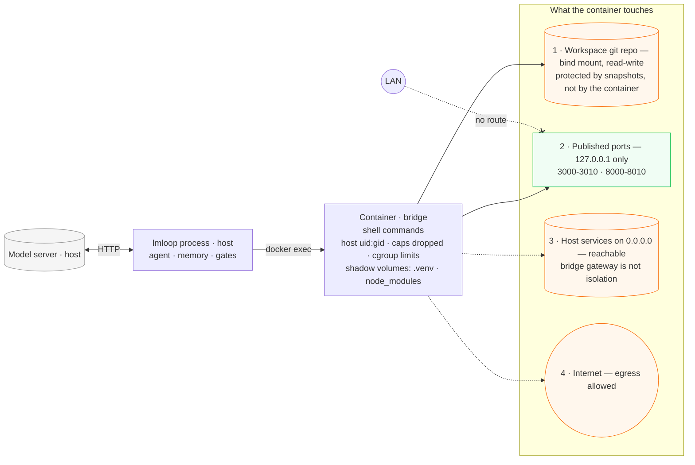
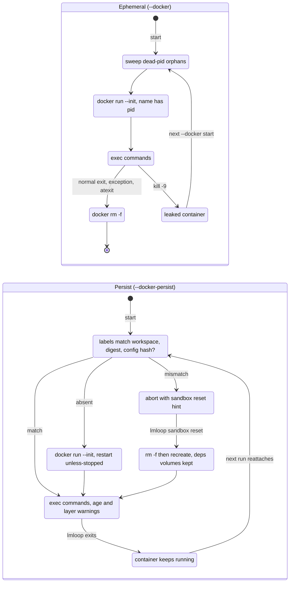
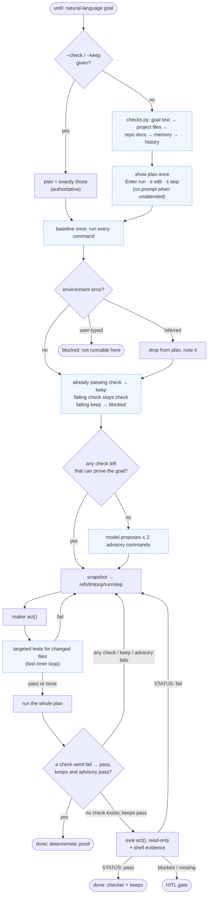

# Design: Execution sandbox and verification hardening

**Status:** derived checks shipped (Phase V, tasks V1–V6 and the `company` graph half of V10). Snapshots (Phase R), the sandbox (Phase S), and V7–V9 are still proposed.
**Date:** 2026-09-19 · **Revised:** 2026-09-26 (review round 4)
**Depends on:** `tools.run_shell`, `tools.GatePolicy`, `loop.run_until`, `graph.run_graph`
**Companions:** [DESIGN_DAG_AND_KNOWLEDGE_CANVAS.md](DESIGN_DAG_AND_KNOWLEDGE_CANVAS.md) ·
[DESIGN_MEMORY_RETRIEVAL.md](DESIGN_MEMORY_RETRIEVAL.md)

Two questions drive this file:

1. Should autonomous shell execution leave the host? **Only when the user asks for it
   on the command line.** The default stays exactly what ships today: local execution,
   local model, no container runtime anywhere in the path.
2. How does the loop stop believing the model — **without making the user type
   commands?** lmloop **derives** a check plan from the goal, the project, and memory,
   baselines it, and lets exit codes decide. Typed `--check` / `--keep` remain the exact
   override. An LLM checker decides only when no command can prove the goal.

## Review log (round 4)

| # | Sev | Defect in revision 3 | Evidence | Fix (section) |
|---|---|---|---|---|
| 1 | P0 | **Shipped:** a check command that cannot start (`pytest` not installed) is classified `fail`, so the maker loops trying to fix code that is not broken until `until_max_steps` | Reproduced on this repo: `ERROR: [Errno 2] No such file or directory: 'pytest'` → `fail` | Spawn errors and exit 126/127 are `blocked` (§2.5) |
| 2 | P0 | **Shipped:** the packaged `company` graph hardcodes `--check 'pytest -q'`, which cannot pass in any non-pytest project — including lmloop itself, whose tests run under `unittest` | `graphs/company.md`, `DEVELOPMENT.md` | `company` drops the hardcoded check and infers one (§2.1, task V10) |
| 3 | P1 | The design made typed commands the **only** authority, so a plain-language goal got the weakest gate (model-only eval). The UX tax fell on exactly the users who most need verification | Revision 3 §2 | Derived check plans with trust tiers (§2.1–§2.4) |
| 4 | P1 | Three command flags (`--check`, `--accept`, `--keep`) differing only in whether eval also runs — a distinction users should never have to learn | Revision 3 §2.2 | `--accept` removed; when eval runs is derived from the baseline (§2.4) |
| 5 | P2 | `require_negative_baseline` was a flag guarding behavior that should be the default | Revision 3 §2.3 | Reclassification is automatic; the key is gone (§2.4) |
| 6 | P2 | Per-cycle adversarial probe costs a serialized model call per passing cycle on a single-slot laptop, for a same-model signal | `model_concurrency` is 1 on a laptop (companion doc §1.2) | Deferred; the once-per-run proposal in §2.1 step 7 covers the useful half (§2.9) |

## Review log (round 3)

## Review log (round 3)

Defects found by re-auditing revision 2 against the code and against real `git` /
Docker behavior. Each is fixed in the body below; this table exists so a reviewer can
diff intent, not just text.

| # | Sev | Defect in revision 2 | Evidence | Fix (section) |
|---|---|---|---|---|
| 1 | P0 | Snapshot command `git stash create --include-untracked` **silently drops untracked files**: it exits 0 and prints nothing when only untracked files changed, so the "safety net" recorded `HEAD` | Reproduced on git 2.43 | Temp-index plumbing, verified to capture untracked files without touching the index or tree (§1.6) |
| 2 | P0 | `-p 3000-3010:3000-3010` binds **0.0.0.0** — every agent test server exposed to the LAN | Docker default publish address | `-p 127.0.0.1:…` (§1.4) |
| 3 | P0 | `sh -lc 'timeout … <quoted command>'` breaks shell-syntax commands (`timeout` tries to exec a program literally named `a \| b`) and `-l` sources login profiles nondeterministically | Quoting analysis | Two argv shapes, no login shell (§1.2) |
| 4 | P0 | Host-built `.venv` / `node_modules` in the bind mount are **wrong-platform** binaries inside a Linux container (Mach-O on macOS); container-built ones then break the host. Revision 2 filed this under "performance" | Platform ABI | Per-workspace named volumes shadow dependency dirs (§1.5) |
| 5 | P1 | `bridge` described as host isolation. It is not: a bridged container reaches host services bound to 0.0.0.0 through the gateway, Docker Desktop always resolves `host.docker.internal`, revision 2 *added* `--add-host` on purpose, and outbound internet (exfiltration) is unrestricted | Docker networking | R-NET rewritten honestly; no `--add-host`; `none` recommended for untrusted input (§1.4) |
| 6 | P1 | Probe called "read-only" but the readonly tool set still includes `run_shell`, shell redirects and `pip install` mutate, and a `max_rounds=1` act may call tools itself | `tools.READONLY_OMIT` keeps `run_shell` | Probe act is `no_tools`; probe commands are simple argv only; under `--docker` they run in a sibling container with the workspace mounted `:ro`, which is actually enforceable (the probe is now deferred, §2.9) |
| 7 | P1 | Negative baseline blocks legitimate refactor goals, where tests are **supposed** to pass before and after | Rule analysis | `--keep` invariants; since round 4, automatic reclassification of passing checks (§2.4) |
| 8 | P1 | "Unverified: last shell exited N" is biased: a trailing `grep` no-match (exit 1) is framed as a failure, contradicting R-SCOPE | Rule analysis | Neutral "Shell evidence" table of the last three commands (§2.7) |
| 9 | P1 | "Downgrade is safe" was false for graphs: `GraphRun.next_step` returns `("run", defn.start)` for an unknown role, so an old binary would **restart the whole graph** | `graph.py:377` | Graph logs get no new roles; verification folds into the `node` row, as eval already does (§3.3) |
| 10 | P1 | Persist container keeps old limits/network after config changes | Lifecycle analysis | `lmloop.config_hash` label; mismatch refuses with the reset hint (§1.2) |
| 11 | P1 | Two containers on one workspace (persist + ephemeral, or two processes) and host port collisions were possible | Lifecycle analysis | Preflight refuses a second live container per workspace and checks port availability (§1.3) |
| 12 | P2 | Preflight check "inside a git repo when snapshots are on" was tautological (snapshot default already depends on git); "no docker.sock in configured mounts" guarded mounts the design never defined | Self-contradiction | v1 has exactly one bind mount plus shadow volumes; no user mount config exists to check (§1.3) |
| 13 | P2 | `--user uid:gid` with no passwd entry: `HOME` does not exist, and tools calling `getpwuid` (git identity, ssh) fail | Container UID behavior | `HOME` created at start; git identity passed via env; limitation documented (§1.2) |
| 14 | P2 | `--docker-image` override did not require a digest, bypassing R-PIN for one run | Flag spec | Same `@sha256:` rule as config (§3.2) |

## Activation model (read this first)

| Invocation | Shell execution | Container |
|---|---|---|
| `lmloop …` (default, unchanged) | Host `subprocess`, exactly as today | None. `docker` is never invoked, never probed |
| `lmloop --docker …` | Inside an **ephemeral** container removed when the process exits | Created at start, removed at exit, orphans reaped on next start |
| `lmloop --docker-persist …` | Inside a **long-lived** container that survives process exit | Named, reattached each run, for 24/7 supervisors |

No config key can turn the sandbox on; config only parameterizes a sandbox the flag
requested. `--docker-persist` implies `--docker`. Once the flag is present there is no
fallback to the host. Git snapshots (§1.6) default on in **both** modes, because the
default mode has no container at all.

## Architecture

The combined target architecture for both proposals is in the companion doc
([Architecture overview](DESIGN_DAG_AND_KNOWLEDGE_CANVAS.md#architecture-overview));
the current system is in [ARCHITECTURE.md](ARCHITECTURE.md#system-overview). This
section shows only what this proposal adds. Dashed boxes are new.

### Target components

Every command-running caller goes through one backend instance chosen once per process
(R-SAME). `checks.py` only *reads* the workspace to build a plan; the plan's commands run
through the same backend as the maker. The snapshot writer sits beside it, on the host,
in both modes.



### Activation and preflight



### Trust boundaries under `--docker`



| Target | In `bridge` | In `none` |
|---|---|---|
| 1 · Workspace | Read-write. The container does **not** protect it; snapshots do (§1.6) | Same |
| 2 · Published ports | Host loopback only, so the LAN has no route to the agent's test servers | Not published |
| 3 · Host services on 0.0.0.0 | **Reachable** through the bridge gateway, and via `host.docker.internal` on Docker Desktop | Unreachable |
| 4 · Internet | **Egress allowed**, so exfiltration is possible | Blocked |

The agent itself stays on the host and talks to the model server directly; the container
never needs to reach it. Orange targets are the honest part of R-NET: `bridge` limits
inbound exposure, and only `none` removes 3 and 4 — at the cost of package installs and
any command that needs the network.

---

## Part 0 — Requirements from the adversarial review

| ID | Requirement | Why |
|---|---|---|
| R-FLAG | Activation is a CLI flag only | A config key would silently containerize a user who typed `lmloop` |
| R-SNAP | Snapshot before every autonomous maker step, both modes, including untracked files | A bind-mounted workspace is the blast radius; `backup_file` covers only file tools |
| R-NET | Default `bridge`, published ports bound to loopback, no `--add-host`; `none` for untrusted input; `host` opt-in with a warning | `bridge` limits *inbound* exposure, not host reachability or egress (see §1.4) |
| R-ID | Container identity from the workspace realpath hash; ephemeral names add the pid; labels verified before reuse | A fixed name lets project A's agent run in project B's mount |
| R-TMO | `timeout` inside the container plus a client-side guard | Killing the `docker` CLI does not kill the process in the container |
| R-LIM | `--pids-limit`, `--memory`, `--cpus`, `--cap-drop ALL`, `no-new-privileges` | A runaway in a container still exhausts the host and can OOM-kill LM Studio |
| R-PIN | Images by `@sha256:` only, everywhere a reference is accepted | Floating tags are non-deterministic builds |
| R-UID | Host uid/gid, created `HOME`, host-side ownership probe | Root-owned files in the user's repo |
| R-SAME | Every planned check command uses the maker's backend | A host-side gate certifies work done somewhere else |
| R-FAIL | Preflight failure aborts before the first model call | Silent fallback to the host is the failure this file prevents |
| R-SECRET | No credential mounts, no docker socket, no environment passthrough in v1 | Prompt injection via `fetch_url` can exfiltrate anything mounted |
| R-ABI | Dependency directories are shadowed by per-workspace named volumes | Host and container binaries are not interchangeable |
| R-DET | Authority lives in deterministic commands; model-proposed checks can only downgrade | Same-model auditing has correlated errors |
| R-SCOPE | Exit-code authority applies only to designated commands | A blanket rule teaches `\|\| true` |
| R-DRIFT | Persist mode verifies image digest and config hash, warns on age and layer size | A long-lived container stops resembling what was pinned |
| R-INIT | `--init` in every container | `sleep infinity` as PID 1 never reaps zombies |
| R-REAP | Ephemeral teardown in `finally` + `atexit`, dead-pid orphan sweep on next start | `kill -9` leaks containers |
| R-COMPAT | New log rows must be safe under an old binary's resume logic | `GraphRun.next_step` restarts from the start on unknown roles |

### Rejected outright

- **Docker SDK / `docker-py`** — adds `requests`/`urllib3`/`websocket-client` to a
  project whose loop is deliberately `urllib`-only. The CLI over `subprocess` suffices.
- **A `signal_task_complete` tool** — `until`/`graph` already ignore prose; the REPL has
  a human reading every reply.
- **Podman/nerdctl backend classes** — `LMLOOP_DOCKER` covers CLI-compatible runtimes.
- **An in-process daemon** — 24/7 means an OS supervisor invoking
  `lmloop --docker-persist until …`.
- **Mounting `~/.lmloop`** — memory stays host-side because the agent process does.
- **User-configurable extra mounts or environment passthrough in v1** — each is a new
  exfiltration and corruption surface; the one bind mount plus shadow volumes is the whole
  contract.

---

## Part 1 — Execution backend

### 1.1 New module: `lmloop/exec.py`

```python
@dataclass(frozen=True)
class ExecResult:
    stdout: str
    stderr: str
    exit_code: int
    backend: str          # "local" | "docker"
    timed_out: bool

class ExecBackend:          # method contract, not an ABC
    name: str
    def run(self, argv_or_script: "list[str] | str", *, timeout_s: int,
            cwd: Path, readonly: bool = False) -> ExecResult: ...
    def preflight(self) -> "str | None": ...
    def describe(self) -> str: ...
```

- `LocalBackend` is today's `subprocess.Popen` path moved verbatim, including
  `KeyboardInterrupt` kill semantics. It rejects `readonly=True` with a clear error — the
  host cannot enforce it, and pretending otherwise is how revision 2 went wrong (§2.5).
- `exec.build_backend(cfg, workspace_root, *, docker: bool, persist: bool)` is the only
  factory. With `docker=False` it returns `LocalBackend` without a PATH lookup.
- `run` takes a **list** for simple commands and a **str** for shell syntax, mirroring
  the existing `run_shell` split (`argv = command if shell_syntax else shlex.split(command)`),
  so the classification stays in `ShellCommand` where it already lives.

**Import graph:** `exec.py` is a leaf (`subprocess`, `shlex`, `hashlib`, `pathlib`,
`config`); it must not import `tools`, `agent`, `loop`, or `graph`.

### 1.2 Container lifecycle

| | `--docker` (ephemeral) | `--docker-persist` |
|---|---|---|
| Name | `lmloop-sbx-<slug>-<sha8>-<pid>` | `lmloop-sbx-<slug>-<sha8>` |
| Labels | `lmloop.mode`, `lmloop.pid`, `lmloop.workspace`, `lmloop.image_digest`, `lmloop.config_hash` | same |
| Create | At start, after preflight | First use; reattached while running |
| Restart policy | none | `PERSIST_RESTART` (default `unless-stopped`) |
| Teardown | `docker rm -f` in `finally` + `atexit` | Only via `lmloop sandbox rm/reset` |
| Orphans | Next start sweeps `lmloop.mode=ephemeral` containers whose pid is dead | Digest/config-hash mismatch refuses; age/size warns |



`lmloop.config_hash` is `sha8` of the normalized values that are baked in at creation
(image, network, and the sandbox constants — so an upgrade that changes a constant also triggers the reset hint). Changing any of
them makes an existing persist container refuse with "config changed — run
`lmloop sandbox reset`" rather than silently running with stale limits.

```
docker run -d --init --name <n> <labels…> \
  -v <ws>:/workspace -v lmloop-dep-<sha8>-venv:/workspace/.venv … \
  -w /workspace --user <uid>:<gid> -e HOME=/tmp/lmloop-home \
  -e GIT_AUTHOR_NAME -e GIT_AUTHOR_EMAIL -e GIT_COMMITTER_NAME -e GIT_COMMITTER_EMAIL \
  --cap-drop ALL --security-opt no-new-privileges \
  --pids-limit <n> --memory <m> --cpus <c> [network flags] [restart flags] \
  <image@digest> sleep infinity
docker exec <n> mkdir -p /tmp/lmloop-home          # once, after create
```

Exec has two shapes, and neither uses a login shell:

```
simple:  docker exec -w /workspace <n> timeout --signal=TERM --kill-after=5s <N>s -- <argv…>
shell:   docker exec -w /workspace <n> timeout --signal=TERM --kill-after=5s <N>s /bin/sh -c <script>
```

Each element is a separate argv entry to `subprocess`, so there is no second layer of
quoting to get wrong. GNU `timeout` (without `--foreground`) signals its whole process
group, so a pipeline's children die with it. Exit 124 maps to `timed_out=True` and the
existing `ERROR: command timed out after Ns` string; the client-side guard is `N + 15s`
for a hung daemon.

Git identity values are read from the host's `git config` once at start and passed as
env, because the container uid has no passwd entry. Tools that call `getpwuid` for
other reasons (ssh, some package managers) may still fail; that is documented, not
papered over with `nss_wrapper` in v1.

### 1.3 Preflight (only with `--docker`; fail fast before any model call)

1. `LMLOOP_DOCKER` on PATH.
2. `docker version --format '{{.Server.Version}}'` succeeds within 10s.
3. The image reference contains `@sha256:` and is present locally.
4. Workspace is not `/`, not `$HOME`, and no path component is a Docker socket.
5. Write probe `touch .lmloop-probe && rm .lmloop-probe`; confirm on the host that no
   root-owned artifact remains.
6. No **other** running container carries this `lmloop.workspace` label (one sandbox per
   workspace, whatever its mode).
7. Our own container, if present, matches `lmloop.image_digest` and `lmloop.config_hash`.
8. Every host port in `SANDBOX_PORTS` is free on `127.0.0.1` (bind-and-close test).
9. Persist only: age ≤ `PERSIST_MAX_AGE_D`, writable layer ≤
   `PERSIST_DISK_WARN_GB` — **warn and continue**.

### 1.4 Networking, stated honestly

| `sandbox_network` | Inbound from LAN | Reach host services | Internet egress | Use for |
|---|---|---|---|---|
| `bridge` (default) | Only published ports, bound to `127.0.0.1` | **Yes** for anything the host binds on 0.0.0.0 (via the bridge gateway; always on Docker Desktop) | Yes | Normal development |
| `none` | No | No | No | Untrusted input: tasks that `fetch_url` arbitrary pages, or any unattended persist run that doesn't need the network |
| `host` | Whatever the process binds | Yes, including loopback | Yes | Opt-in, Linux/WSL2 only, printed warning |

`bridge` is an inbound-exposure control and a namespace boundary, **not** host isolation
and not exfiltration protection. Revision 2 oversold it. No `--add-host` is added: the
agent process talks to the model server from the host, so the container has no reason to.

Ports publish as `-p 127.0.0.1:3000-3010:3000-3010 -p 127.0.0.1:8000-8010:8000-8010`.
When ranges are published, `steer.py` appends: *"Test servers must bind 0.0.0.0 inside
the sandbox on a port in 3000-3010 or 8000-8010; the host reaches them at 127.0.0.1."*
Binding 0.0.0.0 *inside* the container is correct and does not expose the host, because
the host side of the publish is loopback.

### 1.5 Image and dependency directories (R-PIN, R-ABI)

`lmloop/sandbox/Dockerfile`, digest-pinned and small:

```dockerfile
FROM debian:bookworm-slim@sha256:<pinned>
RUN apt-get update && apt-get install -y --no-install-recommends \
      ca-certificates git ripgrep curl python3 python3-venv \
 && rm -rf /var/lib/apt/lists/*
```

`lmloop sandbox build` records the repo digest in config; a tag is never persisted.

Dependency directories are a **correctness** problem, not a performance one. A `.venv`
built on macOS contains Mach-O binaries that cannot run in a Linux container, and a
`.venv` built in the container breaks the host. `SANDBOX_SHADOW_DIRS` (default
`.venv,node_modules`) mounts a named volume `lmloop-dep-<sha8>-<dir>` over each listed
path inside the container:

- The host's copy is invisible to the container and untouched by it.
- The volume persists across ephemeral runs, so dependencies install once per workspace,
  not once per run. Under `sandbox_network: none` the first install must happen in a
  networked run; preflight notes an empty shadow volume.
- `lmloop sandbox reset --deps` removes the volumes; plain `reset` keeps them.

### 1.6 Snapshots (R-SNAP) — on by default, both modes

Before each maker step in `until` / `graph`, when the workspace is a git repo and
`autonomous_snapshot: git` (default):

```bash
idx=$(mktemp -d)/index                       # path must not pre-exist: git rejects an empty file
GIT_INDEX_FILE=$idx git read-tree HEAD
GIT_INDEX_FILE=$idx git add -A               # tracked edits + untracked, honoring .gitignore
tree=$(GIT_INDEX_FILE=$idx git write-tree)
sha=$(git commit-tree "$tree" -p HEAD -m "lmloop snapshot <run> <step>")
git update-ref "refs/lmloop/<run-ts>/<step>" "$sha"
```

Verified on git 2.43: the snapshot commit contains modified tracked files and untracked
files, and the user's real index and working tree are unchanged afterwards. The ref
name goes into the run row; recovery is `git checkout refs/lmloop/…` or
`git restore --source=refs/lmloop/… -- <path>`.

Guards:

- **Size:** untracked files larger than `SNAPSHOT_MAX_FILE_MB` (default 20) are excluded
  via a pathspec, and the row lists what was skipped. An agent that writes a 2 GB
  artifact must not bloat `.git` by 2 GB per cycle.
- **Clean tree:** when `write-tree` equals `HEAD^{tree}`, no ref is written and the row
  records `HEAD`.
- **Retention:** refs older than 14 days are deleted (same horizon as `trash/`);
  objects are reclaimed by the user's normal `git gc`.
- **Push safety:** `refs/lmloop/*` is outside every default refspec, so `git push` never
  sends it; `git push --mirror` would, and the README says so.

---

## Part 2 — Verification hardening

The user types a goal in plain language. lmloop finds the deterministic checks itself,
shows them, and uses exit codes as the authority. Typed commands remain the exact
override, never the price of admission.

```
lmloop until make the flow command emit valid JSON             # inferred plan
/until fix the flaky timeout in loop.py                        # inferred plan
lmloop until make `npm test` pass without breaking `npm run lint`   # commands in the prose
lmloop until --check 'pytest -q tests/api' implement the API   # explicit: no inference
```

### 2.1 From a goal to a check plan

A new module `checks.py` turns a goal plus the workspace into a `CheckPlan`: an ordered,
de-duplicated list of `PlannedCheck(cmd, role, source, tier, reason)`. It is
deterministic — file reads and `ShellCommand` parsing only. The one model call (step 7)
is made by `loop.py`, which passes the result in; `checks.py` never imports `agent`.

**Resolution order** — earlier steps win on duplicates (compared by normalized argv):

1. **Flags.** `--check` / `--keep` present → use exactly those; inference is skipped for
   the whole run. Explicit means exact.
2. **Commands in the goal.** Backtick spans, plus quoted spans after a cue verb
   ("run", "make", "until", "keep"), accepted only when `ShellCommand` parses them and
   `argv[0]` resolves (`shutil.which`, a workspace path, or a project runner). A bare
   `<runner> <target>` phrase without backticks ("make test pass") is accepted only when
   that target exists in the project (`test:` in the Makefile, `scripts.test` in
   `package.json`). No NLP: cue words and project facts only. Role is `keep` after
   "keep", "still", "without breaking", "don't break"; otherwise `check`. The goal text
   reaches the maker unchanged.
3. **Project files and repo docs** (table below).
4. **Memory.** Learnings of type `tool` or `operational` that contain a backticked
   command — the `qa` skill already tells the model to save test commands this way.
5. **History.** Commands that went fail → pass in an earlier run on this project
   (`workflow.py`, companion doc): gates proven to discriminate.
6. **Change-targeted narrowing** (after the first maker step, not at planning time):
   changed files mapped to tests by convention (`tests/test_<stem>.py`,
   `<stem>.test.ts`, `<stem>_test.go`). Used as a fast inner-loop check; the full plan
   still gates `done`. On a laptop this is the difference between a 5-second and a
   5-minute cycle.
7. **Model proposal**, only when baseline (§2.4) leaves no command able to *prove* the
   goal: one no-tools call proposes ≤ 2 goal-specific commands, e.g.
   `lmloop flow --json | python3 -m json.tool` for "emit valid JSON".

**Project sources**, each a small reader returning candidates with a human-readable
reason:

| Source | Reads | Yields | Parser (stdlib only) |
|---|---|---|---|
| `pyproject.toml`, `setup.cfg`, `tox.ini`, `pytest.ini` | pytest/tox config, `tests/` | `<python> -m pytest -q`, preferring `.venv/bin/python` | `tomllib` on 3.11+; section-header scan on 3.10, which lmloop supports and which has no `tomllib` |
| `package.json` | `scripts.test`, `lint`, `typecheck`, `build` | `<pm> run <script>`, package manager from the lockfile | `json` |
| `Makefile`, `justfile` | targets `test`, `check`, `lint` | `make test`, `just test` | line scan for `^target:` |
| `Cargo.toml`, `go.mod`, `mix.exs`, `Gemfile` + `Rakefile`, `gradlew`, `pom.xml`, `deno.json` | presence | `cargo test`, `go test ./...`, `mix test`, … | presence |
| `.pre-commit-config.yaml` | presence | `pre-commit run --all-files` as `keep` | presence |
| `.github/workflows/*.yml` | single-line `run:` values | each, if runnable locally | line scan; multi-line `run: \|` blocks and steps with `${{ }}`, services, or secrets are skipped — no YAML dependency, and CI-only steps are not local gates |
| `AGENTS.md`, `CLAUDE.md`, `.cursor/rules/*.mdc`, `CONTRIBUTING.md`, `DEVELOPMENT.md`, `README.md` | fenced `bash` / `sh` / `console` blocks under a heading containing test, lint, check, verify, or qa | lines containing a runner token (`pytest`, `unittest`, `test`, `lint`, `ruff`, `mypy`, `tsc`, `eslint`, `cargo test`, `go test`, …) | markdown line scan; setup lines without a runner token are ignored |

**Worked example — this repository.** It has no manifest, so a manifest-only design would
find nothing. `lmloop/DEVELOPMENT.md` › "Setup and tests" holds
`cd lmloop && PYTHONPATH=. .venv/bin/python -m unittest discover -s tests -v`, which the
repo-docs reader picks up; the setup line beside it (`bash lmloop/setup-lmloop.sh`) has no
runner token and is ignored. Contrast the packaged `company` graph, whose hardcoded
`--check 'pytest -q'` cannot pass here at all (§2.5).

### 2.2 Trust tiers

| Tier | Sources | Effect |
|---|---|---|
| **Authoritative** | Flags; commands in the goal; project files; repo docs; `user-stated` memory; proven history | Exit codes gate `done` |
| **Advisory** | Model proposals; `observed` / `inferred` memory; CI lines not confirmed runnable | Can only **downgrade**: a nonzero exit sends the cycle back to the maker; a zero never finishes the run on its own |

This replaces revision 3's "never LLM-authored" rule with something usable: the model may
*suggest* checks, but a suggestion cannot certify work — unless the user accepts it in the
plan, at which point it is user-typed.

### 2.3 Showing the plan

Interactive (REPL `/until`, or `lmloop until` on a TTY), printed once before the first
maker step:

```
until · check plan for "make the flow command emit valid JSON"
  check     cd lmloop && PYTHONPATH=. .venv/bin/python -m unittest discover -s tests -v
            from DEVELOPMENT.md › Setup and tests
  advisory  lmloop flow --json | python3 -m json.tool
            proposed for this goal
  Enter run · e edit · s skip checks (checker only)
```

- **Enter** is the default; the common case costs one keypress.
- **e** opens the plan as editable lines; edited lines become user-typed (authoritative).
- **Unattended** (piped stdin, OS supervisor, a graph run with no TTY): no prompt, ever. Authoritative
  checks apply, advisory ones stay advisory, and the plan is printed once for the log.
- The plan is stored on the until meta row (`checks: [{cmd, role, source, tier}]`), so
  resume reuses it rather than re-inferring against a changed tree. Graph nodes store
  theirs in the `node` row's `verify` field and reuse it on re-entry.

### 2.4 Baseline, and when the checker runs

`until_baseline: auto` (default) runs a baseline whenever the plan is non-empty:

1. **Once**, before the first maker step, run every planned command; record a `baseline`
   row. Resume never re-runs it.
2. **Drop the unrunnable.** An inferred command that fails with an environment error
   (§2.5) or times out is removed from the plan with a note. A *user-typed* one blocks
   instead: *"check not runnable here: <cmd>"*.
3. **Reclassify.** An inferred `check` that already passes becomes a `keep` — it cannot
   prove the goal, but it must not regress. A failing one stays a `check`: it can prove
   the goal. This is what lets a refactor goal ("tidy the parser without changing
   behavior") work with no flags at all.
4. **Decide.**

| After the maker's step | Outcome |
|---|---|
| At least one `check` went fail → pass, all `keep`s pass, all advisory pass | **done** — deterministic proof, no checker model call (today's `--check` behavior) |
| No `check` left (all already passed, or none found) | The **eval checker** judges the goal, *and* every `keep` and advisory command must pass |
| A **user-typed** `--check` already passed at baseline | Warn *"this check already passes, so it cannot show the change"*; eval also judges the goal |
| A `keep` fails at baseline | **blocked** — *"invariant already broken before any work: <cmd>"* |

This subsumes revision 3's `require_negative_baseline` flag: the rule it enforced is now the
default behavior, and it no longer needs a key or an explanation.

`until_baseline: off` restores today's semantics exactly (checks gate directly, no
reclassification) for users who want them.

### 2.5 Environment errors are `blocked`, not `fail` (shipped defect)

`loop.check_status_from_output` returns `fail` for anything that is not `DENIED:` and has
no `[exit code: 0]` — including `ERROR: [Errno 2] No such file or directory: 'pytest'`.
Verified on this repository: the packaged `company` graph's build node runs
`--check 'pytest -q'`, `pytest` is not installed, the result is `fail`, and the maker is
sent back to "fix" code that is not broken until `until_max_steps` runs out.

Fix: a spawn error (`ERROR:` from `run_shell`), exit **126** (not executable), or **127**
(not found) maps to `blocked`, with the command named in the gate message. The maker
cannot fix an environment by editing source; a human can. `ModuleNotFoundError` inside
a Python runner exits 1 and cannot be distinguished deterministically, which is why the
baseline (§2.4) drops inferred commands that fail before any work. This fix is small,
independent of everything else here, and should land first.

### 2.6 What is authoritative, in one table

| Signal | Authority |
|---|---|
| `check`-role commands in the plan | **Authoritative** — fail → pass proves the goal |
| `keep`-role commands in the plan | **Authoritative** — must pass at the end |
| Advisory commands | Downgrade-only |
| Eval `STATUS:` | Decides only when no `check` can prove the goal; necessary, never sufficient on its own when keeps exist |
| Maker prose | Zero |
| Other shell exits | Evidence for the checker (§2.7), never a verdict |

### 2.7 Shell evidence for the checker (deterministic, always on)

Appended to the eval prompt, computed from the maker's tool transcript:

```
Shell evidence (last 3 maker commands, most recent last):
  exit 0  pytest -q tests/test_loop.py
  exit 1  grep -n TODO lmloop/loop.py
  exit 0  ruff check .
```

Neutral wording, no verdict: the checker sees exit codes without being told that a
`grep` no-match is a failure.

### 2.8 The cycle, end to end



### 2.9 Adversarial probe — deferred

The revision-3 probe (a no-tools act proposing ≤ 2 falsifying commands, run read-only
under `--docker`) is **deferred**, not deleted. Step 7 of §2.1 covers the useful half —
goal-specific commands when nothing else can prove the goal — at one model call per run
instead of one per passing cycle, which matters on a single-slot laptop. Revisit if
`lmloop flow` shows runs finishing on checker-only `pass` and later regressing.

---

## Part 3 — Config, commands, compatibility

### 3.1 Config keys

Five user-facing keys, per the [roadmap's config budget](DESIGN_ROADMAP.md#3-config-budget).
Sandbox keys are **inert unless `--docker` was passed**.

| Key | Default | Meaning |
|---|---|---|
| `sandbox_image` | `""` | Must contain `@sha256:`; written by `lmloop sandbox build` |
| `sandbox_network` | `bridge` | `bridge` \| `none` \| `host` (§1.4) — a real security choice |
| `autonomous_snapshot` | `git` | **Host runs too**; `git` \| `off` |
| `check_inference` | `auto` | `auto`: derive a check plan when no `--check`/`--keep` is given (§2.1) \| `off`: today's behavior |
| `until_baseline` | `auto` | `auto`: baseline and reclassify whenever the plan is non-empty (§2.4) \| `off`: checks gate directly |

Named constants in `exec.py` / `snapshot.py`, not config — sensible for everyone, easier to
test, impossible to misconfigure:

| Constant | Value |
|---|---|
| `SANDBOX_PORTS` | `3000-3010`, `8000-8010`, published on `127.0.0.1` when `bridge` |
| `SANDBOX_MEMORY` / `SANDBOX_CPUS` / `SANDBOX_PIDS` | `4g` / `2` / `512` |
| `SANDBOX_SHADOW_DIRS` | `.venv`, `node_modules` |
| `PERSIST_RESTART` | `unless-stopped` |
| `PERSIST_MAX_AGE_D` / `PERSIST_DISK_WARN_GB` | 7 / 5 — warnings only |
| `SNAPSHOT_MAX_FILE_MB` | 20 |

The container runtime binary comes from the environment variable `LMLOOP_DOCKER` (default
`docker`), so Podman users set it once in their shell rather than in lmloop's config.
Environment-variable passthrough into the container is **not** offered in v1 (R-SECRET).

Revision 3's `require_negative_baseline` and `eval_probe*` keys are gone: the first is now
default behavior (§2.4), the second is deferred (§2.9).

### 3.2 Flags and the one new stem

Root-parser flags, accepted by every subcommand: `--docker`, `--docker-persist`
(implies `--docker`), `--docker-image <ref@sha256:…>` (one-run override; rejected
without a digest, same rule as config).

`sandbox` is one `CommandMeta` with `arg_choices = ("build","status","shell","reset","rm")`;
`reset --deps` also removes shadow volumes. `/sandbox` mirrors `status`/`reset`.
`/stats` gains one honest line:

```
exec: local (host)
exec: docker · persist · lmloop-sbx-repo-1a2b3c4d · age 2d · layer 1.4G · bridge 127.0.0.1:3000-3010
```

### 3.3 Run-log compatibility (R-COMPAT)

Verified against the resume code, not assumed:

- **Until logs** may gain the role `baseline`, because `UntilRun.next_role` falls back to
  `"maker"` for unknown `(role, status)` pairs: an old binary re-runs a maker step, which
  is harmless. Plan results ride on the existing `check` rows (one row per cycle, with
  per-command exits in a `results` field), and the plan itself on the meta row's `checks`
  field — so the common path adds **no** role an old binary has not seen.
- **Graph logs gain no new roles.** `GraphRun.next_step` returns `("run", defn.start)`
  for an unknown role, so a new role would make an old binary restart the entire graph.
  Check-plan outcomes fold into the existing `node` row's `status` (exactly how skill
  eval is already folded), with the plan and per-command results in an optional `verify`
  field.
- New optional fields everywhere: `snapshot_ref`, `backend`
  (`local` / `docker:ephemeral` / `docker:persist`), `verify`. Readers use `.get`.

---

## Part 4 — Task breakdown

### Phase S — sandbox (opt-in)

| ID | Task | Files | Tests | Done when |
|---|---|---|---|---|
| S1 | `exec.py`: `ExecResult`, `ExecBackend`, `LocalBackend` extracted verbatim; `build_backend(docker=False)` short-circuit; `LocalBackend` rejects `readonly=True` | `exec.py`, `tools.py` | Local run, nonzero, timeout, interrupt; no PATH lookup without the flag; existing shell tests unchanged | `run_shell` has no `subprocess` import, zero behavior delta |
| S2 | `--docker` / `--docker-persist` / `--docker-image` on the root parser | `cli.py`, `repl.py` | No flag → local; persist implies docker; image without digest rejected; no config key enables docker | R-FLAG is a test |
| S3 | `DockerBackend` argv: names, labels, `--init`, both exec shapes, 124 mapping, env identity | `exec.py` | Exact argv asserted against a fake `subprocess`; shell script passed as one argv element; no `-l` anywhere | Quoting is structural, not escaped |
| S4 | Lifecycle: ephemeral teardown + orphan sweep; persist attach, restart policy, digest and config-hash labels | `exec.py` | Simulated `kill -9` orphan reaped; changed memory limit → refuse with reset hint | R-REAP / R-DRIFT are tests |
| S5 | Preflight (nine checks) + abort wiring | `exec.py`, `cli.py`, `status.py` | Each check fails independently; second container per workspace refused; busy port refused | A dead daemon aborts before the first token |
| S6 | Same-backend enforcement for every planned check, baseline, and targeted test | `loop.py`, `graph.py`, `tools.py` | `run_check` cannot run locally while the maker is containerized | R-SAME is a unit test |
| S7 | Loopback-only port publishing + steering line; network table in `/sandbox status` | `exec.py`, `steer.py` | Every `-p` argument starts with `127.0.0.1:`; no `--add-host` in any argv | R-NET is a test |
| S8 | Shadow volumes + `reset --deps` | `exec.py` | Each listed dir gets a volume mount; volume name stable per workspace | Host `.venv` never visible in the container |
| S9 | `sandbox` stem, `/sandbox`, `/stats` exec line; image build + digest persistence | `commands.py`, `cli.py`, `repl.py`, `ui.py`, `sandbox/Dockerfile`, `config.py` | Routing; `/stats` says `local (host)` by default; tag never persisted | `/help` lists `sandbox` once |
| S10 | Docs: README (flags, network table, Safety, config, troubleshooting incl. `--mirror` caveat), ARCHITECTURE, DEVELOPMENT | docs | — | Docs say plainly that the default is host execution and that `bridge` is not host isolation |

### Phase R — recovery (protects the default host path; land first)

| ID | Task | Files | Tests | Done when |
|---|---|---|---|---|
| R1 | Temp-index snapshot, size guard, clean-tree shortcut, 14-day prune, `snapshot_ref` on rows | `snapshot.py` (leaf), `loop.py`, `graph.py` | Untracked file present in the snapshot; real index/tree unchanged; oversize file excluded and listed; clean tree writes no ref; non-git → `off` with a note | The regression that sank revision 2 (untracked files lost) is a named test |
| R2 | README: "recover from an autonomous run" beside the `trash/` row | docs | — | Recovery documented where users already look |

### Phase V — verification (no sandbox required)

| ID | Task | Files | Tests | Done when |
|---|---|---|---|---|
| V0 | **Environment errors → `blocked`** in `check_status_from_output` (spawn `ERROR:`, exit 126/127), naming the command in the gate | `loop.py`, `status.py` | `pytest` missing → blocked, not fail; exit 1 still fail; `DENIED:` still blocked | The shipped `company` graph stops looping on a missing binary |
| V1 | `checks.py`: `CheckPlan`, goal-text extraction (backticks, cue verbs, project-backed bare targets) | `checks.py`, `tools.py` (`ShellCommand` reuse) | `` `npm test` `` extracted; "make test pass" only when a `test:` target exists; "keep" cue → keep; unparsable span ignored | No command is invented from prose |
| V2 | Project readers: Python (tomllib or 3.10 scan), `package.json` + lockfile, Makefile/justfile, presence-based ecosystems, pre-commit, single-line CI `run:`, repo-doc fenced blocks with runner tokens | `checks.py` | Fixture repo per ecosystem; this repo yields the `DEVELOPMENT.md` unittest command and ignores the setup line; multi-line CI blocks skipped | Every source has a fixture test |
| V3 | Memory and history sources; tiers | `checks.py`, `memory.py`, `workflow.py` | `user-stated` learning → authoritative; `observed` → advisory; proven history command ranked first | Tier comes from the source, never from the model |
| V4 | Plan display, Enter/e/s, unattended no-prompt path, plan on meta row / `verify` field, reuse on resume | `loop.py`, `graph.py`, `repl.py`, `ui.py`, `status.py` | Piped stdin never prompts; edited lines become authoritative; resume does not re-infer | One keypress in the common case |
| V5 | Baseline: drop unrunnable inferred commands, block unrunnable typed ones, reclassify passing checks to keeps, decision table | `loop.py` | Every row of the §2.4 table; refactor goal with no flags finishes via eval + keeps; `until_baseline: off` equals today | Natural-language goals get deterministic gates without flags |
| V6 | `--check` repeatable + `--keep` on CLI, `/until`, graph nodes; inference disabled when either is given | `loop.py`, `graph.py`, `cli.py`, `repl.py` | Quoted commands survive `shlex`; repeats accumulate; parse errors fail closed | Explicit flags are exact |
| V7 | Change-targeted narrowing after the first maker step | `checks.py`, `loop.py` | Changed `loop.py` → `tests/test_loop.py` runs first; no mapping → skipped | Inner loop is fast; `done` still needs the full plan |
| V8 | Model proposal when nothing can prove the goal: one no-tools call, ≤ 2 commands, advisory | `loop.py`, `status.py` | Only runs when §2.4 leaves no `check`; output parsed through `ShellCommand`; destructive dropped | A suggestion can fail a cycle but never finish one |
| V9 | Shell-evidence table | `loop.py`, `agent.py` (transcript accessor) | Last three commands with exits; no verdict words | Checker sees exits, unbiased |
| V10 | Docs: README until section rewritten around plain-language goals; ARCHITECTURE goal-loop; packaged `company` graph drops its hardcoded `--check 'pytest -q'` | docs, `graphs/company.md` | `company` parses and infers on a non-Python fixture | The packaged graph works outside Python projects |

### Sequencing

V0 → R1 → V1–V6 → S1 → V7–V9 → S2–S9. V0 is a one-function fix for a live defect. R1
next, because the default mode is the host and has no other net. V1–V6 are the UX change
users feel. S1 creates the sandbox seam with no user-visible change; the rest of Phase S
is opt-in and can follow whenever `--docker` is wanted.

---

## Part 5 — Risk register

| Risk | Sev | Mitigation | Residual |
|---|---|---|---|
| Workspace destroyed (host mode, the default) | P0 | R-SNAP with untracked capture | Ignored files and files over the size guard are not snapshotted |
| Docker broken under `--docker` | P0 | R-FAIL | Run stops; `/continue` after the human fixes it |
| Cross-project or duplicate containers | P0 | R-ID + one-container-per-workspace preflight | Same path reused later: `sandbox reset` |
| Agent test servers exposed to the LAN | P0 | Loopback-only publish | None known |
| Wrong-platform dependency binaries | P0 | R-ABI shadow volumes | First install under `network: none` needs a networked run |
| Exfiltration via egress in `bridge` | P1 | Documented; `none` for untrusted input | `bridge` allows egress by design |
| Container reaches host services | P1 | Documented honestly; no `--add-host` | Host services bound to 0.0.0.0 remain reachable in `bridge` |
| Persist drift (image, config, layer) | P1 | R-DRIFT | Age/size are warnings, not enforcement |
| Inferred check is the wrong gate (too broad, too slow, flaky) | P1 | Shown before the run; baseline drops unrunnable and slow ones; reclassification stops a passing suite from certifying anything; `lmloop flow` reports which sources produce useful gates | A plausible-but-wrong inferred check wastes cycles until a human edits the plan |
| Repo docs contain a destructive command under a "test" heading | P1 | Every planned command still runs under the `GatePolicy`; destructive ones are `DENIED` like any other | A non-destructive but slow command (full e2e suite) can be selected; baseline timeout drops it |
| Model-proposed command certifies bad work | P1 | Advisory tier: downgrade-only unless the user accepts it | A weak proposal adds a cycle, never a false pass |
| Old binary resumes a new log | P1 | R-COMPAT: no new graph roles | Old until binary re-runs one maker step |
| Runaway process / host exhaustion | P1 | R-TMO, R-LIM, R-INIT | Disk is not limited; layer size is reported |
| Missing passwd entry breaks a tool | P2 | Git identity via env; documented | ssh-style tools may fail in the container |

---

## Part 6 — Test matrix (no network, no real Docker)

Docker interactions are asserted at the **argv** level against a fake `subprocess`, in
the style of `test_tools.py`'s existing `Popen` patching. No test needs a daemon.

- **Default path first:** no flag → `LocalBackend`, `docker` never invoked, the whole
  existing suite passes unmodified.
- Argv: `--init`, `--user`, `--cap-drop`, `--pids-limit`, `--memory`, `--cpus`,
  `--security-opt`, shadow volume mounts, every `-p` prefixed `127.0.0.1:`, no
  `--add-host`, no `-l`; exec wraps `timeout … --` for argv and `/bin/sh -c` for scripts.
- Identity: same path → same name; different path → different; ephemeral carries pid;
  label, digest, or config-hash mismatch → refuse.
- Snapshot (real `git` in a temp repo — fast, no network): untracked captured; index and
  tree untouched; oversize excluded; clean tree → no ref.
- Compat: an until log with a `baseline` row resumes to `maker` under the old
  `next_role` table; a graph log written by the new code contains only existing roles.
- Inference: one fixture repo per source in §2.1, plus this repository itself (no
  manifest; `DEVELOPMENT.md` fenced block). No test executes an inferred command against
  the real tree — plans are asserted, then run against fakes.
- Verification: environment error → blocked; inferred passing check → keep; failing
  check fail→pass → done without eval; no check left → eval + keeps; advisory nonzero →
  maker; advisory zero alone never finishes; typed `--check` passing at baseline → warning
  + eval.
