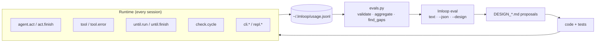

# Design: Usage evals and the self-improvement loop

**Status:** partial — V0 shipped (`usage.jsonl` instrumentation, `evals.py`, `lmloop eval`)
**Date:** 2026-10-07
**Depends on:** `usage.py`, `evals.py`, `loop.py`, `agent.py`, `tools.py`
**Companions:** [DESIGN_DAG_AND_KNOWLEDGE_CANVAS.md](DESIGN_DAG_AND_KNOWLEDGE_CANVAS.md) (`lmloop flow`) ·
[DESIGN_ROADMAP.md](DESIGN_ROADMAP.md) · [DEVELOPMENT.md](../DEVELOPMENT.md)

## Problem

lmloop already appends **local, opt-out** feature events to `~/.lmloop/usage.jsonl`.
Without a deterministic reader, that file is inert: humans cannot see patterns, and the
agent cannot turn real friction into prioritized design work.

The goal is a **closed loop** on the machine:

1. **Instrument** touchpoints (tools, until, act rounds, CLI vs REPL).
2. **Aggregate** into eval stats and **gap** hypotheses (no model calls).
3. **Emit** human-readable reports and **design-doc skeletons**.
4. **Ship** fixes + regression tests; optional **defineEval**-style locks later.
5. Repeat — usage proves whether the gap closed.

Nothing in this loop sends telemetry off-host. The same JSONL remains the audit trail.

---

## Architecture (V0 shipped)



### Event contract

| Field | Required | Notes |
|---|---|---|
| `ts` | yes | ISO UTC from `config.utc_now()` |
| `feature` | yes | dotted stem; registry in `evals.KNOWN_FEATURES` |
| `detail` | no | JSON object; keep values scalar or small lists |

**Feature stems (V0):**

| Feature | When | Detail keys |
|---|---|---|
| `agent.act` | start of `act()` | `readonly`, `no_tools` |
| `agent.act.finish` | `act()` finally | `rounds`, `tools`, `interrupted`, `ok` |
| `tool` | successful dispatch entry | `name` |
| `tool.error` | ERROR result or validation fail | `name`, `phase` |
| `until.run` | enter `run_until` | `resume` |
| `until.finish` | leave `run_until` | `outcome`, `paused`, `done` |
| `check.cycle` | after shell check plan | `status`, `checks`, `blocked` |
| `cli.command` / `cli.repl` | CLI routing | subcommand / `has_task` |
| `repl.command` / `repl.session` | REPL | stem / skill |
| `graph.run` | graph runner | `name` |

Tests enforce **`KNOWN_FEATURES` ↔ `usage.record` parity** (`tests/test_evals.py`).

### Gap rules (V0)

Pure functions in `evals.find_gaps()` — thresholds are named constants, not config keys yet:

- **tool-error-rate** — `tool.error / tool` above 25% with ≥8 tool calls.
- **until-pause-heavy** — ≥40% `until.finish` outcomes are `paused`.
- **act-high-rounds** — ≥30% of finishes with `rounds ≥ 12`.
- **act-interrupted** — ≥20% finishes with `interrupted: true`.
- **cli-unused** — REPL sessions without any `cli.command`.

Each gap carries a **`design_hook`** string pointing at the doc or module that should
 absorb the fix (so `lmloop eval --design` is a paste-ready outline, not prose fluff).

---

## CLI (shipped)

```bash
lmloop eval                 # human report
lmloop eval --json          # machine report (CI / agent ingestion)
lmloop eval --design        # markdown skeleton for a new or existing DESIGN_*.md
```

Opt out of collection entirely: `LMLOOP_USAGE=0`.

---

## Validation strategy

| Layer | What | Where |
|---|---|---|
| Schema | each row validates against `KNOWN_FEATURES` | `evals.validate_row` |
| Registry | grep `usage.record` vs `KNOWN_FEATURES` | `test_evals.InstrumentationRegistryTests` |
| Aggregation | counters, percentiles, invalid rows | `test_evals.AggregateTests` |
| Gaps | threshold boundaries | `test_evals.GapTests` + `@parametrize` |
| Instrumentation | `tool.error` on bad dispatch | `test_evals.ToolErrorInstrumentationTests` |
| Until | outcome labels | `test_evals.UntilOutcomeTests` |

Future: golden JSON fixtures checked into `tests/fixtures/usage_*.jsonl` representing
realistic weeks of local use.

---

## Roadmap — closing the loop further

### V1 — Join run logs (no new config keys)

`evals.load_stats()` also scans:

- `~/.lmloop/projects/<slug>/until/*.jsonl`
- `~/.lmloop/projects/<slug>/graphs/*/*.jsonl`

Derive:

- check commands that **never pass** on this project
- graph nodes that **always pause**
- correlation: high `tool.error` on `run_shell` before until pause

Emit gaps with **project-relative evidence** (command strings, not env secrets).

### V2 — `lmloop flow` alignment

When [DESIGN_DAG_AND_KNOWLEDGE_CANVAS.md](DESIGN_DAG_AND_KNOWLEDGE_CANVAS.md) ships
`workflow.FlowStats`, **one printer** should read both usage.jsonl and run logs so
product metrics and eval gaps do not diverge.

### V3 — Agent-assisted improvement (human gate)

Skill playbook **`/skill improve`** (proposed):

1. Run `lmloop eval --json`.
2. Pick gaps with `severity: action`.
3. Open or extend the referenced `DESIGN_*.md` using `design_doc_skeleton` sections.
4. Implement smallest diff + tests; never auto-commit.

Optional: write `~/.lmloop/evals/last_report.json` on each eval for mine/retro prompts.

### V4 — Locked regressions (defineEval-style)

For each closed gap, add a **fixture replay test**:

- Input: anonymized usage slice (committed under `tests/fixtures/`).
- Assert: gap **absent** after code change, or metric below threshold.

This mirrors BDK defineEval without adding pytest or network.

---

## Non-goals

- Cloud sync of usage or eval reports
- Automatic code changes without review
- Replacing unittest with pytest for eval locks
- Using the model to **compute** gaps (rules only; models write prose later)

---

## Open questions

- Should gap thresholds live in constants, `config.json`, or per-project overrides?
- When V1 reads until logs, do we redact shell commands that contain secrets?
- Which gap IDs become retro `/memory mine` prompts vs explicit `/skill improve`?

---

## Appendix — Example agent workflow

```bash
# After a week of local use
lmloop eval --json > /tmp/eval.json
lmloop eval --design > docs/DESIGN_MY_PROJECT_GAPS.md
# Human edits Status + proposed table, then implements + tests
cd lmloop && PYTHONPATH=. .venv/bin/python -m unittest discover -s tests -q
```

When the same gap disappears from `--json` output, the loop worked.
