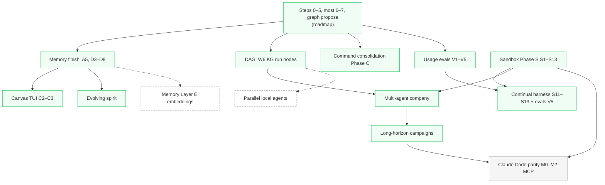

# Implementation plan (all `docs/` specs)

**Status:** living — update when a phase ships or is cut.  
**Date:** 2026-10-10  
**Index:** [DESIGN_ROADMAP.md](DESIGN_ROADMAP.md) (cuts, config budget, deferred triggers)  
**Archive:** [archived/](archived/) (fully shipped design docs)

This file orders **every** document under `docs/`: what to build next, what depends on what,
and what to move to `archived/` when done.

---

## Doc inventory

| Document | Role | Implementation status | Location when done |
|----------|------|------------------------|-------------------|
| [DESIGN_ROADMAP.md](DESIGN_ROADMAP.md) | Master cuts + steps 0–9 | Living index | Always `docs/` |
| [ARCHITECTURE.md](ARCHITECTURE.md) | Shipped behavior | Living | Always `docs/` |
| [GUIDE_DOCKER_AND_OPENROUTER.md](GUIDE_DOCKER_AND_OPENROUTER.md) | User guide | Update with Phase S / company | Always `docs/` |
| [FINDINGS_OPEN_SOURCE_AGENT_HARNESSES.md](FINDINGS_OPEN_SOURCE_AGENT_HARNESSES.md) | Research input | Not a build track | `docs/` (reference) |
| [DESIGN_LLM_CALLING.md](archived/DESIGN_LLM_CALLING.md) | Spec | **Shipped** | `archived/` |
| [DESIGN_FILE_READING.md](archived/DESIGN_FILE_READING.md) | Spec | **Shipped** | `archived/` |
| [DESIGN_GRAPH_ENGINEERING.md](archived/DESIGN_GRAPH_ENGINEERING.md) | Spec | **Shipped** | `archived/` |
| [DESIGN_LOOP_AND_GRAPH.md](archived/DESIGN_LOOP_AND_GRAPH.md) | Spec | **Shipped** | `archived/` |
| [DESIGN_SANDBOX_AND_VERIFICATION.md](DESIGN_SANDBOX_AND_VERIFICATION.md) | Spec | **Phase S shipped**; probe deferred | Stay in `docs/` while §2.9 is deferred |
| [DESIGN_MEMORY_RETRIEVAL.md](DESIGN_MEMORY_RETRIEVAL.md) | Spec | Partial — D minimal, E deferred | Archive when D1–D8 + open A* done |
| [DESIGN_DAG_AND_KNOWLEDGE_CANVAS.md](DESIGN_DAG_AND_KNOWLEDGE_CANVAS.md) | Spec | **C2–C3 shipped**; parallel agents deferred | Stay in `docs/` while Part 5 is deferred |
| [DESIGN_COMMAND_CONSOLIDATION.md](DESIGN_COMMAND_CONSOLIDATION.md) | Spec | Phases A–C shipped (Wave 1) | Stay until Phase D is cut to Non-goals |
| [DESIGN_USAGE_EVALS_AND_SELF_IMPROVEMENT.md](DESIGN_USAGE_EVALS_AND_SELF_IMPROVEMENT.md) | Spec | **V0–V5 shipped** | Stay in `docs/` while open questions remain |
| [DESIGN_CONTINUAL_HARNESS_AND_SANDBOX_EVOLUTION.md](DESIGN_CONTINUAL_HARNESS_AND_SANDBOX_EVOLUTION.md) | Spec | **S11–S13 + V5 shipped**; optimizer not built | Stay in `docs/` (human-gated) |
| [DESIGN_MULTI_AGENT_COMPANY.md](DESIGN_MULTI_AGENT_COMPANY.md) | Spec | **P1–P6 shipped** (JSON manifest, cap 2) | Stay while open questions remain |
| [DESIGN_LONG_HORIZON_PLANNING.md](DESIGN_LONG_HORIZON_PLANNING.md) | Spec | **H0–H5 shipped** | Stay while open questions remain |
| [DESIGN_EVOLVING_SPIRIT.md](DESIGN_EVOLVING_SPIRIT.md) | Spec | **P0–P5 shipped** | Stay while open questions remain |
| [DESIGN_CLAUDE_CODE_PARITY.md](DESIGN_CLAUDE_CODE_PARITY.md) | Spec | **Proposed** — MCP + harness parity | Stay in `docs/` until M0–M2 ship |

**Archival rule:** When a design doc’s **user-facing** behavior is in README + ARCHITECTURE and
remaining ideas live only in Non-goals, set `Status: shipped`, move the file to
`docs/archived/`, and add a one-line pointer in this table (per [DEVELOPMENT.md](../DEVELOPMENT.md)).

Partial docs **stay in `docs/`** until their last task row ships; then archive the whole file.

---

## Recommended build order

Follow dependency edges first; within a wave, prefer **latency-neutral host-path** work before
Docker and multi-process orchestration (see roadmap §2).

### Wave 4 — MCP and Claude Code–class harness (proposed)

See [DESIGN_CLAUDE_CODE_PARITY.md](DESIGN_CLAUDE_CODE_PARITY.md). Suggested serial order:

| Order | Track | Tasks | Depends on |
|-------|--------|-------|------------|
| 4.1 | MCP config + CLI | **M0.1–M0.3** | — |
| 4.2 | Stdio + lazy meta-tools | **M1.1–M1.4** | M0 |
| 4.3 | HTTP, OAuth, gates | **M2.1–M2.4** | M1, `GatePolicy` |
| 4.4 | Hooks, task tool, REPL UX | **M3–M4** | M2 |

Wave 4 is **latency-neutral** for users with `mcp_enabled: false`. Revisit eager MCP schemas only for remote/frontier endpoints.

### Wave 0 — Already shipped (archive only)

Roadmap steps **0–5**, **9**, and most of **6–7** on the **host** path. Four standalone
specs are in [archived/](archived/). No feature work unless regressions appear.

---

### Wave 1 — Host path completion (no Docker)

Do these in parallel where convenient; suggested **serial** order for one contributor:

| Order | Track | Tasks | Doc | Why here |
|-------|--------|-------|-----|----------|
| 1.1 | Memory index | **A5** parse cache; **D3–D8** incremental sync, query, wiring, `memory reindex`, check-inference candidates | [DESIGN_MEMORY_RETRIEVAL.md](DESIGN_MEMORY_RETRIEVAL.md) | **Shipped** |
| 1.2 | Flow / KG | **W6** run/goal nodes in knowledge graph | [DESIGN_DAG_AND_KNOWLEDGE_CANVAS.md](DESIGN_DAG_AND_KNOWLEDGE_CANVAS.md) | **Shipped** (`record_workflow_run`) |
| 1.3 | UX vocabulary | **Phase C** — `mine_on_exit`, submit-line mine routes, `/memory audit` | [DESIGN_COMMAND_CONSOLIDATION.md](DESIGN_COMMAND_CONSOLIDATION.md) | **Shipped** |
| 1.4 | Self-improvement loop | **V1–V4** — join until logs, align `flow`, human-gated agent patches, locked regressions | [DESIGN_USAGE_EVALS_AND_SELF_IMPROVEMENT.md](DESIGN_USAGE_EVALS_AND_SELF_IMPROVEMENT.md) | **Shipped** (V5 landed in Wave 2) |

Optional in Wave 1: **A1** perf harness (skipped-by-default tests) when touching memory hot paths.

**Defer in Wave 1:** **Layer E** embeddings rerank — revisit when FTS5 misses real paraphrases
(roadmap deferred table).

---

### Wave 2 — Isolation + visibility (**shipped**)

| Order | Track | Tasks | Doc | Status |
|-------|--------|-------|-----|--------|
| 2.1 | Docker sandbox | **S1–S10** (`DockerBackend`, flags, preflight, shadow volumes, docs) | [DESIGN_SANDBOX_AND_VERIFICATION.md](DESIGN_SANDBOX_AND_VERIFICATION.md) | **Shipped.** Default stays host. `bridge` is not host isolation |
| 2.2 | Canvas TUI | **C2–C3** after **C1** | [DESIGN_DAG_AND_KNOWLEDGE_CANVAS.md](DESIGN_DAG_AND_KNOWLEDGE_CANVAS.md) | **Shipped.** `canvas_tui.py`; text fallback without a TTY |
| 2.3 | Governance + co-evolution | **S11–S13**, **V5** Act/Abstain/Pair fixtures | [DESIGN_CONTINUAL_HARNESS_AND_SANDBOX_EVOLUTION.md](DESIGN_CONTINUAL_HARNESS_AND_SANDBOX_EVOLUTION.md) | **Shipped.** Allowlist, scoped secrets, and policy hash are optional files/env, not new config keys. A broken keep abstains |

[GUIDE_DOCKER_AND_OPENROUTER.md](GUIDE_DOCKER_AND_OPENROUTER.md) matches the flags, network
table, and troubleshooting. These docs stay in `docs/` because each still has a deferred
section (probe, parallel agents, or the unattended optimizer).

---

### Wave 3 — Multi-agent and identity (remote + Docker) (**shipped**)

| Order | Track | Doc | Status |
|-------|--------|-----|--------|
| 3.1 | Multi-agent company | [DESIGN_MULTI_AGENT_COMPANY.md](DESIGN_MULTI_AGENT_COMPANY.md) | **Shipped.** `lmloop --docker company run`. JSON manifest (stdlib; no YAML parser). Allowlist is the packaged file plus `company_models_allowlist`. At most two workers, and only with distinct worktrees. `ceo` / `retro` / `plan` / `mine` stay on the host. Local sequential mode is unchanged |
| 3.2 | Evolving spirit | [DESIGN_EVOLVING_SPIRIT.md](DESIGN_EVOLVING_SPIRIT.md) | **Shipped.** Seed, actions, thoughts, traits, `self.md`, `/spirit distill --patch`. `spirit_self_max_chars` is the constant 4000 |
| 3.3 | Long-horizon campaigns | [DESIGN_LONG_HORIZON_PLANNING.md](DESIGN_LONG_HORIZON_PLANNING.md) | **Shipped.** `lmloop campaign` store, plan block, board, daily tick, end-of-day hour, `campaign_max_days`. The `plan` skill's JSON is validated before it touches the plan |

Constants, not config keys: `COMPANY_MAX_PARALLEL = 2`, orchestrator model = `eval_model` or the manifest, spirit injection cap 4000, plan injection cap 4000. Parallel **local** agents stay deferred.

Use [FINDINGS_OPEN_SOURCE_AGENT_HARNESSES.md](FINDINGS_OPEN_SOURCE_AGENT_HARNESSES.md) when
designing **V3/V5** and spirit reflection — research, not a gating dependency.

---

### Explicitly deferred (do not schedule ahead of evidence)

| Item | Doc | Revisit when |
|------|-----|--------------|
| Parallel local agents | [DESIGN_DAG_AND_KNOWLEDGE_CANVAS.md](DESIGN_DAG_AND_KNOWLEDGE_CANVAS.md), roadmap | `lmloop flow` shows remote frontier wait dominates |
| Per-cycle eval probe | Sandbox | Runs pass on checker-only then regress |
| Memory Layer E | [DESIGN_MEMORY_RETRIEVAL.md](DESIGN_MEMORY_RETRIEVAL.md) | FTS5 recall misses user paraphrases |
| Command Phase D items | [DESIGN_COMMAND_CONSOLIDATION.md](DESIGN_COMMAND_CONSOLIDATION.md) | Marked “not merged” — only if product asks |

---

## Per-doc “done” checklist

Use before moving a file to `archived/`:

1. All task tables for that doc are **shipped** or moved to Non-goals with a revisit trigger.
2. `README.md`, `ARCHITECTURE.md`, and `commands.py` / tool tables match behavior.
3. `Status: shipped` in the doc header.
4. Component map in ARCHITECTURE lists the module under `docs/archived/` with “(shipped)”.

---

## Maintenance

- After each wave, refresh [DESIGN_ROADMAP.md](DESIGN_ROADMAP.md) step table and this file’s
  mermaid (green = done).
- [DESIGN_ROADMAP.md](DESIGN_ROADMAP.md) remains the **authority on cuts** (10 config keys,
  no default parallel agents). This plan is the **authority on order** across all doc files.
